# Chỉnh sửa báo cáo — LinguaIELTS (BaoCao_Final.docx)

> Ghi chú chỉnh sửa theo **đúng cấu trúc Word** — mở file Word, tìm mục tương ứng, làm theo checklist.  
> Đối chiếu: barem VKU + codebase thực tế (`docker-compose.yml`, backend, frontend).  
> Ngày rà soát: 20/06/2026

**Ký hiệu:** ✅ Đạt · ➕ Bổ sung · ✏️ Sửa · ➖ Thừa/gỡ · 📸 Chụp màn hình · ⬇️ Cắt giảm trang

---

## PHẦN ĐẦU (trước Chương 1)

### Trang tiêu đề (Title page)

| Việc cần làm | Chi tiết |
|--------------|----------|
| ➕ Bổ sung | **Mã số sinh viên (MSSV)** cho Nguyen Ngoc Anh Vi và Nguyen Van Tan Phuc |
| ✅ Đạt | Tên đề tài, lớp 22KIT, GVHD Dr. Dang Van Cuong, ngày tháng |

### Supervisor's Comments / Acknowledgements

| Việc cần làm | Chi tiết |
|--------------|----------|
| ✏️ Sửa | Lời cảm ơn (Acknowledgements) đang ghi **Redis, Celery** — stack Docker thực tế **không có** → đổi thành: FastAPI, Vue 3, PostgreSQL, Docker, nginx |
| ✏️ Sửa | Limitations trong Acknowledgements: giữ RAG deferred, thêm **stack gọn <50 users, ML inline** |

### Mục lục (Content page) — barem ≤5 trang

| Việc cần làm | Chi tiết |
|--------------|----------|
| ➕ Bổ sung | **Table of Contents** tự sinh Word, đánh số **1.1.1, 1.1.2…** |
| ✏️ Sửa | Sau khi tách Chương 5, cập nhật lại số trang toàn bộ mục lục |

### Danh mục hình / bảng / viết tắt

| Việc cần làm | Chi tiết |
|--------------|----------|
| ✅ Đạt | List of Figures, Tables, Abbreviations đã có |
| ➕ Bổ sung | Thêm số hình/bảng mới khi bổ sung screenshot & UML (Forecast, Placement, Translation…) |

### TÓM TẮT (Executive summary) — barem =1 trang

| Việc cần làm | Chi tiết |
|--------------|----------|
| ✅ **Đã soạn** | Nội dung bên dưới — copy vào Word (≈1 trang A4, font 12–13pt) |

---

#### Nội dung Tóm tắt (tiếng Việt) — copy vào Word

**TÓM TẮT**

Trong bối cảnh chuyển đổi số giáo dục và nhu cầu chứng chỉ IELTS ngày càng lớn tại Việt Nam, người học vẫn gặp nhiều hạn chế khi tự ôn luyện: công cụ luyện tập bị phân mảnh, lịch sử làm bài không được thống nhất, phản hồi Writing và Speaking phụ thuộc giám khảo hoặc gia sư với chi phí cao và thời gian chờ dài, trong khi Reading và Listening tuy chấm được tự động nhưng thiếu lộ trình cá nhân hóa bền vững. Đề tài hướng tới xây dựng một nền tảng web tích hợp, có khả năng triển khai thực tế, hỗ trợ luyện thi IELTS bốn kỹ năng kết hợp trí tuệ nhân tạo (AI) và khoa học học tập.

**Phương pháp thực hiện** gồm bốn giai đoạn: (1) khảo sát bối cảnh thị trường và phân tích đối thủ (PESTEL, Porter, SWOT), từ đó xác định yêu cầu chức năng và phi chức năng; (2) thiết kế kiến trúc hệ thống modular monolith ba tầng, mô hình dữ liệu quan hệ, giao diện người dùng (UI/UX) và tập sơ đồ UML; (3) xây dựng sản phẩm khả dụng tối thiểu (MVP) LinguaIELTS bằng Vue 3, FastAPI, PostgreSQL và Docker Compose; (4) triển khai thử nghiệm, đánh giá chức năng và đề xuất định hướng thương mại hóa theo Lean Startup và Business Model Canvas.

**Sản phẩm LinguaIELTS** là nền tảng luyện thi IELTS trực tuyến dành cho người học tự định hướng (18–35 tuổi), tích hợp luyện Reading/Listening qua bộ đề mock JSON, chấm Writing và Speaking bằng LLM (OpenRouter) kết hợp nhận dạng giọng nói Whisper và mô hình phát âm Wav2Vec2, ôn từ vựng theo thuật toán lặp ngắt cách SM-2, shadowing video, hội thoại mô phỏng, thi thử đủ bốn kỹ năng, kiểm tra trình độ đầu vào (placement test), luyện dịch Việt–Anh, dự báo điểm theo kỹ năng (NeuralProphet) và dự đoán xu hướng tuần tới (RandomForest). Hệ thống còn có dashboard phân tích tiến độ, kế hoạch học AI, gamification (XP, streak, huy hiệu, bảng xếp hạng) và cổng quản trị nội dung. Stack triển khai gọn gồm bốn dịch vụ Docker: nginx gateway, frontend Vue, API FastAPI (ML chạy inline) và PostgreSQL 17; media quiz lưu trên Cloudinary.

**Kết quả chính** đạt được: (i) MVP chạy end-to-end qua `docker compose up -d`, có migration Alembic, xác thực JWT/httpOnly refresh và CSRF; (ii) chấm điểm lai Reading/Listening xác định theo đáp án, Writing/Speaking theo rubric IELTS dạng JSON — phản hồi trong phút thay vì ngày; (iii) cơ chế thích ứng SM-2 và gợi ý bài tiếp theo trên dashboard mà không cần dataset quy mô lớn; (iv) bộ tài liệu thiết kế gồm sơ đồ use case, class, activity, sequence và deployment; (v) ma trận kiểm thử chức năng, phân tích hiệu quả định tính và khung kinh doanh freemium/B2B. Giá trị đổi mới nằm ở tích hợp đa kỹ năng, pipeline đánh giá lai (tự động + LLM + acoustic) và triển khai được trong phạm vi đồ án tốt nghiệp.

**Hạn chế:** điểm AI mang tính *formative*, chưa tương đương band chính thức của giám khảo IELTS; chưa có thí nghiệm người dùng quy mô lớn có đối chứng; chưa load test hàng nghìn người dùng đồng thời; stack demo tối ưu cho quy mô nhỏ (<50 người dùng), chưa tích hợp thanh toán và RAG trên tài liệu có bản quyền.

**Kiến nghị phát triển:** mở rộng ứng dụng di động, hiệu chuẩn AI với corpus có nhãn giám khảo, nghiên cứu hiệu quả học tập có đối chứng, tích hợp cổng thanh toán, RAG trên tài liệu được cấp phép, và quan sát vận hành (Prometheus/Grafana) khi mở rộng cho trung tâm tiếng Anh.

*Từ khóa: IELTS, EdTech, trí tuệ nhân tạo, FastAPI, Vue.js, lặp ngắt cách SM-2, Docker, luyện thi tiếng Anh.*

---

#### Bản tiếng Anh (nếu báo cáo giữ ngôn ngữ Anh) — Executive Summary

**EXECUTIVE SUMMARY**

Amid digital transformation in education and rising IELTS demand in Vietnam, self-directed learners still face fragmented tools, disconnected attempt history, slow Writing/Speaking feedback, and weak personalization. This thesis designs, implements, and evaluates **LinguaIELTS** — a deployable web platform that unifies four-skill IELTS practice with AI-assisted formative assessment, adaptive study planning, and speech intelligence.

The methodology comprises market and requirements analysis (including PESTEL, Porter, and SWOT), system and database design with UML artifacts, MVP implementation (Vue 3, FastAPI, PostgreSQL, Docker Compose), and pilot-oriented evaluation with a commercialization sketch (Design Thinking, Lean Startup, Business Model Canvas).

The MVP delivers Reading/Listening mocks with deterministic scoring; Writing/Speaking pipelines using OpenRouter LLMs, Whisper ASR, and a fine-tuned Wav2Vec2 pronunciation model; SM-2 vocabulary SRS and per-skill adaptive scheduling; shadowing, conversation practice, translation drills, placement onboarding, band forecasting (NeuralProphet), and next-week trend prediction (RandomForest); gamification and an admin content portal. Production topology uses four Docker services (nginx gateway, Vue frontend, FastAPI API with inline ML, PostgreSQL 17) and Cloudinary for quiz media.

Key outcomes include a runnable end-to-end stack, hybrid scoring architecture, documented UML and test matrices, and a credible startup prototype. Limitations: AI bands are formative only, not official IELTS scores; no large-scale controlled user study or load test; demo stack targets &lt;50 concurrent users without payment or RAG over licensed PDFs.

Future work: mobile apps, examiner-calibrated AI, controlled efficacy studies, payment integration, licensed-content RAG, and operational observability at center scale.

*Keywords: IELTS, EdTech, artificial intelligence, FastAPI, Vue.js, spaced repetition, Docker, English test preparation.*

**Checklist phần đầu**
- [ ] MSSV trên trang bìa
- [ ] Sửa Acknowledgements (bỏ Redis/Celery)
- [ ] Mục lục Word đầy đủ
- [ ] Viết Tóm tắt 1 trang

---

## CHƯƠNG 1 — GIỚI THIỆU (Introduction)  
*Barem: 5–7 trang · Hiện tại: ~13 trang*

### 1.1. Motivation and Rationale for Topic Selection

| Việc cần làm | Chi tiết |
|--------------|----------|
| ✅ **Đã soạn bản chỉnh** | Nội dung bên dưới — copy thay §1.1 trong Word |

---

#### Bản chỉnh §1.1 (tiếng Anh) — copy vào Word

**1.1. Motivation and Rationale for Topic Selection**

**1.1.1. Context of Digital Transformation in Education**

Education worldwide is shifting toward hybrid and online models driven by cloud infrastructure, mobile access, learning analytics, and AI-assisted feedback. In Vietnam and the Asia–Pacific region, this aligns with Industry 4.0 and human-capital policies, while IELTS remains a gatekeeper for study abroad, migration, and multinational careers. Meaningful digital transformation here requires more than static PDFs: learners need integrated platforms that unify attempt data, personalize pathways, and scale examiner-like support through deployable software.

LinguaIELTS is developed in this context at VKU as a web-native, API-driven IELTS practice product that combines mock examinations, AI formative grading, speech intelligence, gamification, and analytics in one Docker-deployable system.

**1.1.2. Practical Problems in IELTS Preparation**

Despite abundant online materials, self-directed learners and centers still face six recurring problems that motivate this thesis:

1. **Fragmented tools and data silos** — vocabulary, listening, writing, and speaking are spread across separate apps; history and weak-skill profiles are not unified, so learners cannot reliably answer *what to practice next*.
2. **One-size-fits-all pacing** — identical mock sequences for all students; affordable personalization still depends heavily on human coaches.
3. **Asymmetric feedback latency** — Reading and Listening can be auto-scored, but Writing and Speaking feedback from tutors may take days, delaying error correction.
4. **High cost and uneven access** — expert correction is expensive in cities and scarce elsewhere; many apps provide generic comments rather than rubric-aligned band feedback.
5. **Low sustained engagement** — multi-week preparation without streaks, goals, and visible progress leads to dropout among busy students and professionals.
6. **Engineering complexity** — combining LLM APIs, speech models, auth, and persistence in one maintainable MVP requires disciplined architecture (layered FastAPI, Alembic migrations, Docker Compose).

**1.1.3. Market and User Needs**

Demand for IELTS preparation remains strong in Vietnam, where outbound study and skilled migration sustain targets of band 6.0–7.5+. Learners increasingly prefer flexible, lower-cost digital practice over tutoring alone. Table 1 maps primary segments to LinguaIELTS capabilities.

| User Segment | Typical Need | How LinguaIELTS Addresses It |
|--------------|--------------|------------------------------|
| University students (VKU and peers) | Affordable mocks and feedback before study abroad | Four-skill practice, placement onboarding, dashboard radar, adaptive study plan |
| Young professionals | Short daily sessions, mobile-friendly web | Streaks, next-task recommendations, forecast tab, in-app notifications |
| Self-directed learners | Targeted improvement (e.g., Writing Task 2, translation drills) | Adaptive SM-2, AI band JSON, Vi→En translation practice with AI checking |
| Training centers (future B2B) | Cohort tracking and reporting | Multi-user database, leaderboard, history API, admin content tools |
| Developers and IT students | Reference architecture for AI-integrated EdTech | Documented MVP, Docker Compose, UML diagrams |

*Table 1 Primary user segments and how LinguaIELTS addresses their needs*

Across segments, core needs include: formative Writing/Speaking band estimates; authentic Reading/Listening mocks with review and transcripts; **placement-based onboarding** for new users; **translation sentence drills** for productive skills; **band forecasting and next-week trend hints** from practice history; personalized next-step guidance; vocabulary SRS with contextual saving; speaking support via shadowing, conversation practice, and pronunciation scoring; and secure account-backed data in PostgreSQL.

The MVP scope is deliberately feature-rich yet bounded for graduation-level delivery and evaluation.

**1.1.4. Related Technology Trends**

Several trends make LinguaIELTS feasible and timely:

- **Large Language Models (LLMs)** — API gateways such as OpenRouter provide rubric-based JSON scoring, coaching chat, and study-plan generation without self-hosting large models.
- **Speech AI** — Whisper enables ASR for learner audio; a fine-tuned Wav2Vec2 pronunciation model (trained offline on SpeechOcean762 via `docs/notebooks/ielts-speaking.ipynb`, deployed as `pron_scorer_best.pt`) complements LLM rubric feedback; GOP alignment supports word-level checks.
- **Learning science** — SM-2 spaced repetition for vocabulary and per-skill adaptive scheduling (`skill_adaptive_states`).
- **Forecasting analytics** — NeuralProphet and RandomForest (`ielts_model/`) support band trend visualization and next-week predictions from `score_history`.
- **Modern full-stack and DevOps** — Vue 3, FastAPI, PostgreSQL 17, Docker Compose (gateway, frontend, api, db), and nginx form a deployable demo stack; ML inference runs inline in the API for the current MVP (<50 users).
- **Gamification** — XP, streaks, badges, and leaderboards sustain multi-week preparation.
- **Cloud media** — Cloudinary (or local volumes) serves quiz audio and images without mandatory self-hosted object storage.

Together, these trends support a socially relevant, technically substantial graduation product that demonstrates current IT practice while remaining deployable as a pilot platform.

### 1.2. Objectives and Contributions

| Việc cần làm | Chi tiết |
|--------------|----------|
| ✅ **Đã soạn bản chỉnh** | Nội dung bên dưới — copy thay §1.2 trong Word |

---

#### Bản chỉnh §1.2 (tiếng Anh) — copy vào Word

**1.2. Objectives and Contributions**

**1.2.1. General Objective**

The general objective of this thesis is to design, implement, and evaluate **LinguaIELTS** — a deployable web product that integrates IELTS practice, AI-assisted formative assessment, adaptive study planning, placement onboarding, translation drills, band forecasting, and speech intelligence — demonstrating real-world applicability through Docker-based pilot deployment and a commercialization-oriented roadmap (freemium, B2B centers, API partnerships), without claiming equivalence to official IELTS certification.

**1.2.2. Specific Objectives**

Eight specific objectives structure the research and implementation work:

**Objective 1 — Analyze the problem and domain requirements.** Study IELTS skill structure, official band descriptors, and typical learner workflows. Elicit functional and non-functional requirements covering authentication, four-skill practice, placement onboarding, translation practice, adaptive study planning, gamification, forecasting, and system security. Compare personalization approaches (rule-based SM-2 plus LLM guidance versus large-scale deep knowledge tracing) and justify the chosen scope.

**Objective 2 — Design the system architecture and data model.** Specify a three-tier modular-monolith architecture: Vue 3 frontend, FastAPI backend, and a data layer comprising PostgreSQL 17, JSON mock corpora, and Cloudinary or local media storage. Model core entities including User, History, SkillAdaptiveState, StudyPlanTask, PlacementSession, and translation/forecast tables. Produce UML artifacts (use case, class, activity, sequence, deployment) with PlantUML for documentation and maintenance.

**Objective 3 — Build a functional prototype and MVP.** Implement Reading/Listening mocks, Writing and Speaking AI pipelines, vocabulary SRS, shadowing, conversation practice, translation drills, placement test, full mock exams, dashboard analytics (including forecast), badges, notifications, and a public leaderboard. Integrate OpenRouter LLM, Whisper ASR, fine-tuned Wav2Vec2 pronunciation weights (`pron_scorer_best.pt`, trained offline), and GOP word-level checks. Deliver a runnable MVP via Docker Compose (gateway, frontend, api, db) with ML inference inline in the API process.

**Objective 4 — Implement adaptive personalization and intelligent academic support.** Deploy AdaptiveStudyService (SM-2 per skill), StudyPlanService (LLM five-day plans), next-task API, dashboard coach chat, and NeuralProphet / RandomForest forecasting from practice history — without requiring EdNet-scale datasets.

**Objective 5 — Evaluate system effectiveness.** Execute functional scenarios covering authentication, practice submission, speaking evaluation (synchronous inline in the demo stack, with optional async workers when Celery is enabled), translation checking, placement flow, study-plan generation, and next-task recommendations. Assess qualitative usefulness of AI feedback against IELTS rubric expectations. Document limitations: formative AI bands, no large-scale load test, no certified examiner equivalence.

**Objective 6 — Propose a business and commercialization model.** Outline value proposition, segments, freemium versus premium boundaries (including per-user AI quotas and optional user-supplied OpenRouter keys), cost drivers (LLM tokens, inference, Cloudinary storage), and B2B licensing paths. Address copyright, privacy, and AI disclaimer policies.

**Objective 7 — Ensure engineering sustainability.** Apply router → service → repository layering, Alembic migrations, pytest and Playwright test tiers, and structured API documentation to support safe evolution of critical paths (e.g., practice submission, auth refresh).

**Objective 8 — Demonstrate offline ML research pipeline.** Document fine-tuning of the Wav2Vec2 pronunciation scorer on SpeechOcean762 (`docs/notebooks/ielts-speaking.ipynb`), export of production weights, and the separate `ielts_model/` RandomForest pipeline for next-week band trend prediction.

**1.2.3. Expected Contributions**

The thesis is expected to produce contributions across three dimensions:

**Technical contributions** include a documented full-stack MVP for AI-augmented IELTS preparation; hybrid scoring (deterministic R/L grading, LLM rubric JSON, acoustic pronunciation); per-learner SM-2 adaptation and LLM study plans; placement onboarding, translation practice, and band forecasting modules; and a Docker-deployable four-service stack suitable for pilot demos (<50 users).

**Scientific and academic contributions** include an illustration of how LLMs, ASR, and fine-tuned speech models can support formative assessment in a web product, plus UML and architectural artifacts reusable in software engineering and AI application teaching at VKU.

**Practical and commercial contributions** include a pilot-ready codebase for university clubs or language centers, with a Business Model Canvas linking usage quotas, infrastructure costs, and market segments to a viable freemium/B2B service design.

### 1.3. Research Scope

| Việc cần làm | Chi tiết |
|--------------|----------|
| ✅ **Đã soạn bản chỉnh** | Nội dung bên dưới — copy thay §1.3 + Table 2 trong Word |

---

#### Bản chỉnh §1.3 (tiếng Anh) — copy vào Word

**1.3. Research Scope**

**1.3.1. Target Users and Research Subjects**

Primary subjects are self-directed IELTS learners aged approximately 18–35: VKU and other university students preparing for study abroad, graduates and young professionals targeting band 6.5–7.5+, and digitally literate learners using laptop or smartphone browsers.

New users may complete a **four-skill placement test** after registration to seed initial skill estimates and dashboard recommendations. Secondary stakeholders (beneficiaries, not formal research subjects) include language-center administrators evaluating cohort licensing and thesis examiners assessing the MVP demonstration.

This thesis does not conduct large-sample controlled human-subjects experiments; evaluation is engineering- and demonstration-oriented, with formal user studies proposed as future work.

**1.3.2. Technology Scope**

Technologies and modules within scope are summarized in Table 2.

| Area | Technologies / Modules |
|------|------------------------|
| Frontend | Vue 3, Vite, Pinia, Vue Router, Axios, DOMPurify, Tailwind CSS |
| Backend | FastAPI, SQLAlchemy 2 (async), Alembic, Pydantic, Gunicorn + Uvicorn workers |
| Data storage | PostgreSQL 17 (production/Docker), SQLite (local dev), JSON mock corpora (`backend/data/`), Cloudinary or local `uploads/` for media |
| ML / AI | Whisper ASR, fine-tuned Wav2Vec2 pronunciation (`pron_scorer_best.pt`), GOP word checks, NeuralProphet forecast, RandomForest next-week model (`ielts_model/`), OpenRouter LLM |
| Auth & security | JWT access tokens, httpOnly refresh cookies, CSRF middleware, bcrypt, optional Google OAuth |
| Content & practice | MockDataService, Reading/Listening/Writing/Speaking mocks, translation drills, shadowing, conversation, full mock exams, placement API |
| DevOps | Docker Compose (gateway, frontend, api, db), nginx reverse proxy, optional Prometheus `/metrics`, Sentry |
| Documentation & QA | PlantUML, pytest (unit/integration), Vitest, Playwright E2E |

*Table 2 Technology scope of LinguaIELTS*

**Functional scope** includes: authentication (email/password, Google OAuth, email verification); Reading and Listening practice; Writing and Speaking AI evaluation; **placement onboarding**; **Vi→En translation practice**; vocabulary SRS; shadowing and conversation; full four-skill mock exams; attempt history and review; dashboard with radar charts, **band forecast tab**, and adaptive study plans; 32 achievement badges; XP and streak systems; in-app notifications; public leaderboard; and admin content management.

**Out of demo-stack scope (optional for future scale):** Redis caching, Celery workers, MinIO/S3 self-hosting, PgBouncer — supported in code paths but **not deployed** in the current Docker Compose MVP.

**1.3.3. System Limitations and Boundaries**

The following are explicitly out of scope or constrained for this thesis cycle:

- Issuing official IELTS certificates or operating as an authorized test center.
- Claiming statistical parity between AI-generated bands and certified examiner scores without calibration studies.
- Large-scale load testing (e.g., 10,000+ concurrent users) or production SLA guarantees.
- Payment gateway, subscription billing, and full legal/commercial terms implementation.
- Retrieval-Augmented Generation (RAG) over proprietary publisher PDFs.
- Native iOS/Android applications (web-first MVP).
- **Demo deployment target: fewer than 50 concurrent users**; single-node PostgreSQL without read replicas.
- **Speaking/shadowing ML runs inline** in the API process in the demo stack (no separate worker container).

**1.3.4. Deployment Environment**

**Staging and demonstration.** Docker Compose orchestrates four services: **gateway** (nginx, port 80), **frontend** (Vue static build), **api** (FastAPI with inline ML preload), and **db** (PostgreSQL 17). Environment variables are managed via `.env` / `.env.production.example`; secrets are excluded from version control.

**Startup flow.** The API container runs Alembic migrations, then Gunicorn with Uvicorn workers. Quiz audio/images are served via Cloudinary CDN or `/api/audio` and `/images` when `STORAGE_BACKEND=cloudinary` or local storage respectively.

**Production-oriented assumptions.** Deployment targets a Linux host or cloud VM with HTTPS terminated at nginx or an upstream load balancer. External dependencies include OpenRouter API keys, optional Cloudinary credentials, SMTP (or Resend/Brevo) for verification email, and Google OAuth client credentials. Pronunciation weights (`backend/model/pron_scorer_best.pt`) are bundled with the API image or mounted as a volume.

### 1.4. Practical Significance and Commercialization Orientation

| Việc cần làm | Chi tiết |
|--------------|----------|
| ✅ **Đã soạn bản chỉnh** | Nội dung bên dưới — copy thay §1.4 (+ Table 3) trong Word |

---

#### Bản chỉnh §1.4 (tiếng Anh) — copy vào Word

**1.4. Practical Significance and Commercialization Orientation**

**1.4.1. Solving Real-World Problems**

LinguaIELTS addresses the practical problems identified in Section 1.1.2 by unifying practice history and progress in one account-backed platform; reducing Writing/Speaking feedback delay through LLM-structured responses within minutes; surfacing weak skills via radar charts, adaptive next-task recommendations, SRS due dates, and **band forecast** hints; increasing practice frequency through gamification; and supporting onboarding via **placement test** and **translation drills** for productive skills. Learner data remains in PostgreSQL under authenticated access rather than scattered across disconnected apps.

**1.4.2. Deployment Capability**

The project is engineered for pilot deployment, not presentation-only prototyping. Deployment-readiness features include:

- **Alembic** schema migrations and health-check endpoints (`/health`).
- **JWT + httpOnly refresh** token rotation and **CSRF** protection on mutating API calls.
- **Rate limiting** on authentication and ML-heavy routes via nginx and SlowAPI.
- **Docker Compose** stack reproducible with `docker compose up -d`: gateway (nginx), frontend (Vue), api (FastAPI + Gunicorn), db (PostgreSQL 17).
- **Inline ML inference** in the API container (Whisper, pronunciation model, forecast services) for the current demo MVP — avoiding a separate worker fleet at small scale.
- **Cloudinary or local volumes** for quiz media; environment separation via validated `.env` settings (`ENVIRONMENT=production` enforces stricter secrets).

A developer can clone the repository, configure `.env`, rebuild containers, and reach `http://localhost` with API routes under `/api/*` — suitable for thesis defense and university club pilots.

**1.4.3. Scalability and Startup Potential**

**Current MVP positioning.** The demo stack targets **fewer than 50 concurrent users** on a single host — appropriate for graduation demonstration and closed beta at one language center.

**Future horizontal scaling (not implemented in the demo compose file)** may include: stateless FastAPI replicas behind a load balancer; optional **Celery** workers for long-running speaking/shadowing jobs; **Redis** for cache and message brokering; PostgreSQL read replicas; and CDN-backed media at higher volume.

Proposed commercialization models are summarized in Table 3.

| Model | Description | Target Segment |
|-------|-------------|----------------|
| B2C Freemium | Free Reading/Listening mocks and basic history; premium AI Writing/Speaking quotas, forecast analytics, unlimited translation checks | Individual learners |
| B2B Center License | Per-seat or semester package with cohort leaderboard, admin content tools, branded subdomain | Language training centers |
| API / White-label Scoring | Partner apps call Writing/Speaking scoring API with usage-based billing | EdTech integrators |

*Table 3 Proposed commercialization models for LinguaIELTS*

Primary cost drivers to manage include OpenRouter token consumption, CPU/GPU time for pronunciation inference, Cloudinary storage and bandwidth, and transactional email at scale. The product differentiates through Vietnamese-localized UX, integrated four-skill practice, hybrid AI+acoustic scoring, and pronunciation analytics — while clearly disclaiming that AI bands are formative estimates, not official IELTS certification.

### 1.5. Thesis Structure

| Việc cần làm | Chi tiết |
|--------------|----------|
| ✅ **Đã soạn bản chỉnh** | Nội dung bên dưới — copy thay §1.5 trong Word |

---

#### Bản chỉnh §1.5 (tiếng Anh) — copy vào Word

**1.5. Thesis Structure**

This graduation thesis is organized into front matter, five chapters, references, and optional appendices, as follows:

**Front matter**
- Title page (dissertation title, student names and IDs, supervisor, class, date)
- Supervisor’s comments (if required)
- Acknowledgements
- Table of contents (numbered 1.1.1, 1.1.2, …)
- List of figures, list of tables, list of abbreviations
- **Executive Summary** (one page: context, method, product, results, limitations, recommendations)

**Chapter 1 — Introduction** presents motivation and the digital-transformation context for IELTS preparation, research objectives and expected contributions, research scope and limitations, practical significance and commercialization orientation, and this structural overview.

**Chapter 2 — Literature Review and Theoretical Foundation** surveys EdTech and IELTS market context, analyzes related products with PESTEL, Porter’s Five Forces, and SWOT frameworks, formalizes functional and non-functional requirements, and establishes theoretical foundations (IELTS descriptors, SM-2, LLM formative assessment, speech processing, forecasting, and web architecture).

**Chapter 3 — Product Design and Development** documents system architecture, database design, functional and UI/UX design, technology choices, MVP definition, UML diagrams, and module-to-code implementation mapping for LinguaIELTS.

**Chapter 4 — Deployment, Evaluation, and Commercialization** reports Docker deployment results and representative screenshots, functional and non-functional evaluation, effectiveness analysis, and startup orientation (Design Thinking, Lean Startup, Business Model Canvas).

**Chapter 5 — Conclusion and Recommendations** summarizes main achievements and innovation value, states limitations of the current MVP, and proposes a product roadmap and future research directions.

**References** list sources in APA style.

**Appendices** (optional) may include extended screenshots, detailed test matrices, PlantUML sources, environment configuration samples, and sample LLM prompts.

The logical flow moves from **problem and theory** (Chapters 1–2) to **design and implementation** (Chapter 3), then **evidence of deployment and business viability** (Chapter 4), and finally **synthesis and forward-looking recommendations** (Chapter 5).

**Checklist Chương 1**
- [ ] Rút từ ~13 tr xuống 5–7 tr
- [ ] Dán §1.1 – §1.5 đã chỉnh + Table 1–3
- [ ] Thêm Tóm tắt / Executive Summary ở front matter
- [ ] Tách §4.5 → **Chapter 5** trong Word + cập nhật mục lục

---

## CHƯƠNG 2 — TỔNG QUAN TÀI LIỆU & CƠ SỞ LÝ THUYẾT  
*Barem: ≤25 trang · Hiện tại: ~15 trang — OK*

### 2.1. Overview of the Field

| Việc cần làm | Chi tiết |
|--------------|----------|
| ✅ Đạt | §2.1.1, §2.1.2 — giữ nguyên nếu đã ổn |
| ✅ **Đã soạn §2.1.3** | Nội dung bên dưới — copy thay **2.1.3** trong Word |

---

#### Bản chỉnh §2.1.3 (tiếng Anh) — copy vào Word

**2.1.3. Related Technology Trends**

Several converging trends make an integrated IELTS MVP both feasible and aligned with current EdTech practice:

**Large language models and API marketplaces.** Unified gateways (e.g., OpenRouter) expose multiple models behind one API, enabling rubric-structured JSON scoring, coaching dialogue, and study-plan generation without self-hosting frontier LLMs. Cost control via model cascading and per-user quotas is now a standard product concern.

**Speech and pronunciation AI.** Whisper provides robust ASR for learner recordings. Fine-tuned Wav2Vec2 regressors (trained offline on corpora such as SpeechOcean762) supply acoustic pronunciation signals that complement text-only LLM rubrics. Forced-alignment and Goodness-of-Pronunciation (GOP) methods enable word-level feedback beyond utterance-level scores.

**Spaced repetition and skill-level adaptation.** The SM-2 algorithm remains a practical, interpretable basis for vocabulary SRS and can be extended to per-skill scheduling when combined with lightweight priority rules and LLM-generated study plans — avoiding dependence on massive interaction logs required by deep knowledge tracing.

**Learning analytics and time-series forecasting.** Modern preparation platforms increasingly surface *where the learner is headed*, not only *where they are today*. Two complementary approaches are relevant to LinguaIELTS:

- **Per-skill band forecasting (NeuralProphet).** NeuralProphet extends Prophet-style decomposable time-series models with neural components, fitting daily band snapshots in `score_history` to project short-horizon skill trends and support dashboard “forecast” views after sufficient practice history (cold-start thresholds apply).
- **Next-week overall prediction (RandomForest, offline training).** Ensemble tree models trained on weekly aggregated features — band trajectories, study hours, correct-rate proxies — can classify whether overall performance is likely to improve, plateau, or decline next week. In this project, the `ielts_model/` pipeline trains offline (`next_week_ielts.joblib`); the API performs inference only, keeping training off the critical serving path.

Together, forecasting layers turn historical attempt data into proactive nudges (e.g., warnings when predicted bands stall), improving self-regulated study without claiming certified score prediction.

**Full-stack delivery and lean DevOps.** Vue 3, FastAPI, PostgreSQL, Docker Compose, and nginx form a mainstream, hireable stack for deployable educational products. For pilot-scale MVPs (<50 users), ML inference may run **inline in the API process**; optional Redis, Celery workers, and object-storage clusters remain scaling paths rather than demo-stack requirements.

**Gamification and behavioral design.** XP, streaks, badges, and leaderboards sustain multi-week preparation cycles — especially for working professionals with irregular schedules.

**Cloud media delivery.** CDN-backed storage (e.g., Cloudinary) reduces operational burden for thousands of quiz audio clips and images compared with self-hosted object stores at small scale.

These trends justify LinguaIELTS as a graduation-level product that combines established learning science, modern NLP/speech ML, **learning analytics forecasting**, and deployable web engineering.

### 2.2. Market Analysis and Related Systems

| Việc cần làm | Chi tiết |
|--------------|----------|
| ✅ Đạt | Table 5 so sánh đối thủ, **PESTEL** (Table 6), **Porter** (Table 7), **SWOT** (Table 8) |
| ✅ **Đã soạn §2.2** | Table 5 + Table 8 bên dưới — copy thay trong Word |
| ✏️ Giữ nguyên | Table 6 (PESTEL), Table 7 (Porter) — không cần sửa nội dung |

---

#### Bản chỉnh §2.2 (tiếng Anh) — copy vào Word

**2.2.1. Market Needs Survey**

Based on the problem analysis in Chapter 1 and common IELTS learner behaviors reported across industry surveys and training center practice, the following needs are most frequently identified:

First, learners require affordable and unlimited mock practice for Reading and Listening with explanations. Second, they need fast Writing and Speaking feedback aligned to official band descriptors rather than generic grammar checking. Third, clear study direction after each attempt — specifying which skill to practice next and at what difficulty — is highly valued. Fourth, vocabulary retention linked to reading and listening contexts is important for sustained progress. Fifth, speaking fluency tools including shadowing, conversation simulation, and pronunciation feedback are in demand. Sixth, progress visibility through band trends over time, streak tracking, and exam countdown features supports motivation. **Seventh, onboarding placement — estimating current band level before routing learners to appropriate difficulty — reduces frustration from mismatched tasks.** **Eighth, short translation drills (L1→L2) help bridge productive skills between classroom Vietnamese and exam English.** **Ninth, forward-looking analytics — not only current scores but projected band trajectories — support self-regulated study planning.** Tenth, mobile-friendly web access without requiring installation of a native application is preferred for initial engagement.

LinguaIELTS maps these needs directly to concrete system modules: practice sessions, AI submission pipelines, adaptive next-task recommendations, vocabulary SRS, shadowing, conversation practice, **placement test gate**, **translation practice**, **forecast dashboard**, and the analytics dashboard.

**2.2.2. Comparative Analysis of Related Products**

Table 5 compares representative product categories across key dimensions. LinguaIELTS is positioned as an integrated, IELTS-specific MVP with local deployability as a key differentiator. Three additional columns — **Placement**, **Band Forecast**, and **Translation** — reflect features implemented in the codebase but often absent from fragmented competitors.

| Solution | Primary Focus | Personalization | Writing/Speaking AI Feedback | Full 4-Skill Mock | Placement Test | Band Forecast | Translation Practice | Open Deployable MVP |
|----------|---------------|---------------|------------------------------|-------------------|----------------|---------------|------------------------|---------------------|
| British Council / IDP official apps | Official prep content | Limited adaptive | Human/mock rubric, not open AI pipeline | Partial per app | Informal quizzes only | No learner forecast | No | No (closed SaaS) |
| Duolingo English | General English and gamification | Generic path | Limited IELTS rubric depth | Not IELTS-exam authentic | Generic CEFR placement | No IELTS band forecast | No | No |
| IELTS Liz / similar content ecosystems | Tips and self-study | Manual by learner | Human content, no unified AI | Fragmented | Self-assessment only | No | No | No |
| Elsa Speak / pronunciation apps | Pronunciation only | Phoneme drills | Acoustic scores, not full IELTS speaking rubric | No full IELTS mock | No | No | No | No |
| Grammarly / general writing AI | Writing mechanics | Not IELTS band schema | No Task 1/2 IELTS criteria JSON | Not applicable | No | No | No | API only |
| Human tutoring centers | High-touch coaching | Human personalized | Expert but expensive and slow | Yes in premium packages | Informal oral/written check | Tutor judgment, not dashboard | Sometimes in class | Not applicable |
| **LinguaIELTS (this thesis)** | **IELTS 4 skills, vocabulary, shadowing** | **SM-2 + LLM plan + next-task** | **LLM + Wav2Vec2 + Whisper pipeline** | **Yes (web MVP)** | **Yes (reading/listening placement gate)** | **Yes (NeuralProphet per-skill + RandomForest next-week trend)** | **Yes (Vi→En sentence check with AI feedback)** | **Yes (source code, Docker Compose)** |

*Table 5 Comparison of related IELTS and English learning solutions*

The strengths gap that LinguaIELTS targets is the combination of skill unification, AI formative feedback loops, adaptive scheduling, **placement onboarding, translation drills, and learning-analytics forecasting**, plus engineering transparency suitable for a VKU graduation-level demonstration and startup extension. Weaknesses to acknowledge include a smaller mock content library than commercial publishers, AI band scores not calibrated against official examiner panels, the absence of brand recognition that must be built over time, and **a deliberately lean demo deployment stack (see SWOT weaknesses)**.

**2.2.3. PESTEL Analysis** — *giữ nguyên Table 6 hiện có.*

**2.2.4. Porter's Five Forces Analysis** — *giữ nguyên Table 7 hiện có.*

**2.2.5. SWOT Analysis**

Table 8 presents the SWOT analysis for LinguaIELTS. Strengths and weaknesses are updated to reflect **placement test**, **translation practice**, **band forecasting**, and the **honest technical scope of the demo Docker stack** (four services; no Redis/Celery in `docker-compose.yml`).

| | |
|---|---|
| **Strengths** | **Weaknesses** |
| Integrated four-skill web MVP | Smaller mock content bank than commercial publishers |
| Wav2Vec2 pronunciation + Whisper + LLM pipeline | AI band accuracy not calibrated against examiner panels |
| SM-2 adaptive engine + LLM study plans | No payment or subscription module implemented |
| Gamification with 32 badges, XP, and streak | RAG-based document tutoring not yet implemented |
| **Placement test gate (reading/listening onboarding)** | **Demo stack: 4 Docker services only (gateway, frontend, api, db)** |
| **Band forecast dashboard (NeuralProphet per-skill trends)** | **No Redis/Celery workers in demo compose — ML runs inline in API** |
| **Translation practice (Vi→En) with AI formative feedback** | **Pilot scale target <50 concurrent users; not load-tested at 10k+** |
| Open architecture using FastAPI, Vue, and Docker | Requires GPU/API budget for pronunciation and LLM at scale |
| Documented UML and maintainable modular monolith | Speaking model domain shift risk (SpeechOcean762 training data) |
| **Opportunities** | **Threats** |
| B2B licensing to language training centers | Official IELTS digital offerings continue to expand |
| University career-center partnerships | LLM API pricing or policy changes |
| Mobile application and RAG over institutional PDFs | Competitors rapidly adding generative AI features |
| Freemium model with premium AI usage quotas | Regulatory scrutiny of AI in educational assessment |
| Pronunciation scoring API as a standalone product | User distrust of AI-generated band score claims |
| **Forecast analytics as premium B2C upsell** | **Scaling beyond demo stack requires async workers and caching investment** |

*Table 8 SWOT analysis — LinguaIELTS*

### 2.3. System Requirements

| Việc cần làm | Chi tiết |
|--------------|----------|
| ✅ Đạt | Table 9 Functional, Table 10 Non-functional |
| ✅ **Đã soạn §2.3** | Chỉ phần **thêm/sửa** bên dưới — copy vào Table 9 & 10 trong Word |

---

#### Bản chỉnh §2.3 (tiếng Anh) — chỉ phần cần sửa

**2.3.1. Functional Requirements — add to Table 9** *(giữ nguyên FR-01 … FR-18)*

| ID | Requirement | Rationale |
|----|-------------|-----------|
| FR-19 | **Placement onboarding**: status check, staged reading/listening sessions, manual band entry, and full-exam finalize (`/api/placement/*`) | Routes new learners to appropriate difficulty before unrestricted practice |
| FR-20 | **Translation practice**: step/topic/sentence catalogue and AI-checked Vi→En submissions (`/api/translation/*`) | Bridges productive skills between L1 and exam English |
| FR-21 | **Band forecast dashboard**: per-skill NeuralProphet projections, alerts, next-week trend (RandomForest), and score ingestion (`/api/users/me/forecast/*`) | Supports forward-looking self-regulated study beyond static history |
| FR-22 | **Word-level pronunciation (GOP)**: expected phoneme lookup and audio upload scoring via G2P + wav2vec2 forced alignment (`/api/pronunciation/word`) | Complements utterance-level speaking rubrics with phoneme-level feedback |
| FR-23 | **Reading session annotations**: persist learner highlights and notes per practice session (`/api/annotations/{session_id}`) | Enables active reading strategies and review after attempts |
| FR-24 | **Google OAuth login**: authorization-code exchange and account linking (`POST /api/auth/google`) | Reduces registration friction for web-first learners |
| FR-25 | **User-supplied AI key**: profile settings to store an encrypted OpenRouter API key and route Writing/Speaking/coach calls through user or system provider (`GET/PUT /api/users/me/ai-settings`) | Lets advanced users bypass shared quota limits while keeping keys server-side encrypted |

**2.3.2. Non-Functional Requirements — revise/add in Table 10** *(giữ nguyên các dòng không liệt kê)*

| ID | Requirement | Target Approach |
|----|-------------|-----------------|
| NFR-01 | Security | bcrypt password hashing; **JWT access token in memory/sessionStorage**; **refresh token in httpOnly cookie** with rotation; **double-submit CSRF** (`X-CSRF-Token` header vs `csrf_token` cookie) on mutating routes; API rate limiting; task ownership enforcement |
| NFR-02 | Performance | JSON index warmup; **inline ML inference in API process** for demo MVP (Whisper, pronunciation, forecast); optional Redis caching when horizontally scaled |
| NFR-03 | Availability & observability | `/health` endpoints; **Sentry** error tracking when `SENTRY_DSN` is configured; **Prometheus** request counters/latency histograms exposed at `/metrics`; Celery retry patterns as a future scaling path |
| NFR-10 | Media delivery | Quiz audio and images served via **Cloudinary CDN** when `STORAGE_BACKEND=cloudinary`, with local volume fallback for offline demos |

### 2.4. Theoretical Foundation

| Việc cần làm | Chi tiết |
|--------------|----------|
| ✅ Đạt | IELTS descriptors, SM-2, LLM, Whisper, Wav2Vec2, 3-tier web |
| ✅ **Đã soạn §2.4** | Chỉ phần **thêm/sửa tối thiểu** bên dưới |

---

#### Bản chỉnh §2.4 (tiếng Anh) — **chỉ sửa tối thiểu**

**Cuối §2.4.4 Speech Processing Theory** — thêm một câu:

> For **word-level** feedback, LinguaIELTS also applies **Goodness-of-Pronunciation (GOP)** scoring via wav2vec2 CTC forced alignment (`gop_pronunciation_service.py`), complementing utterance-level Wav2Vec2 regression.

**Trước §2.4.5 Web Application Architecture** — thêm đoạn ngắn (có thể đặt là *2.4.5 Learning Analytics and Forecasting*, đổi số mục Web → 2.4.6, Summary → 2.4.7):

> **Learning analytics forecasting.** Per-skill band snapshots in `score_history` are projected with **NeuralProphet** (`ForecastService`). A separate **RandomForest** classifier (`ielts_model/`, `NextWeekForecastService`) predicts next-week overall trend from weekly aggregates; training is offline, inference only at API runtime.

**§2.4.5 Web Application Architecture** — chỉ thay hai câu:

| Cũ | Mới |
|----|-----|
| *…PostgreSQL for persistent storage, **Redis for caching and message brokering**, and optional S3-compatible object storage…* | *…PostgreSQL for persistent storage, **JSON corpora and Cloudinary/local media**, and PyTorch speech weights…* |
| *Long-running ML tasks … **offloaded to Celery workers*** | *Long-running ML tasks run **inline in the API** in the demo stack; **Celery workers are optional** when `CELERY_ENABLED=true`* |

**Table 12** — thêm 3 dòng *(giữ nguyên các dòng còn lại)*:

| Concept | Implementation Artifact |
|---------|-------------------------|
| Placement onboarding | `PlacementService`, `/api/placement/*` |
| Translation formative check | `TranslationService`, `/api/translation/*` |
| Band / trend forecasting | `ForecastService`, `NextWeekForecastService`, `/api/users/me/forecast/*` |

### 2.5. Chapter Conclusion

| Việc cần làm | Chi tiết |
|--------------|----------|
| ✏️ Sửa | Cập nhật tóm tắt cuối chương sau khi thêm lý thuyết forecast, GOP |

**Checklist Chương 2**
- [x] Bổ sung yêu cầu FN cho placement, translation, forecast (§2.3 đã soạn)
- [x] Bổ sung lý thuyết NeuralProphet + RandomForest (§2.4 đã soạn)
- [x] Bổ sung GOP pronunciation (§2.4 đã soạn)
- [x] Cập nhật SWOT/Table 5 (§2.2 đã soạn)

---

## CHƯƠNG 3 — THIẾT KẾ & PHÁT TRIỂN SẢN PHẨM  
*Barem: ≤25 trang · Hiện tại: ~31 trang*

### 3.1. System Architecture

#### 3.1.1. Architectural Style and Layers
| Việc cần làm | Chi tiết |
|--------------|----------|
| ✅ Đạt | Modular monolith, 3-tier |
| ✅ **Đã soạn §3.1.1** | Nội dung bên dưới — copy thay §3.1.1 + **Table 14** trong Word |

---

##### Bản chỉnh §3.1.1 (tiếng Anh) — **chỉ sửa tối thiểu**

*Giữ nguyên đoạn văn hiện có; chỉ thay một cụm:*

> …with **optional** asynchronous worker processes **(not used in the demo Docker stack)** rather than…

*Sửa **một dòng** trong Table 14:*

| Tier | Technology | Responsibility |
|------|------------|----------------|
| Data and Intelligence | PostgreSQL, JSON corpora, Cloudinary/local media, PyTorch (`pron_scorer_best.pt`), Whisper | Persistence, mock content, quiz media delivery, speech scoring *(Redis optional for cache/leaderboard at scale)* |

#### 3.1.2. REST API and Service Boundaries
| Việc cần làm | Chi tiết |
|--------------|----------|
| ✅ Đạt | Table 15 API groups |
| ✅ **Đã soạn §3.1.2** | Chỉ **sửa 1 dòng + thêm dòng** trong Table 15 bên dưới |

---

##### Bản chỉnh §3.1.2 (tiếng Anh) — **chỉ sửa tối thiểu**

*Giữ nguyên đoạn mở đầu và đoạn kết; sửa **Table 15**:*

| API Group | Example Endpoints | Primary Service |
|-----------|-------------------|-----------------|
| Vocabulary, Shadowing, Conversation | **`/vocabulary/*`**, `/shadowing/*`, `/conversation/*` | Respective skill services |
| Writing and Speaking | `/writing/submit`, `/speaking/evaluate` | WritingService, **`evaluate_speaking_core` (inline)** |
| Placement | `/placement/status`, `/placement/sessions/*` | PlacementService |
| Translation | `/translation/steps`, `/translation/check` | TranslationService |
| Forecast | `/users/me/forecast`, `/users/me/forecast/next-week` | ForecastService, NextWeekForecastService |
| Pronunciation (word) | `/pronunciation/word`, `/pronunciation/word/{word}/expected` | `gop_pronunciation_service`, phoneme_scorer |
| Annotations | `/annotations/{session_id}` | Vocabulary router (reading notes) |
| Full mock catalog | `/mock-exams/sets` | FullExamService |

*Các nhóm Authentication, Practice, Study and coach, Engagement, Administration — **giữ nguyên** như trong Word.*

#### 3.1.3. Cloud-Oriented Deployment via Docker Compose
| Việc cần làm | Chi tiết |
|--------------|----------|
| ✅ **Đã soạn §3.1.3** | Chỉ **thay Table 16 + 1 câu** bên dưới |

---

##### Bản chỉnh §3.1.3 (tiếng Anh) — **chỉ sửa tối thiểu**

*Giữ câu mở đầu; **thay toàn bộ Table 16**:*

| Service | Role |
|---------|------|
| **gateway** (nginx:80) | Reverse proxy: **`/api/*` → api**, **`/` → frontend**; rate-limit auth (`10r/m`) and ML routes (`3r/m`) |
| **frontend** (Vue static) | SPA build on port 80 |
| **api** (FastAPI + Gunicorn) | REST API, Alembic migrations, **inline ML** (Whisper, pronunciation, forecast) |
| **db** (PostgreSQL **17**) | Primary relational store |

*Table 16 Docker Compose service topology*

*Thêm **một câu** sau bảng (thay đoạn workers/MinIO cũ):*

> Quiz media is served via **Cloudinary CDN** (`STORAGE_BACKEND=cloudinary`) or a local **`uploads`** volume; Redis, Celery, PgBouncer, and MinIO are **not part of the demo compose file** and remain optional scaling paths.

#### 3.1.4. End-to-End Processing Pipeline
| Việc cần làm | Chi tiết |
|--------------|----------|
| ✅ Đạt | 7 bước pipeline tổng quát |
| ✏️ Sửa | Bước Speaking: **Celery pipeline** → **inline `evaluate_speaking_core`** (MVP); ghi chú async khi `CELERY_ENABLED=true` |

### 3.2. Database Design

#### 3.2.1–3.2.3 Design Principles / Entity Groups / Core Tables
| Việc cần làm | Chi tiết |
|--------------|----------|
| ✅ Đạt | Table 17, 18 — User, History, SkillAdaptiveState, StudyPlanTask… |
| ➕ Bổ sung | Entity: `placement_sessions`, `score_history`, `forecast_model_meta` |
| ➕ Bổ sung | Entity translation: `translation_steps`, `translation_topics`, `translation_sentences`, `translation_attempts` |
| ➕ Bổ sung | Chiến lược content: mock quiz = **JSON files** (`backend/data/`), không normalize hết vào DB |
| ➕ Bổ sung (tùy chọn) | ERD quan hệ FK đầy đủ |

### 3.3. Functional Design

#### 3.3.1. Functional Module Map (Table 19)
| Việc cần làm | Chi tiết |
|--------------|----------|
| ✅ Đạt | Auth, R/L, Writing, Speaking, Vocab, Shadowing, Conversation, Dashboard, Admin… |
| ✅ **Đã soạn §3.3** | Chỉ **sửa 2 dòng + thêm dòng** Table 19; **3 câu** flows; **1 câu** NFR bên dưới |

---

##### Bản chỉnh §3.3 (tiếng Anh) — **chỉ sửa tối thiểu**

**Table 19** — sửa 2 dòng cũ:

| Module | Cũ → Mới |
|--------|----------|
| Speaking | `Celery speaking.evaluate` → **`evaluate_speaking_core` (inline API)** |
| AI coach | thêm **Catbot** persona → `POST /users/me/chat`, writing/speaking coach endpoints |
| Gamification | bỏ `Redis leaderboard ZSET` → **`LeaderboardService` (PostgreSQL)** |

**Table 19** — thêm dòng:

| Module | Capabilities | Key Artifacts |
|--------|--------------|---------------|
| Placement | Onboarding gate, staged R/L sessions | PlacementService, PlacementGate.vue |
| Translation | Vi→En sentence check with AI feedback | TranslationService |
| Forecast | Per-skill NeuralProphet + next-week RandomForest | ForecastService, NextWeekForecastService |
| Word pronunciation | GOP / G2P word-level scoring | `gop_pronunciation_service`, `/pronunciation/word` |
| Reading annotations | Highlights and notes per session | `annotations_router` |
| Full mock catalog | Bundled 4-skill exam sets | FullExamService, `/mock-exams/sets` |

**§3.3.2 Critical Functional Flows** — thêm 3 câu *(giữ nguyên 3 đoạn hiện có)*:

> **Placement:** new users complete a placement session or manual band entry; `PlacementService` sets initial difficulty before hub access.  
> **Translation:** learner submits a Vi→En sentence; `TranslationService` returns formative AI feedback and progress.  
> **Forecast:** after enough `score_history` snapshots, `ForecastService` projects per-skill bands; cold-start thresholds apply until minimum data is met.

**§3.3.3 Non-Functional Design Constraints** — thay một cụm:

| Cũ | Mới |
|----|-----|
| *Redis leaderboard caching … Celery task ownership tracked in Redis* | *httpOnly refresh cookies, CSRF double-submit, CORS, Sentry, Prometheus `/metrics`; demo stack targets **<50 concurrent users**; Redis/Celery **optional**, not in demo compose* |

### 3.4. UI/UX Design

#### 3.4.1. Information Architecture
| Việc cần làm | Chi tiết |
|--------------|----------|
| ✅ **Đã soạn §3.4–3.5** | Chỉ **thêm/sửa tối thiểu** bên dưới |

---

##### Bản chỉnh §3.4 & §3.5 (tiếng Anh) — **chỉ sửa tối thiểu**

**Table 20** — sửa 1 dòng + thêm dòng *(giữ các area còn lại)*:

| Area | Routes | View |
|------|--------|------|
| Skills | `/reading`, `/listening`, **`/writing` (hub)**, `/writing/ielts`, **`/writing/translation/*`**, `/speaking` | Hub pages; **WritingHub** branches IELTS vs Translation |
| Productive results | thêm **`/writing/result/:historyId`** | WritingResult.vue |
| Extension | thêm **`/conversation`**, **`/vocabulary/practice/:topicId`** | ConversationHub; SRS practice stages |
| Full exam | `/full-exam`, **`/full-exam/break`**, **`/full-exam/writing`**, `/full-exam/result` | FullExamHub → break → writing → result |
| Guide | **`/guide`** | Guide.vue |
| Administration | `/admin`, `/admin/users`, `/admin/content/*` *(incl. translation)* | Admin* views |

*Thêm **một câu** sau Table 20:*

> Sidebar groups routes into **Overview** (dashboard, history, profile), **Practice** (four skills, full exam, shadowing), **Learning** (vocabulary, conversation, translation, guide), and **Admin** (role-gated).

**§3.4.2 Interaction and Visual Patterns** — thêm **một câu** *(giữ đoạn hiện có)*:

> The dashboard uses **five tabs** (Home, Reports, Forecast, Progress, Study Plan); **PlacementGate** blocks hub access until onboarding completes; **AiKeyRequiredModal** gates AI-heavy flows; the sidebar **collapses on mobile**.

**§3.4.3 UX Principles Applied** — thêm **một câu** *(giữ 5 nguyên tắc)*:

> AI band scores are labeled as **formative estimates** (not official IELTS certification); AI features show an **empty-state prompt** when no system or user OpenRouter key is configured.

**Table 21** — sửa 3 dòng + thêm 4 dòng:

| Layer | Technology | Version / Note | Role |
|-------|------------|----------------|------|
| Database | PostgreSQL | **17** | Primary persistent store *(PgBouncer optional)* |
| Cache and queue | Redis 7 | **Optional** | Scale path; not in demo compose |
| Task queue | Celery | **Optional** | Async ML when `CELERY_ENABLED=true` |
| Object storage | **Cloudinary** / local `uploads` | `STORAGE_BACKEND` | Quiz media, avatars |
| Forecasting | **NeuralProphet**, **scikit-learn/joblib** | RF trained offline (`ielts_model/`) | Per-skill forecast + next-week trend |
| Observability | **Sentry**, **Prometheus** | `/metrics` | Error tracking, request metrics |

### 3.6. Minimum Viable Product (MVP)

#### 3.6.1–3.6.3 Core Features / Trial Scope / Value Proposition
| Việc cần làm | Chi tiết |
|--------------|----------|
| ✅ **Đã soạn §3.6–3.7** | Text tối thiểu + **PlantUML** copy vào [plantuml.com](https://www.plantuml.com/plantuml) |

---

##### §3.6 — chỉ sửa tối thiểu (tiếng Anh)

**3.6.1 Core Features** — thêm **một câu** vào đoạn 6 categories:

> Extension modes also include **placement onboarding**, **Vi→En translation drills**, and **band forecast analytics** (NeuralProphet + next-week RandomForest).

**3.6.2 Trial and Experimental Scope — Out of scope** — thêm **một câu**:

> The **demo Docker Compose stack** does not include Redis, Celery workers, PgBouncer, or MinIO (`CELERY_ENABLED=false`, `REDIS_REQUIRED=false`).

**Table 22 (Distinctive Value)** — thêm 1 dòng:

| Dimension | LinguaIELTS MVP Value |
|-----------|----------------------|
| Learning analytics | Placement gate + translation drills + forecast dashboard beyond static history |

---

### 3.7. UML Design

| Diagram | Hành động |
|---------|-----------|
| 3.7.1–3.7.4, 3.7.6, 3.7.8–3.7.15 | ✅ Giữ nguyên |
| 3.7.5, 3.7.7, 3.7.16, 3.7.17 | ✏️ Thay Figure cũ |
| 3.7.18–3.7.26 | ➕ Diagram mới (Appendix hoặc cuối §3.7) |

> Copy từng block → [plantuml.com](https://www.plantuml.com/plantuml) → export PNG → chèn Word.

---

#### 3.7.5 Speaking Evaluation (Activity) — thay Figure 5

**Giải thích:** Luồng chấm Speaking sau khi upload audio. Demo MVP chạy `evaluate_speaking_core` **trực tiếp trong API**; chỉ khi `CELERY_ENABLED=true` mới trả `task_id` và poll.

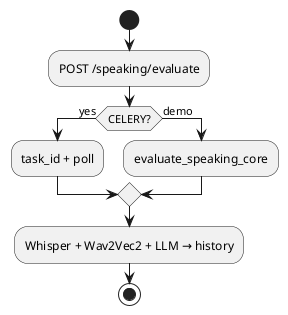

---

#### 3.7.7 Full Mock Exam (Activity) — thay Figure 7

**Giải thích:** Thi thử 4 kỹ năng; trạng thái lưu `sessionStorage` qua Pinia `fullExam`. Có màn **break** và **writing** riêng trước Speaking; placement mode gọi finalize sau khi xong.

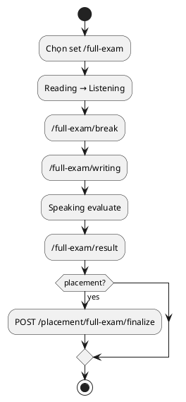

---

#### 3.7.16 Speaking Evaluate (Sequence) — thay speaking sequence

**Giải thích:** Tương tác client–server khi nộp bài Speaking. Nhánh trái = demo compose (phản hồi đồng bộ); nhánh phải = scale path với Celery.

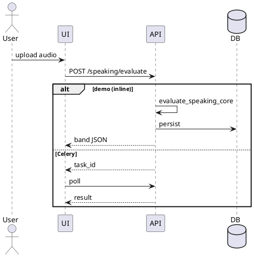

---

#### 3.7.17 Deployment Component — thay Figure deployment

**Giải thích:** Topology **4 service** trong `docker-compose.yml`. Nginx định tuyến `/api/*` → API, `/` → Vue; media qua Cloudinary; Redis/Celery không có trong stack demo.

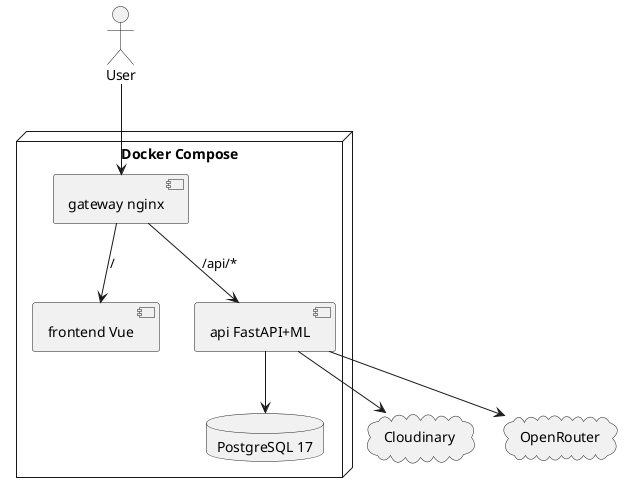

---

#### 3.7.18 Placement Test (Activity) — mới

**Giải thích:** Onboarding trước khi vào hub luyện tập. User chọn nhập band thủ công hoặc làm diagnostic 4 kỹ năng; kết quả ghi vào `UserProfile.initial_*_band`.

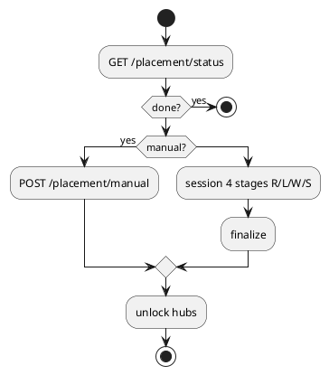

---

#### 3.7.19 Translation AI Check (Sequence) — mới

**Giải thích:** Learner dịch câu Vi→En; `TranslationService` gọi OpenRouter chấm formative và lưu `translation_attempt`.

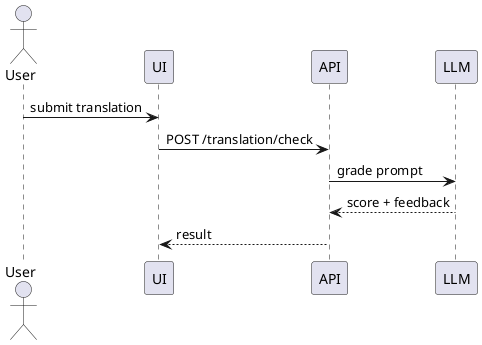

---

#### 3.7.20 Vocabulary SRS Review (Activity) — mới

**Giải thích:** Ôn từ theo SM-2: flashcard → đánh giá q → cập nhật interval; có thể qua nhiều stage (typing/reading/speaking) trong một session.

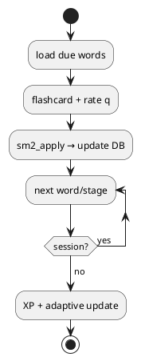

---

#### 3.7.21 Google OAuth (Sequence) — mới

**Giải thích:** Đăng nhập Google: đổi authorization code lấy userinfo, tìm/tạo user, phát JWT + **httpOnly refresh** cookie.

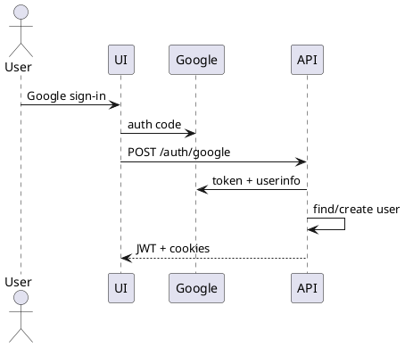

---

#### 3.7.22 Forecast Train & Predict (Activity) — mới

**Giải thích:** RandomForest train **offline** (`ielts_model/`); API chỉ ingest snapshot và inference NeuralProphet + RF khi đủ dữ liệu (cold-start nếu chưa đủ).

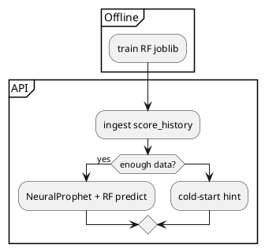

---

#### 3.7.23 Shadowing Video Ingest (Activity) — mới

**Giải thích:** Xử lý video YouTube: lấy transcript (caption hoặc Whisper), lưu DB; demo chạy inline, Celery optional. Luyện shadowing kèm GOP chấm phát âm.

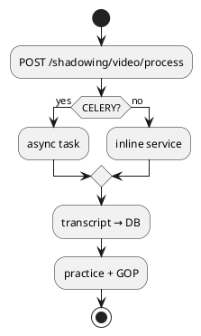

---

#### 3.7.24 Conversation Voice Turn (Sequence) — mới

**Giải thích:** Một lượt hội thoại bằng giọng nói: Whisper transcribe → `ConversationService` + OpenRouter trả lời và gợi ý rubric.

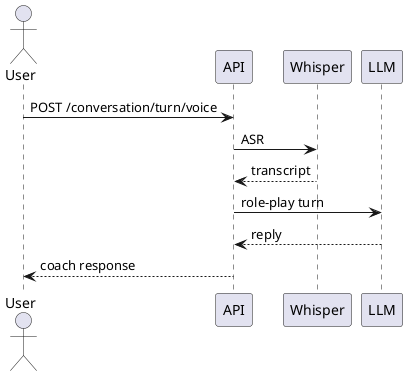

---

#### 3.7.25 Frontend Component — mới

**Giải thích:** Kiến trúc SPA Vue 3: Router điều hướng, Pinia giữ auth/fullExam, axios gọi `/api` kèm CSRF; `PlacementGate` chặn trước khi placement xong.

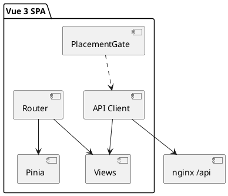

---

#### 3.7.26 Speaking Eval State Machine — mới

**Giải thích:** Trạng thái một request chấm Speaking — phân nhánh inline (demo) vs queue + poll (Celery).

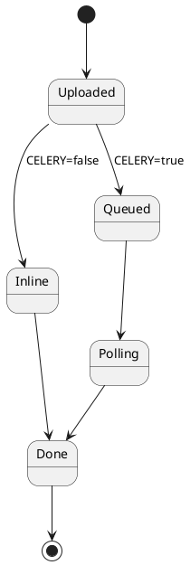

### 3.8. Module Implementation Summary (Table 23)
| Việc cần làm | Chi tiết |
|--------------|----------|
| ✅ Đạt | Mapping module → code |
| ➕ Bổ sung hàng | Placement, Translation, Forecast, Pronunciation, Annotations |
| ✏️ Sửa | Speaking: `evaluate_speaking_core` inline; Celery chỉ khi bật |

### 3.9. Chapter Summary
| Việc cần làm | Chi tiết |
|--------------|----------|
| ✏️ Sửa | Cập nhật sau khi sửa architecture, thêm module & UML |

**Checklist Chương 3**
- [ ] Sửa Table 16 + Figure 17 deployment (4 service)
- [ ] Sửa pipeline Speaking/Shadowing (inline)
- [ ] Cập nhật Table 19, 20, 21, 23
- [ ] Bổ sung DB entities: placement, forecast, translation
- [ ] Bổ sung 3.4 IA + 5 tab Dashboard
- [ ] Thêm 2–3 UML tối thiểu: Placement, Translation, Forecast
- [ ] Thêm mục Storage (Cloudinary) + Security (CSRF)
- [ ] Cắt bớt nếu vượt 25 tr (đưa UML dư sang Phụ lục)

---

## CHƯƠNG 4 — TRIỂN KHAI & MÔ HÌNH KINH DOANH  
*Barem: ≤5 trang · Hiện tại: ~31 trang — **cần cắt mạnh***

### 4.1. Deployment Results

#### 4.1.1. Deployment Environment (Table 24)
| Việc cần làm | Chi tiết |
|--------------|----------|
| ✅ **Đã soạn §4.1.1** | Chỉ **sửa Table 24 + đoạn checklist** bên dưới |

---

##### Bản chỉnh §4.1.1 (tiếng Anh) — **chỉ sửa tối thiểu**

*Giữ câu mở đầu; **thay Table 24**:*

| Environment | Stack | Purpose |
|-------------|-------|---------|
| Development | Vite dev server + FastAPI (local) | Feature development |
| **Production-oriented (demo)** | **`docker compose up -d` → gateway (nginx:80), frontend (Vue), api (FastAPI+Gunicorn+ML inline), db (PostgreSQL 17)** | Reproducible pilot; **`http://localhost`** |

*Table 24 Deployment environment configurations*

*Thay đoạn checklist (bỏ Celery worker; thêm Cloudinary):*

> The following checklist was executed for the production-oriented environment: (1) `alembic upgrade head` on PostgreSQL 17; (2) secrets from **`.env`** / **`.env.production.example`** (`SECRET_KEY`, `OPENROUTER_API_KEY`, `DB_PASSWORD`, `CELERY_ENABLED=false`, `REDIS_REQUIRED=false`); (3) `MockDataService.warmup_index()` at API startup; (4) quiz media via **Cloudinary** (`STORAGE_BACKEND=cloudinary`) or local **`uploads`** volume; (5) `GET /health` via nginx confirms API liveness. **Redis, Celery, PgBouncer, and MinIO are not part of this demo compose file.**

#### 4.1.2. System Screenshots and Functional Demonstration

**📸 Đã có trong Word (giữ lại)**

| Mục Word | Nội dung |
|----------|----------|
| 4.1.2.1 | Login and Register |
| 4.1.2.2 | Dashboard (Reports, Progress, Study Plan — Fig 20–22) |
| 4.1.2.3 | QuizRunner (Reading & Listening) |
| 4.1.2.4 | Result and Answer Key |
| 4.1.2.5 | WritingEditor |
| 4.1.2.6 | Speaking Result |
| 4.1.2.7 | Profile and Badges |
| 4.1.2.8 | Leaderboard |
| 4.1.2.9 | Shadowing Studio (3 tab) |
| 4.1.2.10 | Conversation Practice |
| 4.1.2.11 | Full Exam Hub and Result |
| 4.1.2.12–4.1.2.19 | Admin: users, moderation, mock builders R/L/S/W, conversation topics |

**📸 Thiếu — ưu tiên cao (thêm mục 4.1.2.x hoặc đưa Phụ lục)**

| # | Màn hình | Route | Đề xuất mục Word |
|---|----------|-------|-----------------|
| 1 | Dashboard tab **Home** | `/dashboard?tab=home` | 4.1.2.2b |
| 2 | Dashboard tab **Dự báo** | `/dashboard?tab=forecast` | 4.1.2.2c |
| 3 | Reading hub | `/reading` | 4.1.2.3b |
| 4 | Listening hub | `/listening` | 4.1.2.3c |
| 5 | Writing hub | `/writing` | 4.1.2.5b |
| 6 | IELTS Writing list | `/writing/ielts` | 4.1.2.5c |
| 7 | **Writing Result** | `/writing/result/:id` | 4.1.2.5d |
| 8 | **Speaking practice** (ghi âm) | `/speaking` | 4.1.2.6b |
| 9 | Translation Hub | `/writing/translation` | 4.1.2.5e |
| 10 | Translation Practice | `/writing/translation/practice/:topicId` | 4.1.2.5f |
| 11 | Vocabulary hub | `/vocabulary` | 4.1.2.12 (mới) |
| 12 | Vocab Practice | `/vocabulary/practice/:topicId` | 4.1.2.12b |
| 13 | Conversation Hub | `/conversation` | 4.1.2.10b |
| 14 | Shadowing hub | `/shadowing` | 4.1.2.9b |
| 15 | History | `/history` | 4.1.2.13 (mới) |
| 16 | **Placement test** | `PlacementGate.vue` | 4.1.2.14 (mới) |
| 17 | MockTestMode | `/mock-tests/:id` | 4.1.2.3d |

**📸 Thiếu — ưu tiên trung bình**

| # | Màn hình | Route |
|---|----------|-------|
| 18 | Full Exam Break | `/full-exam/break` |
| 19 | Full Exam Writing | `/full-exam/writing` |
| 20 | Admin Dashboard | `/admin` |
| 21 | Admin System Vocab | `/admin/system-vocab` |
| 22 | Admin Translation CMS | `/admin/content/translation` |
| 23 | Verify email | `/verify-email` |
| 24 | Forgot / Reset password | `/forgot-password`, `/reset-password` |
| 25 | Google login | Login + OAuth callback |
| 26 | Guide | `/guide` |

**📸 Thiếu — ưu tiên thấp (ghép vào ảnh khác)**

Reading highlight, Word pronunciation (GOP), Badge celebration, Notification bell, AI key modal, Catbot chat, Translation Step.

#### 4.1.3. Case Study: Self-Regulated Preparation Week
| Việc cần làm | Chi tiết |
|--------------|----------|
| ✅ Đạt | Table 25 pilot scenario |
| ➕ Bổ sung | Thêm hoạt động: placement, translation, xem forecast tab |

### 4.2. Testing, Evaluation, and User Feedback

| Việc cần làm | Chi tiết |
|--------------|----------|
| ✅ Đạt | Table 26 functional tests, Table 27 NFR, Table 28 feedback |
| ➕ Bổ sung | **Chiến lược 6 tầng**: pytest (unit→integration), Vitest, Playwright 11 E2E |
| ➕ Bổ sung | Test case: placement, translation, forecast endpoints |
| ✏️ Sửa | Test “async speaking” → thêm case **sync inline** khi Celery off |
| ⬇️ Cắt | Đưa test matrix chi tiết sang **Phụ lục** để Ch4 ≤5 tr |

### 4.3. Effectiveness Analysis (Tables 30–33)
| Việc cần làm | Chi tiết |
|--------------|----------|
| ✅ Đạt | Time savings, cost, accuracy, comparative summary |
| ⬇️ Cắt | Giữ **1 bảng tóm tắt** trong Ch4; chi tiết sang Phụ lục |

### 4.4. Startup Orientation and Commercialization

| Mục | Việc cần làm |
|-----|--------------|
| 4.4.1 Design Thinking (Table 34) | ✅ Đạt · ✏️ Prototype row: bỏ “Celery speaking pipeline” làm core |
| 4.4.2 Lean Startup (Table 35) | ✏️ Cycle 3: “Celery async” → “inline ML + optional Celery” |
| 4.4.3 Business Model Canvas (Table 36) | ✅ Đạt · ➕ user-provided OpenRouter key |
| 4.4.4 Go-to-Market (Table 37) | ✅ Đạt |
| 4.4.5 Risks (Table 38) | ✅ Đạt |

### 4.5. Conclusion and Future Work — **TÁCH RA CHƯƠNG 5**

| Việc cần làm | Chi tiết |
|--------------|----------|
| ➖ Gỡ khỏi Ch4 | Toàn bộ **4.5.1 Conclusion** và **4.5.2 Future Work** → chuyển sang **Chương 5** |

**Checklist Chương 4**
- [ ] Cắt từ ~31 tr xuống **≤5 tr**
- [ ] Sửa 4.1.1 deployment environment
- [ ] Giữ 5–8 hình tiêu biểu; phần còn lại → Phụ lục
- [ ] Chụp tối thiểu 10 màn thiếu (Forecast, Placement, hubs, Translation, Vocab, History…)
- [ ] Tách 4.5 sang Chương 5
- [ ] Rút Tables 30–33, 26–28: chỉ tóm tắt trong chương

**Gợi ý cấu trúc Ch4 sau cắt (≤5 tr)**
1. 4.1.1 Môi trường Docker (0.5 tr)
2. 4.1.2 Demo 5–8 hình chính (2 tr)
3. 4.2 Đánh giá tóm tắt (1 tr)
4. 4.4 BMC + Lean Startup tóm tắt (1–1.5 tr)

---

## CHƯƠNG 5 — KẾT LUẬN & KIẾN NGHỊ *(tách từ 4.5)*  
*Barem: ≤5 trang · Hiện chưa có chương riêng*

| Việc cần làm | Chi tiết |
|--------------|----------|
| ✅ **Đã soạn Chương 5** | Copy §5.1–5.3 bên dưới vào Word; xóa **4.5** cũ |

---

##### Bản Chương 5 (tiếng Anh) — copy vào Word

**CHAPTER 5: CONCLUSION AND RECOMMENDATIONS**

### 5.1. Main Achievements

LinguaIELTS demonstrates that an integrated IELTS preparation product can be designed (Chapter 3), deployed via Docker Compose and nginx (Section 4.1), evaluated through structured functional scenarios (Section 4.2), and positioned for commercialization using Design Thinking, Lean Startup, and Business Model Canvas frameworks (Section 4.4).

The MVP delivers measurable advantages in feedback latency and study organization compared with fragmented traditional approaches. Writing and Speaking feedback is returned within minutes rather than days. Adaptive SM-2 scheduling and LLM-generated study plans reduce the cognitive burden of manual planning. Beyond core four-skill practice, the product also ships **placement onboarding**, **Vi→En translation drills**, and **band forecast analytics** (NeuralProphet per-skill trends plus offline-trained RandomForest next-week classification). Gamification (XP, streaks, 32 badges, leaderboard) sustains engagement across multi-week preparation cycles.

The thesis contributes a full-stack reference implementation with UML documentation (Section 3.7), a hybrid speech-and-language pipeline (Whisper ASR, Wav2Vec2 pronunciation scoring, GOP word-level feedback, OpenRouter LLM rubrics), and a per-learner adaptive engine that does not depend on massive third-party interaction datasets. The **demo deployment** — four Docker services (`gateway`, `frontend`, `api`, `db`) reachable at `http://localhost` — is reproducible from source and suitable for thesis defense and closed beta at a language center.

### 5.2. Limitations

Several limitations should be stated explicitly:

1. **Formative AI bands.** Writing and Speaking scores are LLM-assisted estimates aligned to IELTS descriptors; they are not calibrated against certified examiner panels and must not be presented as official IELTS certification.
2. **Pilot-scale deployment.** The demo `docker-compose.yml` targets fewer than **50 concurrent users** on a single host. Redis, Celery workers, PgBouncer, and MinIO are disabled (`CELERY_ENABLED=false`, `REDIS_REQUIRED=false`); speaking and shadowing ML run **inline in the API process**, which limits throughput under heavy concurrent ML load.
3. **Background jobs.** Scheduled email reminders and async speaking/shadowing queues require Celery; they do not run in the current demo stack. Cron-style push notifications are likewise out of scope for the MVP compose file.
4. **Evaluation depth.** Functional and scenario-based testing was performed; there is no formal controlled user study with pre/post band mocks, and no load test at 1,000+ concurrent users.
5. **Content and commerce.** The mock corpus is curated JSON owned by the project, not licensed publisher item banks. Payment gateway, subscription billing, and native mobile apps are not implemented.

### 5.3. Recommendations and Product Roadmap

**Near-term engineering (from current MVP)**

| Phase | Focus | Deliverables |
|-------|--------|--------------|
| **Phase 0 (current)** | Demo stack | 4-service Docker Compose, inline ML, Cloudinary/local media, PostgreSQL 17 |
| Phase 1 | Scale path | Optional Redis + Celery workers, Prometheus/Grafana dashboards, load test ≥100 users |
| Phase 2 | Trust & revenue | Examiner calibration dataset, MAE reporting, payment + freemium quotas |
| Phase 3 | Reach | Web Push / mobile apps, RAG over licensed center PDFs, B2B white-label API |

**Seven research and product extensions** (adapted from former Section 4.5.2):

1. **RAG tutoring** — vector store (e.g., FAISS/Chroma) over institutional handouts for grounded coach answers.  
2. **Expert calibration** — labeled Writing/Speaking corpora to report MAE vs examiner scores.  
3. **Controlled user study** — pre/post mock bands with a matched control group.  
4. **Monetization** — payment gateway and subscription billing for B2C freemium and B2B seats.  
5. **Mobile engagement** — Web Push and native iOS/Android clients for streak retention.  
6. **Center-scale reliability** — load testing at 1,000+ concurrent users with full observability.  
7. **CI quality gates** — automated impact analysis (e.g., GitNexus) on pull requests as the codebase grows beyond the graduation MVP.

Together, Phase 0 establishes a defensible thesis deliverable; Phases 1–3 and the seven extensions outline a credible path from graduation prototype to commercial IELTS EdTech product in Vietnam.

**Checklist Chương 5**
- [ ] Tạo heading **CHAPTER 5** trong Word
- [ ] Dán §5.1–5.3; **xóa** mục 4.5 cũ
- [ ] Cập nhật mục lục & §1.5 Thesis Structure (5 chapters)

---

## TÀI LIỆU THAM KHẢO (References) — ≤3 trang

| Việc cần làm | Chi tiết |
|--------------|----------|
| ✅ Đạt | APA-style, đủ FastAPI, Vue, SM-2, Whisper, Wav2Vec2… |
| ➕ Bổ sung | NeuralProphet paper/docs, scikit-learn (RandomForest), Cloudinary docs |
| ✏️ Sửa | Celery/Redis references — giữ nếu cite optional architecture; không trình bày như đã deploy |

**Checklist References**
- [ ] Thêm cite NeuralProphet, Cloudinary (nếu dùng trong Ch3)

---

## PHỤ LỤC (Appendices) — ≤10 trang *(chưa có — nên tạo)*

| Nội dung đề xuất | Lý do chuyển vào Phụ lục |
|------------------|-------------------------|
| Screenshot đầy đủ (mục 4.1.2 thiếu) | Giảm Ch4 xuống ≤5 tr |
| Test matrix chi tiết (Table 26–28) | Giảm Ch4 |
| PlantUML source / UML bổ sung | Giảm Ch3 |
| Cấu hình `.env.production.example` | Minh chứng deploy |
| Prompt LLM mẫu (Writing/Speaking) | Minh chứng AI |
| OpenAPI path list `/api/*` | Tham chiếu kỹ thuật |

**Checklist Phụ lục**
- [ ] Tạo mục APPENDICES trong Word
- [ ] Đưa screenshot & test case dư vào đây

---

## BẢNG TRA CỨU NHANH — Nội dung SAI so với code (sửa ở chương nào)

| Nội dung sai | Sửa tại |
|--------------|---------|
| Redis, Celery worker, PgBouncer, MinIO trong stack chính | Ch1 Table 2, Ch3 Table 16, Fig 17, Acknowledgements, Ch4.1.1 |
| PostgreSQL 16 | Ch3 Table 16 → **17** |
| Speaking async Celery là luồng chính | Ch3 §3.1.4, §3.7.5/3.7.15, Ch4 test matrix |
| `/vocab/*` API path | Ch3 Table 15, 20 |
| nginx TLS trong Docker | Ch3 deployment, Ch4.1.1 |

---

## CHECKLIST TỔNG (theo thứ tự làm trong Word)

1. [ ] **Phần đầu**: MSSV, Tóm tắt, Mục lục, sửa Acknowledgements  
2. [ ] **Chương 1**: Table 2, scope, rút trang  
3. [ ] **Chương 2**: yêu cầu + lý thuyết forecast/GOP  
4. [ ] **Chương 3**: Table 16, deployment diagram, Table 19/20, UML, modules thiếu  
5. [ ] **Chương 4**: cắt ≤5 tr, sửa deploy, chụp screenshot thiếu, tách 4.5  
6. [ ] **Chương 5**: tạo mới từ 4.5  
7. [ ] **References + Phụ lục**  
8. [ ] Cập nhật mục lục & số trang lần cuối  

---

*Tham chiếu stack thực tế: `gateway` + `frontend` + `api` + `db` (PostgreSQL 17). Không có Redis, Celery, MinIO, PgBouncer trong `docker-compose.yml`.*

---

## KỊCH BẢN THUYẾT TRÌNH (10–14 phút)

> **4 giai đoạn** lồng vào **5 chương** · Tổng **~12 phút** (có thể rút 10 phút hoặc nới 14 phút)  
> **Nguyên tắc:** ít chữ trên slide, demo 1–2 màn hình, nhấn *sản phẩm chạy được* + *đóng góp kỹ thuật*.

### Phân bổ thời gian

| Giai đoạn | Nội dung | Thời lượng | Chương báo cáo |
|-----------|----------|------------|----------------|
| **1** | Giới thiệu & mục tiêu | **3 phút** | **Chương 1** (§1.1–1.2) |
| **2** | Đối tượng & phương pháp | **2,5 phút** | **Chương 1** (§1.3–1.5) + **Chương 2** (§2.1–2.3) |
| **3** | Lý thuyết & kết quả | **4 phút** | **Chương 2** (§2.4) + **Chương 3** + **Chương 4** (§4.1–4.3) |
| **4** | Giải pháp & mở rộng | **2,5 phút** | **Chương 3** (MVP) + **Chương 4** (§4.4) + **Chương 5** |
| *(dự phòng)* | Câu hỏi / demo nhanh | 1–2 phút | — |

**Slide đề xuất:** 12–15 slide (không tính slide bìa & cảm ơn).

---

### GIAI ĐOẠN 1 — Giới thiệu & mục tiêu *(~3 phút · Chương 1)*

**Slide 1 — Tiêu đề**  
*LinguaIELTS — Nền tảng luyện thi IELTS tích hợp AI* · Nhóm thực hiện · GVHD

**Slide 2 — Bối cảnh thực tiễn (THPTQG + IELTS)** *(§1.1)*  
- Sau kỳ **THPT Quốc gia**: nhiều bạn hỏi *IELTS hay tiếp tục lộ trình thi?*  
- Nhóm hướng **du học / làm việc nước ngoài** → cần bốn kỹ năng, band rõ  
- Tự ôn IELTS vẫn **rời rạc**, W/S chờ gia sư lâu  

**Lời nói (~50s):**  
*"Sau kỳ THPT vừa qua, em thấy nhiều bạn không chỉ ôn điểm Tiếng Anh tốt nghiệp mà còn cân nhắc **IELTS** cho du học hoặc đi làm. Một bộ phận người học cảm nhận lộ trình IELTS **phù hợp mục tiêu quốc tế** hơn — nhưng công cụ tự ôn vẫn tách rời, đặc biệt **Writing và Speaking** chờ chấm rất lâu. Đó là lý do nhóm chọn đề tài."*

**Slide 3 — Vấn đề nghiên cứu & bài toán** *(§1.1.2)*  

| Vấn đề | Bài toán cần giải |
|--------|-------------------|
| Công cụ phân mảnh | Một tài khoản — một lịch sử — bốn kỹ năng |
| Phản hồi W/S chậm | Pipeline AI + speech → phút thay vì ngày |
| Thiếu cá nhân hóa | SM-2, placement, forecast, gợi ý bài tiếp theo |
| Khó triển khai demo | MVP Docker, tài liệu UML, kiểm thử |

**Lời nói (~60s):**  
*"Bốn nhóm vấn đề dẫn tới bài toán: thiết kế sản phẩm **end-to-end** — từ đăng ký, luyện đề, chấm AI, dashboard đến admin nội dung; đảm bảo phản hồi **formative** theo rubric IELTS; và chứng minh **khả năng triển khai** trong phạm vi đồ án tốt nghiệp."*

**Slide 4 — Mục tiêu & đóng góp** *(§1.2)*  
- **Mục tiêu chung:** Xây dựng & đánh giá LinguaIELTS — MVP deployable  
- **Mục tiêu cụ thể (nhấn 4):** (1) Phân tích thị trường & yêu cầu · (2) Kiến trúc + UML · (3) MVP 4 kỹ năng + AI/speech · (4) Kiểm thử & định hướng startup  

**Lời nói (~45s):**  
*"Mục tiêu không phải thay thế kỳ thi IELTS chính thức, mà cung cấp môi trường luyện tập có **phản hồi nhanh, có lộ trình**, và **chạy được trên server thật** để bảo vệ và pilot tại trung tâm."*

---

### GIAI ĐOẠN 2 — Đối tượng & phương pháp *(~2,5 phút · Ch1 + Ch2)*

**Slide 5 — Đối tượng & phạm vi** *(§1.3, Table 2)*  

| Hạng mục | Phạm vi |
|----------|---------|
| **Đối tượng sử dụng** | Người học IELTS tự định hướng 18–35 tuổi; admin trung tâm |
| **Đối tượng nghiên cứu** | EdTech IELTS, adaptive learning, AI formative assessment |
| **Phạm vi chức năng** | 4 kỹ năng + vocab/SRS + shadowing + placement + translation + forecast |
| **Phạm vi kỹ thuật** | Web SPA, REST API, PostgreSQL 17, ML inline, Cloudinary |
| **Ngoài phạm vi** | Chứng chỉ chính thức, payment, app native, RAG PDF có bản quyền |

**Lời nói (~40s):**  
*"Đối tượng trực tiếp là người tự ôn và quản trị nội dung; phạm vi tập trung **web MVP** quy mô pilot **dưới 50 người đồng thời**, không mở rộng sang mobile hay thanh toán trong đồ án này."*

**Slide 6 — Phương pháp nghiên cứu** *(Ch2 §2.1–2.3 + §1.5)*  

```
Khảo sát & phân tích (PESTEL, Porter, SWOT, Table 5)
        ↓
Yêu cầu FN/NFR (Table 9–10)
        ↓
Thiết kế (UML, DB, UI/UX) — Chương 3
        ↓
Phát triển MVP (Vue + FastAPI + Docker)
        ↓
Kiểm thử & đánh giá + BMC — Chương 4
```

**Lời nói (~50s):**  
*"Phương pháp theo pipeline sản phẩm phần mềm: từ phân tích thị trường và đối thủ → formalize yêu cầu → thiết kế có UML → implement MVP → kiểm thử kịch bản và phác thảo mô hình kinh doanh Lean Startup. Đây là phương pháp **thiết kế–triển khai–đánh giá** phù hợp đồ án có sản phẩm chạy được."*

**Slide 7 — Phân tích thị trường (1 câu + bảng nhỏ)** *(§2.2, Table 5)*  
- LinguaIELTS = **tích hợp 4 kỹ năng + AI + placement + forecast + deployable source**

**Lời nói (~30s):**  
*"So với Duolingo, Elsa hay trung tâm gia sư, điểm khác biệt là **một nền tảng IELTS-specific**, có **mã nguồn và Docker** để trung tâm tự host — không chỉ demo slide."*

---

### GIAI ĐOẠN 3 — Lý thuyết & kết quả *(~4 phút · Ch2 + Ch3 + Ch4)*

**Slide 8 — 2 lý thuyết cốt lõi (đóng góp kỹ thuật)** *(§2.4)*  

| Lý thuyết | Ý nghĩa thực tiễn |
|-----------|-------------------|
| **NeuralProphet + RandomForest** | Sau **14 ngày** luyện trên web → dự báo band **theo từng user**, xu hướng tuần tới |
| **Speaking lai** | Wav2Vec2 (Accuracy/Fluency/Prosodic, PCC≈0,69) + LLM (ngữ pháp, từ vựng, bám đề) → rubric IELTS |

**Lời nói (~55s):**  
*"Hai lý thuyết cốt lõi: **Forecast** — user luyện trên website **14 ngày** có lịch sử band, NeuralProphet vẽ xu hướng từng kỹ năng, RandomForest dự đoán tuần tới tăng hay chững. **Speaking lai** — Wav2Vec2 fine-tune SpeechOcean762 chấm **phát âm** (Accuracy, Fluency, Prosodic); LLM chấm **ngữ pháp, từ vựng, mạch lạc** và kiểm tra **có bám câu hỏi đề không** — tránh nói lan man; server gộp band theo IELTS. Vẫn là luyện tập, không thay chứng chỉ chính thức."*

**Slide 9 — Kiến trúc & giải pháp kỹ thuật** *(Ch3 §3.1, Table 16, Fig 17)*  
- Sơ đồ 3 tầng + **4 container**: gateway · frontend · api · db  
- API nhóm: practice, writing, speaking, placement, translation, forecast…

**Lời nói (~45s):**  
*"Chương 3 mô tả modular monolith: một codebase FastAPI, router tách module; ML chạy **inline** trong API ở bản demo; mock đề đọc từ **JSON**, media qua **Cloudinary**."*  
→ *Chỉ slide UML deployment hoặc Table 16, không đọc hết API.*

**Slide 10 — Kết quả nghiên cứu (số liệu & biểu đồ gợi ý)** *(Ch4 §4.1–4.3)*  

**Bảng A — Module đã triển khai**

| Nhóm | Số lượng / trạng thái |
|------|------------------------|
| API router groups | 15+ nhóm (`/api/*`) |
| FR yêu cầu | FR-01 → FR-25 |
| Badge gamification | 32 huy hiệu |
| Docker services | 4 (demo stack) |
| UML diagrams | 17+ (use case, sequence, activity…) |

**Bảng B — So sánh hiệu quả định tính** *(§4.3)*

| Tiêu chí | Cách truyền thống | LinguaIELTS MVP |
|----------|-------------------|-----------------|
| Phản hồi Writing/Speaking | Ngày → tuần | **Phút** |
| Lịch sử làm bài | Phân tán | **Một tài khoản** |
| Gợi ý bài tiếp theo | Tự ước lượng | **Forecast tab + SM-2** |
| Triển khai demo | Khó tái lập | **`docker compose up -d`** |

**Biểu đồ gợi ý trên slide (chọn 1–2):**
1. **Tab Dự báo (Forecast)** — đường band theo kỹ năng + xu hướng tuần tới *(NeuralProphet + RF)*  
2. **Speaking result** — band ring + 4 tiêu chí rubric IELTS  
3. **Timeline** — Upload → Whisper → Wav2Vec2 → LLM rubric → Band  

**Lời nói (~70s):**  
*"Kết quả gắn trực tiếp hai lý thuyết cốt lõi: tab **Forecast** cho từng user sau đủ lịch sử làm bài; **Speaking** trả band và nhận xét theo rubric trong vài phút. MVP chạy end-to-end — từ đăng ký đến dashboard. So với tự ôn: không còn chỉ biết điểm hôm nay mà biết **tuần sau nên cải thiện thế nào**; Speaking không phải chờ gia sư vài ngày."*  
→ *Demo: tab **Forecast** + **Speaking result** ~30 giây.*

**Slide 11 — Kiểm thử & minh chứng** *(§4.2)*  
- Functional test: auth, submit, speaking, placement, translation, admin  
- Screenshot tiêu biểu: Login · Dashboard Forecast · Writing · Speaking band ring  

**Lời nói (~35s):**  
*"Em đã chạy kịch bản kiểm thử chức năng và regression cơ bản; hạn chế là chưa có thí nghiệm người dùng có đối chứng — phần này để hướng phát triển ở giai đoạn 4."*

---

### GIAI ĐOẠN 4 — Giải pháp thực thể & mở rộng *(~2,5 phút · Ch3 + Ch4 + Ch5)*

**Slide 12 — Giải pháp mang tính thực thể** *(§3.6 MVP + §4.1 + §1.4)*  

| Thành phần | Giải pháp triển khai |
|------------|----------------------|
| Sản phẩm | LinguaIELTS web — một URL, một DB |
| Triển khai | Docker Compose 4 service; nginx `/api` proxy |
| Bảo mật | JWT + httpOnly refresh, CSRF, rate limit |
| AI | OpenRouter + user key; quota trên profile |
| Media | Cloudinary CDN |
| Admin | CMS mock JSON, user moderation |

**Lời nói (~50s):**  
*"Giải pháp không dừng ở mô hình: nhóm đã đóng gói **sản phẩm chạy được** — clone repo, cấu hình `.env`, `docker compose up -d`, truy cập qua domain/server thật. Điều này phù hợp bảo vệ, pilot CLB, hoặc B2B cho trung tâm nhỏ."*

**Slide 13 — Hạn chế** *(Ch5 §5.2)*  
1. Band AI formative — chưa hiệu chuẩn giám khảo → corpus có nhãn + MAE  
2. **OpenRouter** — 2 lớp: credit server (402/429) + quota app (20S/40chat/ngày, 120 tutor/tháng) → user key riêng / premium  
3. **Chưa RAG** — prompt thẳng DB, không tra PDF → hallucinate / gợi ý chung → vector licensed + cite
4. Pilot &lt;50, ML inline → Celery + load test  
5. Chưa user study → pilot CLB 30–50 người  
6. SpeechOcean762 domain shift → fine-tune thêm audio IELTS  

**Lời nói (~45s):**  
*"Em nêu từng hạn chế kèm hướng sửa: band AI chỉ luyện tập; **OpenRouter** có giới hạn token — user ôn nhiều chạm quota ngày, có thể nhập key riêng; **chưa RAG** nên feedback chưa bám giáo trình; quy mô pilot nhỏ; chưa thí nghiệm đối chứng."*

**Slide 14 — Hướng phát triển & roadmap** *(Ch5 §5.3 + §4.4 BMC)*  

| Phase | Hướng |
|-------|--------|
| 0 *(hiện tại)* | Docker 4 service, inline ML |
| 1 | Redis/Celery, load test, observability |
| 2 | Hiệu chuẩn AI, payment freemium |
| 3 | Mobile, RAG tài liệu licensed, B2B API |

**Lời nói (~40s):**  
*"Bảy hướng mở rộng: RAG, calibration, user study, monetization, mobile, load test, CI impact analysis. Mô hình kinh doanh **freemium B2C** và **license B2B** cho trung tâm đã phác trong BMC Chương 4."*

**Slide 15 — Kết luận** *(Ch5 §5.1)*  
- Đã đạt: MVP tích hợp · pipeline lai · adaptive · deployable · UML đầy đủ  
- Thông điệp: *"Từ bài toán phân mảnh → một nền tảng IELTS AI có thể triển khai thực tế."*

**Lời nói (~25s):**  
*"Kết luận: đề tài chứng minh có thể xây dựng nền tảng luyện IELTS **tích hợp, có AI, triển khai được** trong phạm vi đồ án CNTT. Em xin cảm ơn thầy và hội đồng, sẵn sàng demo và trả lời câu hỏi."*

---

### Ánh xạ nhanh: 4 giai đoạn ↔ 5 chương

| Giai đoạn thuyết trình | Chương 1 | Chương 2 | Chương 3 | Chương 4 | Chương 5 |
|------------------------|----------|----------|----------|----------|----------|
| 1 Giới thiệu & mục tiêu | ●●● | | | | |
| 2 Đối tượng & phương pháp | ●● | ●● | | | |
| 3 Lý thuyết & kết quả | | ●● | ●● | ●● | |
| 4 Giải pháp & mở rộng | | | ● | ●● | ●● |

---

### Mẹo khi thuyết trình 10–14 phút

- **10 phút:** bỏ Slide 7 (thị trường), rút lời GĐ3; giữ demo 20s.  
- **14 phút:** thêm 1 phút demo live (placement gate + forecast tab) + 1 phút BMC slide.  
- **Nên demo:** Tab **Forecast** (xu hướng tuần) → **Speaking result** (rubric IELTS).  
- **Không đọc:** Table API, UML chi tiết — chỉ show hình.  
- **Câu chốt khi bị hỏi deploy:** *"Báo cáo mô tả stack Docker pilot; production dùng cùng image với domain, HTTPS và biến môi trường production."*

---

### ENGLISH SPEAKER SCRIPT — full transcript (~12 min)

> Read naturally; pause at **[Slide X]**. Total ~1,450 words ≈ 11–13 minutes at moderate pace.

---

#### PHASE 1 — Introduction & Objectives (~3 min · Chapter 1)

**[Slide 1 — Title]**  
Good morning, respected committee members and supervisor. We are pleased to present our graduation thesis: **LinguaIELTS** — an integrated, AI-assisted IELTS preparation web platform. I am [name], and my teammate is [name]. Our supervisor is Dr. Dang Van Cuong.

**[Slide 2 — Context & rationale · §1.1]**  
In Vietnam, demand for IELTS certification continues to grow, especially among young adults preparing for study abroad or employment. Digital education is expanding quickly, but many self-directed learners still rely on **fragmented tools** — one app for vocabulary, another for mocks, and separate channels for Writing and Speaking feedback.

The core pain points are clear. First, **practice history is disconnected** across skills. Second, **Writing and Speaking feedback** often depends on tutors or examiners, which is expensive and slow — sometimes days or weeks. Third, even when Reading and Listening can be auto-scored, learners lack a **sustainable, personalized study path**.

We chose this topic to build a **unified, deployable web platform** that combines four-skill IELTS practice, AI formative assessment, adaptive planning, and speech intelligence — within the scope of a graduation software project.

**[Slide 3 — Research problems & tasks · §1.1.2]**  
This leads to four research problems and corresponding solution tasks.

- **Fragmentation** → one account, one history, four skills in one product.  
- **Slow productive-skill feedback** → hybrid AI and speech pipelines returning results in **minutes**, not days.  
- **Weak personalization** → SM-2 scheduling, placement onboarding, band forecasting, and next-task recommendations.  
- **Weak deployability** → a runnable MVP with Docker, UML documentation, and functional test evidence.

Our task is not to replace official IELTS certification, but to deliver an **end-to-end practice environment** with rubric-aligned formative feedback and **real deployment capability**.

**[Slide 4 — Objectives & contributions · §1.2]**  
The **general objective** is to design, implement, and evaluate LinguaIELTS as a deployable MVP.

Our **specific objectives** are:  
(1) analyze the EdTech market and formalize requirements — Chapter 2;  
(2) design system architecture, database, UI/UX, and UML artifacts — Chapter 3;  
(3) build the MVP with Vue 3, FastAPI, PostgreSQL, AI and speech modules — Chapters 3–4;  
(4) test, evaluate effectiveness, and outline startup commercialization — Chapters 4–5.

Expected contributions include a **full-stack reference implementation**, a **hybrid scoring architecture**, and a **pilot-ready Docker stack** suitable for thesis defense and small-scale center deployment.

---

#### PHASE 2 — Subjects & Methodology (~2.5 min · Chapters 1–2)

**[Slide 5 — Scope & subjects · §1.3, Table 2]**  
**Target users** are self-directed IELTS learners aged 18–35, plus administrators who manage content and users.

**Research scope** covers integrated four-skill practice, vocabulary SRS, shadowing, conversation, placement test, translation drills, and forecast analytics.

**Technical scope** is a web SPA with REST API, PostgreSQL 17, inline ML inference in the demo stack, and Cloudinary for quiz media.

**Out of scope** for this thesis: official IELTS certification, payment gateway, native mobile apps, and RAG over licensed publisher PDFs. The demo stack targets **fewer than 50 concurrent users** — appropriate for graduation demonstration and closed beta.

**[Slide 6 — Research method · Ch2 §2.1–2.3, §1.5]**  
We followed a **design–build–evaluate** pipeline:

1. **Market and field analysis** — PESTEL, Porter’s Five Forces, SWOT, and competitor comparison (Table 5).  
2. **Requirements engineering** — functional and non-functional requirements (Tables 9–10).  
3. **System design** — three-tier modular monolith, database schema, UI routes, and UML diagrams.  
4. **MVP implementation** — Vue 3 frontend, FastAPI backend, Docker Compose deployment.  
5. **Evaluation and commercialization sketch** — functional test matrix, qualitative effectiveness analysis, Lean Startup and Business Model Canvas.

This methodology matches a product-oriented software thesis where **runnable software** is the primary deliverable.

**[Slide 7 — Market positioning · §2.2]** *(optional — skip for 10-min version)*  
Compared with general English apps, pronunciation-only tools, or high-cost tutoring centers, LinguaIELTS differentiates through **IELTS-specific four-skill integration**, **AI plus acoustic scoring**, and **open, Docker-deployable source code** — not only a slide prototype.

---

#### PHASE 3 — Theory & Results (~4 min · Chapters 2–4)

**[Slide 8 — Core theories · §2.4]**  
We focus on **two technical contributions** that directly help learners improve.

**First — personalized weekly score forecasting: NeuralProphet and RandomForest.**  
The system stores each user’s band history per skill. **NeuralProphet** projects skill-level trends on the dashboard. An offline-trained **RandomForest** model predicts whether that user’s overall band is likely to improve, plateau, or decline **next week**. The goal is not to certify exam results, but to give each learner a **personal improvement signal** — which skill to prioritize before the next mock.

**Second — hybrid Speaking assessment aligned with IELTS examiner standards.**  
Speaking is the weakest skill for many post-high-school learners because school exams emphasize multiple choice. Our **hybrid pipeline** combines **Whisper** for transcription, **Wav2Vec2** for pronunciation signal, and an **LLM** that scores against the official **IELTS rubric and band descriptors** — Fluency, Lexical Resource, Grammar, and Pronunciation — the same framework examiners use. Results return in **minutes**. We emphasize this is **formative practice scoring**, not an official IELTS certificate.

**[Slide 9 — Architecture · Ch3 §3.1, Table 16]**  
Chapter 3 describes a **modular monolith**: one FastAPI codebase with clear router boundaries.

The demo deployment uses **four Docker services**: nginx gateway, Vue frontend, API with Gunicorn and **inline ML**, and PostgreSQL 17. Mock tests load from **JSON corpora**; media is served via **Cloudinary** or local uploads. Redis and Celery remain **optional scaling paths**, not part of the demo compose file.

Key API groups include practice, writing, speaking, placement, translation, forecast, vocabulary, shadowing, conversation, and admin content management.

**[Slide 10 — Results · Ch4 §4.1–4.3]**  
Chapter 4 reports deployment and evaluation results.

**Delivered scope:**  
- **15+ API router groups** under `/api/*`  
- **25 functional requirements** (FR-01 through FR-25)  
- **32 achievement badges**, XP, streaks, and leaderboard  
- **4 Docker services** in the pilot stack  
- **17+ UML diagrams** documenting critical flows  

**Qualitative effectiveness** — compared with traditional self-study:

| Criterion | Traditional | LinguaIELTS MVP |
|-----------|-------------|-----------------|
| W/S feedback latency | Days to weeks | **Minutes** |
| Attempt history | Fragmented | **Single account** |
| Improvement direction | Guess from one score | **Per-user weekly forecast** |
| Reproducible demo | Difficult | **`docker compose up -d`** |

Results tie directly to our two core theories: the **Forecast tab** activates when a user has enough score history; **Speaking** returns band and rubric feedback after each recording.

**[Slide 11 — Testing evidence · §4.2]** *(show screenshots)*  
We executed functional scenarios covering authentication, Reading/Listening submission, Writing and Speaking AI grading, placement onboarding, translation check, forecast endpoints, and admin moderation.

If time permits, we briefly show the **Forecast tab** and a **Speaking result screen** — about thirty seconds.

---

#### PHASE 4 — Practical Solution & Future Work (~2.5 min · Chapters 3–5)

**[Slide 12 — Deployable solution · §3.6, §4.1, §1.4]**  
The solution is **practical, not conceptual**.

LinguaIELTS is delivered as a **single web product** — one URL, one database, one deployment workflow. Operators clone the repository, configure `.env` from `.env.production.example`, run `docker compose up -d`, and serve the app behind nginx with `/api/*` proxied to FastAPI.

Security includes JWT access tokens, **httpOnly refresh cookies**, double-submit CSRF, bcrypt hashing, and rate limiting on auth and ML routes. AI calls route through OpenRouter with optional **user-supplied API keys** stored encrypted server-side.

This is suitable for thesis defense, university club pilots, or **B2B deployment** at a small language center.

**[Slide 13 — Limitations · Ch5 §5.2]**  
We state limitations clearly to avoid over-claiming.

1. AI band scores are **formative estimates** — not calibrated against certified examiner panels.  
2. The demo stack targets **under 50 concurrent users**; ML runs **inline** in the API without Redis or Celery workers.  
3. Background jobs such as async speaking queues and scheduled email require Celery — disabled in the demo compose.  
4. No controlled user study, no 1,000-user load test, no payment module, and no licensed publisher item bank.

**[Slide 14 — Roadmap · Ch5 §5.3, §4.4 BMC]**  
**Phase 0 — current:** four-service Docker Compose, inline ML, Cloudinary media.  
**Phase 1:** Redis, Celery workers, load testing, Prometheus/Grafana observability.  
**Phase 2:** examiner calibration, MAE reporting, freemium payment.  
**Phase 3:** mobile apps, licensed-content RAG, B2B white-label scoring API.

Seven extensions from our future-work analysis: RAG tutoring, expert calibration, controlled efficacy study, monetization, mobile engagement, center-scale load testing, and CI impact analysis.

Commercial orientation follows **freemium B2C** and **per-seat B2B licensing**, as outlined in the Business Model Canvas in Chapter 4.

**[Slide 15 — Closing · Ch5 §5.1]**  
In conclusion, this thesis shows that an **integrated, AI-assisted, deployable IELTS platform** can be built within a graduation project scope.

We moved from fragmented self-study problems to a unified product with hybrid scoring, adaptive learning, placement and forecast modules, complete UML documentation, and a reproducible pilot stack.

Thank you for your attention. We are happy to provide a live demo and answer your questions.

---

#### Short answers for likely Q&A (English)

| Question | Suggested answer |
|----------|------------------|
| Is the AI band an official IELTS score? | No — formative feedback aligned to descriptors, not certification. |
| Why no Redis/Celery? | Demo MVP &lt;50 users; ML inline; Celery is optional when scaling. |
| How is Speaking scored? | Whisper transcript + Wav2Vec2 acoustic signal + LLM rubric JSON; server-side aggregation. |
| Can a center deploy it? | Yes — Docker Compose, env-based config, admin CMS for mock content. |
| Main limitation? | No examiner-calibrated validation or large-scale user study yet. |

---

### BẢN HỌC THUỘC — nói trực tiếp với hội đồng (~12 phút)

> **Phiên bản trình bày:** thực tiễn, mở đầu gắn **kỳ thi THPT Quốc gia**, lý thuyết **2 trụ cột** — Forecast (NeuralProphet + RF) và Speaking lai.  
> **Cách học:** 4 khối · Người A = Khối 1+2 · Người B = Khối 3+4.

---

**MỞ ĐẦU**

Kính chào quý thầy cô trong Hội đồng và thầy Dang Van Cuong. Em là [tên], trình bày cùng bạn [tên]. Đồ án của nhóm em là **LinguaIELTS** — nền tảng web luyện IELTS tích hợp AI, đã cài đặt và chạy được thật.

*Em xin bắt đầu từ bối cảnh thực tế.* Vừa qua, sau kỳ thi **THPT Quốc gia**, em thấy rất nhiều bạn — đặc biệt lớp 12 và sinh viên mới — không chỉ ôn cho điểm Tiếng Anh trên phòng thi, mà còn hỏi: *“Em nên đi đường IELTS hay tiếp tục kỳ thi tốt nghiệp?”* Một bộ phận chọn **IELTS** vì mục tiêu du học, làm việc nước ngoài — vì bốn kỹ năng rõ ràng, có lộ trình và có **band cụ thể**.

Trong khi đó, tự ôn trên thị trường vẫn **rời rạc**. Ví dụ thực tế: bạn A dùng **Migii hoặc Quizlet** chỉ ôn từ; bạn B tải **file PDF đề** trên Facebook làm Reading rồi tự đối đáp án, không lưu lịch sử; bạn C gửi bài Writing vào **group Zalo** chờ thầy chấm **ba–năm ngày**; bạn D muốn luyện Speaking thì phải **book gia sư** hoặc quay video gửi — tốn tiền, chờ lâu, **không biết band tổng thể** mình đang ở đâu. Không có chỗ nào gộp bốn kỹ năng, một lịch sử, một hướng cải thiện. Đó là khoảng trống nhóm em muốn lấp bằng **một nền tảng web thống nhất**.

---

#### KHỐI 1 — Vấn đề và mục tiêu *(Chương 1 · ~3 phút)*

Cụ thể, người tự ôn gặp ba khó khăn thường gặp. Thứ nhất, **mỗi kỹ năng một nơi** — không biết mình yếu chỗ nào trên toàn bộ bốn kỹ năng. Thứ hai, **Writing và Speaking** — đúng phần nhiều bạn sau THPT còn yếu — phải trả phí gia sư và chờ lâu. Thứ ba, **không biết hôm nay nên luyện gì**: đề Reading hay sửa bài Writing, ôn từ hay luyện nói.

Nhóm em đặt bài toán: một tài khoản, một lịch sử làm bài, phản hồi AI trong **vài phút**, và gợi ý bài tiếp theo trên dashboard. Sản phẩm phải **deploy được** để trung tâm hoặc nhóm em demo trực tiếp trước hội đồng — không dừng ở thiết kế.

*Mục tiêu đồ án không phải cấp chứng chỉ IELTS thay Bộ hay IDP.* Mục tiêu là xây **môi trường luyện tập có AI** — chấm và gợi ý theo **descriptor IELTS** — để người sau THPT, sinh viên và người đi làm đang chuẩn bị du học **biết mình yếu ở đâu và luyện thế nào cho đúng**, thay vì tự đoán band hoặc chờ gia sư.

---

#### KHỐI 2 — Đối tượng, đối thủ và phương pháp *(Chương 1–2 · ~2 phút)*

**Đối tượng:** học sinh, sinh viên 18–35 tuổi — nhiều người vừa qua THPT, hướng IELTS vì du học hoặc nghề nghiệp.

**Đối thủ và hạn chế của họ** — đây là lý do nhóm em tập trung hai lý thuyết cốt lõi:

| Đối thủ | Hạn chế với người tự ôn IELTS |
|---------|-------------------------------|
| **Duolingo** | Tiếng Anh chung, không bám đề IELTS; không dự báo band cá nhân |
| **Elsa Speak** | Chỉ phát âm — không chấm full Speaking rubric 4 tiêu chí |
| **Grammarly** | Sửa câu chung — không chấm Task 1/2 Writing theo band IELTS |
| **File PDF / group Facebook** | Làm đề rời, không lưu lịch sử, không biết xu hướng tuần sau |
| **Trung tâm / gia sư** | Chấm đúng nhưng **đắt, chậm** — Speaking/Writing chờ ngày |

**LinguaIELTS** khác ở chỗ: **một nền tảng IELTS**, gộp bốn kỹ năng, và hai đóng góp kỹ thuật mà đối thủ trên **không có cùng lúc** — **dự báo band theo tuần cho từng user** và **chấm Speaking lai theo rubric IELTS**.

**Phương pháp** gọn: khảo sát đối thủ → ghi yêu cầu → thiết kế → code Vue + FastAPI → kiểm thử. Phần lý thuyết em sẽ đi thẳng vào **NeuralProphet + RandomForest** và **Speaking lai** — không liệt kê hết công nghệ phụ.

---

#### KHỐI 3 — Lý thuyết cốt lõi và kết quả *(Chương 2–4 · ~4 phút)*

*Phần lý thuyết — nhóm em nhấn **hai đóng góp kỹ thuật** chính.*

**Một — Dự báo điểm cá nhân theo tuần: NeuralProphet và RandomForest.**

Sau THPT, nhiều bạn chỉ biết *hôm nay được mấy điểm* — không biết *tuần sau đi lên hay chững, nên tập Reading hay Speaking*. Hệ thống lưu band từng kỹ năng của **riêng user đó** khi user **luyện trên website**. Điều kiện quan trọng: user phải có **ít nhất 14 ngày** làm bài trên hệ thống — mỗi ngày có điểm được ghi vào lịch sử — thì tab **Dự báo** mới kích hoạt. Khi đủ dữ liệu, **NeuralProphet** vẽ xu hướng band từng kỹ năng; **RandomForest** — train offline — dự đoán **tuần tới** overall của user đó tăng, giữ hay giảm. Mục đích: không đoán band thi thật, mà giúp user **chủ động cải thiện** — biết weak skill và cảnh báo sớm khi luyện không hiệu quả.

**Hai — Chấm Speaking lai theo chuẩn IELTS — tách rõ từng phần.**

Speaking là kỹ năng nhiều bạn sau THPT yếu nhất. Pipeline gồm **bốn bước**:

**Bước 1 — Whisper:** chuyển giọng nói thành transcript.

**Bước 2 — Wav2Vec2 (fine-tune):** mô hình phát âm train trên **SpeechOcean762** (`ielts-speaking.ipynb`), load `pron_scorer_best.pt` khi chạy thật. Mô hình chấm **tín hiệu âm thanh** theo ba khía cạnh: **Accuracy** (độ chính xác âm), **Fluency** (độ trôi chảy âm thanh), **Prosodic** (ngữ điệu, nhịp điệu) — quy đổi sang tiêu chí **Pronunciation** IELTS (thang 0–9).

*Bảng A — kết quả fine-tune trên SpeechOcean762 (notebook `ielts-speaking.ipynb`):*

| Chỉ số | Giá trị | Ý nghĩa |
|--------|---------|---------|
| **PCC trung bình** *(4 khía: Accuracy, Fluency, Prosodic, Total)* | **≈ 0,693** | Tương quan dự đoán–nhãn chuyên gia trên tập validation |
| GOPT SOTA *(cùng corpus, tham chiếu notebook)* | ~0,74 | Benchmark học thuật cao hơn ~0,05 PCC |
| MAE / RMSE | Có trong notebook | Sai số tuyệt đối trên thang 0–10 |
| Trùng band IELTS ±0,5 | Notebook đo % | Mục tiêu tốt ≥70%; app Cathoven ~98% *(dataset lớn hơn)* |

*Bảng B — so sánh độ tin cậy với app/web khác (phát âm & Speaking):*

| Giải pháp | Chấm acoustic | Rubric IELTS 4 tiêu chí | So với giám khảo thật | Phản hồi |
|-----------|---------------|-------------------------|------------------------|----------|
| **Duolingo** | Hạn chế / không IELTS | Không | Không công bố PCC band IELTS | Tức thì |
| **Elsa Speak** | Có *(phoneme)* | Không — chỉ phát âm, không band Speaking | Marketing ~95% phoneme, **không** so khớp examiner IELTS | Tức thì |
| **Grammarly** | Không *(writing)* | Không Task 1/2 IELTS | Sửa ngữ pháp chung, không descriptor | Vài giây |
| **Gia sư / trung tâm** | Nghe thủ công | Có | **Chuẩn vàng** nhưng chủ quan, tốn phí | 1–5 ngày |
| **LinguaIELTS** | Wav2Vec2 **PCC ≈ 0,69** | Có *(hybrid acoustic + LLM)* | **Formative** — chưa hiệu chuẩn examiner | **Vài phút** |

*Câu chốt khi nói:* LinguaIELTS **không claim bằng giám khảo**, nhưng có **số liệu PCC công bố** trên corpus chuẩn — trong khi Elsa/Duolingo **không chấm full rubric IELTS**, gia sư thì đúng nhưng chậm.

**Bước 3 — LLM (OpenRouter):** chấm **nội dung lời nói** theo descriptor IELTS — **Fluency & Coherence**, **Lexical Resource** (từ vựng), **Grammatical Range & Accuracy** (ngữ pháp). LLM còn kiểm tra **bài nói có bám câu hỏi đề không** (`task_response`, `is_off_topic`) — trả lời đúng đề, có nội dung phù hợp mới được điểm cao; nói lan man, lạc đề thì bị hạ band.

**Bước 4 — Server gộp:** acoustic Pronunciation từ Wav2Vec2 + ba tiêu chí nội dung từ LLM → **band tổng** trả về trong **vài phút**. Em nhấn: chấm **theo khung IELTS để luyện tập** — formative — **không thay** giám khảo IELTS chính thức.

*Hai lý thuyết này chạy trên web Vue — FastAPI — PostgreSQL, đã triển khai server thật.*

**Kết quả:** tab **Dự báo** sau 14 ngày luyện; Speaking trả band + rubric sau mỗi lần ghi âm. So với tự ôn rời rạc: vừa **biết hướng cải thiện theo tuần**, vừa **luyện nói có chuẩn IELTS** không chờ gia sư.

*Nếu được phép, em demo tab **Forecast** và **Speaking result** — khoảng ba mươi giây.*

---

#### KHỐI 4 — Hạn chế và hướng cải thiện *(Chương 5 · ~2,5 phút)*

*Cuối cùng em nói thẳng hạn chế — mỗi hạn chế kèm **hướng cải thiện** cụ thể.*

---

**1. Band AI chỉ mang tính luyện tập (Writing + Speaking)**

- **Hạn chế:** LLM chấm theo descriptor IELTS nhưng là **ước lượng formative** — chưa hiệu chuẩn với giám khảo có chứng chỉ; không được trình là band thi IDP/British Council.
- **Hệ quả:** User có thể thấy band cao/thấp lệch so với thi thật 0,5–1,0 band.
- **Hướng cải thiện:** Thu thập corpus Writing/Speaking **có nhãn giám khảo** → báo cáo MAE; fine-tune hoặc calibrate prompt; disclaimer rõ trên UI.

---

**2. OpenRouter — phụ thuộc API bên thứ ba, token và quota**

*Em giải thích rõ vì Writing/Speaking của nhóm em **phụ thuộc LLM bên ngoài** — đây là hạn chế kỹ thuật và vận hành quan trọng.*

**OpenRouter là gì?**  
OpenRouter là **cổng API trung gian** — nhóm em không tự host mô hình lớn (GPT, Claude, Gemini…) mà gửi HTTP request tới `openrouter.ai`, OpenRouter chuyển tiếp tới nhà cung cấp LLM và tính **phí theo token** (đầu vào + đầu ra).

**Những tính năng nào dùng OpenRouter?** *(mỗi lần gọi = tốn token)*

| Module | Việc LLM làm | Ước lượng token/lần |
|--------|--------------|---------------------|
| **Writing** | Chấm Task 1/2 theo rubric JSON | Cao *(essay dài + feedback)* |
| **Speaking** | Chấm transcript theo 4 descriptor + grammar/vocab | Trung bình–cao |
| **Luyện dịch** | Chấm câu Vi→En formative | Thấp–trung bình |
| **Writing coach chat** | Hỏi–đáp sửa bài | Tích lũy theo số tin |
| **AI tutor** *(dashboard)* | Gợi ý luyện tập | Tích lũy theo số câu |
| **Kế hoạch học / hội thoại** | Sinh plan, role-play | Trung bình |

**Luồng kỹ thuật (để hội đồng hiểu):**  
Frontend gửi bài → FastAPI → `openrouter_client.py` → OpenRouter → model *(ưu tiên Gemini Flash, fallback Claude Haiku hoặc model **:free**)* → JSON rubric → server gộp band → lưu PostgreSQL.

**Hai lớp giới hạn — cần tách rõ:**

| Lớp | Cơ chế | Khi chạm trần |
|-----|--------|---------------|
| **A — Credit OpenRouter** *(server)* | Key chung trong `.env`; có thể khai báo **nhiều key** xoay vòng khi lỗi **402/429** | Toàn bộ user: Writing/Speaking **không chấm được**; UI báo *“hết credit / đợi 1–2 phút”* |
| **B — Quota trong app** *(từng user)* | Đếm trên `UserProfile` hoặc Redis; **reset 0h mỗi ngày** hoặc **đầu tháng** | Chỉ **user đó** bị chặn tính năng tương ứng |

**Bảng quota app (MVP hiện tại):**

| Tính năng | Giới hạn | Reset | Ghi chú code |
|-----------|----------|-------|--------------|
| Nộp Writing AI chấm | **Không giới hạn số lần/ngày** | — | Mỗi lần vẫn **tốn token** OpenRouter |
| Chấm Speaking AI | **20 lần/ngày** | 0h hàng ngày | `DAILY_SPEAKING_EVAL_MAX` |
| Writing coach chat | **40 tin/ngày** | 0h hàng ngày | Redis counter |
| AI tutor (dashboard) | **120 câu/tháng** | Đầu tháng | `MONTHLY_TUTOR_QUESTIONS_MAX` |

**Ví dụ thực tế khi bảo vệ:**  
*Bạn ôn Speaking liên tục 20 bài trong một ngày → app trả HTTP 429 “đã đạt giới hạn 20 lần/ngày” — dù OpenRouter còn credit. Ngược lại, nếu server key hết tiền OpenRouter → **cả lớp** không chấm Writing được dù user mới dùng 1 lần.*

**Cơ chế giảm thiểu đã code:**
1. **Model cascade** — thử model `:free` trước *(production)* để giảm chi phí token.  
2. **Xoay nhiều API key** — `OPENROUTER_API_KEY` + `OPENROUTER_API_KEYS` khi key 1 hết quota.  
3. **User tự mang key** — Settings profile: nhập **OpenRouter API key riêng** *(mã hóa `ai_api_key_encrypted`)* → request đi bằng credit của user, **không ăn quota server**, **không bị trần 20 Speaking của app** *(vẫn tốn tiền OpenRouter cá nhân)*.

**Hệ quả còn lại:** Phụ thuộc mạng + uptime OpenRouter; model free đôi khi **chậm hoặc overload**; feedback không đồng nhất 100% giữa các model fallback.

**Hướng cải thiện:**
- Gói **premium** tăng trần Speaking/chat/tháng.  
- Cache phản hồi mẫu cho đề trùng.  
- Self-host model nhỏ cho task đơn giản (dịch câu).  
- Monitoring token/user để dự báo chi phí vận hành *(BMC Ch.4)*.

---

**3. Chưa có RAG — AI nhận prompt thẳng, chưa “bám” giáo trình**

*RAG = Retrieval-Augmented Generation: trước khi hỏi LLM, hệ thống **tìm đoạn tài liệu liên quan** rồi đưa vào prompt. Nhóm em **chưa làm bước tìm kiếm này**.*

**Hiện tại hệ thống làm gì?**

```
Câu hỏi đề (JSON DB) + bài user (essay / transcript)
        ↓
Prompt cố định trong code (descriptor IELTS, schema JSON)
        ↓
OpenRouter → LLM trả band + nhận xét
        ↓
Lưu PostgreSQL, hiển thị UI
```

**Không có:** vector database, embedding PDF Cambridge/IDP, chunk retrieval, trích dẫn nguồn.

**Hạn chế cụ thể:**

| Vấn đề | Ví dụ thực tế |
|--------|----------------|
| Gợi ý **chung chung** | “Dùng linking words” — không trích đúng *Official Cambridge Guide* trang X |
| **Hallucinate** format đề | LLM có thể mô tả Task 1 sai kiểu biểu đồ nếu prompt thiếu context |
| Không **cá nhân hóa theo giáo trình trung tâm** | Trung tâm A dạy template khác trung tâm B — app không đọc được PDF nội bộ |
| **Bản quyền** | Không thể nhét trọn sách Cambridge vào prompt — vi phạm license |

**Khác với RAG lý tưởng (hướng mở):**

```
User hỏi / nộp bài
        ↓
Tìm top-k đoạn trong PDF **licensed** của trung tâm (FAISS/Chroma)
        ↓
Prompt = descriptor + **trích đoạn có cite** + bài user
        ↓
LLM trả lời kèm “theo Handout Unit 3, trang 12…”
```

**Hướng cải thiện:** Index tài liệu trung tâm đã mua bản quyền; RAG cho Writing template và Speaking sample; đánh giá độ *grounded* (có cite hay không). Đây là **Phase 3** trong roadmap báo cáo — chưa có trong MVP vì phạm vi đồ án và vấn đề license.

---

**4. Quy mô pilot — ML inline, chưa scale**

- **Hạn chế:** Tối ưu **&lt;50 user** đồng thời; Whisper + Wav2Vec2 + LLM chạy **inline** trong API — nhiều người ghi âm cùng lúc → chậm hoặc timeout.
- **Hướng cải thiện:** Redis + Celery worker riêng cho ML; load test 100–1000 user; GPU node cho pronunciation.

---

**5. Chưa thí nghiệm người dùng có đối chứng**

- **Hạn chế:** Có kiểm thử chức năng, **chưa** thí nghiệm A/B: nhóm dùng app vs nhóm tự ôn → so band mock trước/sau 8 tuần.
- **Hướng cải thiện:** Pilot CLB/trung tâm nhỏ 30–50 học viên, đo band và retention.

---

**6. Nội dung & thương mại**

- **Hạn chế:** Ngân hàng đề JSON tự quản — ít hơn publisher lớn; chưa cổng thanh toán, chưa app mobile.
- **Hướng cải thiện:** Freemium + license B2B trung tâm *(BMC Ch.4)*; app mobile cho streak sau THPT.

---

**7. Mô hình phát âm — domain shift**

- **Hạn chế:** Wav2Vec2 train **SpeechOcean762** (accent/read-aloud) — PCC ≈ 0,69 trên corpus đó; khi user nói **tự do IELTS Part 2/3** (accent Việt, ngữ cảnh khác) → sai số có thể tăng.
- **Hướng cải thiện:** Fine-tune thêm trên audio IELTS thật; kết hợp GOP word-level đã có trong code.

---

**Kết luận:** từ nhu cầu sau THPT — nhóm em đã xây nền tảng **bốn kỹ năng**, **dự báo cá nhân** và **Speaking lai có số liệu PCC**. Em chủ động nêu hạn chế OpenRouter, quota và chưa RAG để hội đồng đánh giá trung thực. Em cảm ơn quý thầy cô — sẵn sàng demo và trả lời câu hỏi.

---

#### 5 câu trả lời nhanh — thực tiễn

1. **Sau THPT học IELTS trên app này có thay luyện đề THPT không?** — Không thay. App luyện **bốn kỹ năng IELTS**; nhiều bạn chọn IELTS vì mục tiêu du học/đi làm, không phải vì thay hoàn toàn kỳ thi tốt nghiệp.

2. **Điểm AI có phải band IELTS chính thức?** — Không. Chỉ để biết mình cần sửa gì khi luyện tập.

3. **Speaking chấm ra sao?** — Whisper → Wav2Vec2 chấm **Accuracy/Fluency/Prosodic** (PCC ≈ 0,69 khi fine-tune) → LLM chấm **ngữ pháp, từ vựng, mạch lạc** + kiểm tra **bám đề** → server gộp band; vài phút, không phải chứng chỉ chính thức.

4. **Forecast cần gì?** — User **luyện trên website ít nhất 14 ngày**, có điểm band mỗi ngày → NeuralProphet + RandomForest mới bật tab Dự báo.

5. **Hết quota AI thì sao?** — **Hai lớp:** (A) Server hết credit OpenRouter → cả hệ thống không chấm; (B) App quota: Speaking **20/ngày**, chat Writing **40/ngày**, tutor **120/tháng** — reset 0h hoặc đầu tháng. Cách thoát: nhập **OpenRouter key riêng** trên profile.

6. **OpenRouter là gì?** — Cổng gọi LLM tính phí token; nhóm em dùng key server + cascade model free; user có thể dùng key cá nhân.

7. **Sao chưa RAG?** — Prompt thẳng từ DB + bài user; không tra PDF giáo trình → gợi ý chung, có thể sai chi tiết đề; hướng mở: vector store tài liệu licensed.

8. **Hạn chế lớn nhất?** — Band AI chưa so giám khảo; phụ thuộc OpenRouter/token; chưa RAG; chưa thí nghiệm user lớn.

---

#### Gợi ý chia 2 người

| Người | Nói | Thời gian |
|-------|-----|-----------|
| **A** | Mở đầu (THPT) + Khối 1 + Khối 2 | ~5 phút |
| **B** | Khối 3 (**2 lý thuyết cốt lõi** + kết quả) + Khối 4 | ~6 phút |
| **Cả nhóm** | Demo 30s + Q&A | — |
