# GRADUATION THESIS REPORT

## AI-INTEGRATED IELTS LEARNING AND PRACTICE SYSTEM (LINGUAIELTS)

---

## ACKNOWLEDGEMENTS

I would like to express my deepest gratitude to **Dr. Tran Uyen Trang**, Lecturer at the Vietnam—“Korea University of Information and Communication Technology (VKU), who directly supervised this graduation thesis. Throughout the design and implementation of **LinguaIELTS** —” an AI-integrated web platform for IELTS practice —” she provided wholehearted guidance, constructive feedback, and consistent encouragement. Her advice helped me refine the research topic, clarify system requirements (Reading, Listening, Writing, Speaking, adaptive study plans, and LLM-based feedback), strengthen the software architecture (FastAPI, Vue 3, PostgreSQL, Redis, Celery), and improve the quality of analysis, UML design, and documentation presented in this report.

I am also sincerely grateful to the **Vietnam—“Korea University of Information and Communication Technology (VKU)** for offering a supportive learning environment, modern facilities, and a well-structured curriculum in Information Technology. The knowledge and skills gained during my studies —” including web development, databases, software engineering, and artificial intelligence —” provided a solid foundation for building and evaluating a full-stack IELTS learning system with practical features such as mock tests, AI-assisted scoring, spaced-repetition vocabulary, gamification (badges, leaderboard), and adaptive study recommendations.

I would like to thank my family and friends for their patience and motivation during the months of development, testing, and thesis writing. I also appreciate the open-source community and the tools that made this project feasible, including FastAPI, Vue.js, OpenRouter, and GitNexus for codebase analysis during maintenance.

Due to limited time and research experience, certain limitations remain in this work —” for example, AI band estimates are not equivalent to official IELTS examiner scores, large-scale load testing was not fully conducted, and some advanced features (such as document RAG) are left for future development. I sincerely hope to receive understanding and valuable comments from the examination committee so that I can continue to improve both the system and my professional competence.

**Sincerely, thank you!**

| | |
|---|---|
| **Student** | **Phan Thi Quynh** |

---

**Usage note:** This report follows the EDUGUIDE table-of-contents template, adapted to the **ielts_web** codebase and **GitNexus** guidelines in `AGENTS.md`. Page numbers in lists are placeholders—”update after typesetting. **PlantUML** blocks can be pasted into [plantuml.com](https://www.plantuml.com/plantuml) or a VS Code PlantUML extension.

---

## LIST OF ABBREVIATIONS

| Abbr. | Meaning |
|-------|---------|
| API | Application Programming Interface |
| AI | Artificial Intelligence |
| ASR | Automatic Speech Recognition |
| CRUD | Create, Read, Update, Delete |
| CSP | Content Security Policy |
| CSRF | Cross-Site Request Forgery |
| IELTS | International English Language Testing System |
| JWT | JSON Web Token |
| LLM | Large Language Model |
| ORM | Object-Relational Mapping |
| RAG | Retrieval-Augmented Generation |
| REST | Representational State Transfer |
| SM-2 | SuperMemo 2 spaced-repetition algorithm |
| SPA | Single Page Application |
| SRS | Spaced Repetition System |
| XSS | Cross-Site Scripting |

---

## LIST OF FIGURES (suggested)

| No. | Title | Page |
|-----|-------|------|
| Fig. 1 | Overall deployment architecture | 20 |
| Fig. 2 | Use case diagram —” LinguaIELTS | 21 |
| Fig. 3 | Backend class diagram (layered) | 23 |
| Fig. 4 | Domain ER / class diagram (core entities) | 24 |
| Fig. 5 | Activity —” Reading/Listening practice submit | 26 |
| Fig. 6 | Activity —” Adaptive study plan update | 27 |
| Fig. 7 | Sequence —” JWT login and refresh | 28 |
| Fig. 8 | Sequence —” Practice submit | 29 |
| Fig. 9 | Sequence —” Speaking evaluation (async) | 30 |
| Fig. 10 | Dashboard and study-plan UI (screenshot) | 44 |

---

## LIST OF TABLES (suggested)

| No. | Title | Page |
|-----|-------|------|
| Table 1 | Functional requirements by module | 18 |
| Table 2 | Technology stack | 16 |
| Table 3 | Non-functional requirements | 19 |
| Table 4 | Functional test scenarios | 40 |

---

## INTRODUCTION

The contemporary educational landscape has undergone a profound transformation driven by the rapid advancement of Information Technology and Artificial Intelligence. This evolution has fundamentally altered how knowledge is disseminated, accessed, and internalized by learners across diverse educational contexts. Modern e-learning ecosystems have transcended their traditional role as mere repositories of information, evolving into sophisticated platforms that prioritize learning efficiency, pedagogical effectiveness, and individualized educational experiences tailored to each learner's unique cognitive profile and learning trajectory. Within the domain of high-stakes language assessment, these trends are particularly visible: candidates preparing for the **International English Language Testing System (IELTS)** increasingly expect digital environments that combine authentic examination practice, immediate formative feedback, and data-driven guidance toward their target band scores.

Despite these technological advances, a critical challenge persists within the current educational technology infrastructure for language learning. A significant proportion of contemporary IELTS preparation platforms continue to employ uniform, one-size-fits-all pedagogical approaches that inadequately address the heterogeneous nature of learner populations. This standardization overlooks the fundamental reality that IELTS candidates exhibit considerable variability in their prior proficiency, dominant weaknesses across the four skills (Listening, Reading, Writing, and Speaking), preferred learning modalities, study availability, and capacity for knowledge retention. Some learners demonstrate rapid improvement in receptive skills yet plateau in productive skills; others require extended scaffolding in grammar and vocabulary before attempting timed mock examinations. The application of homogeneous instructional strategies—”identical exercise sequences, undifferentiated difficulty levels, and disconnected single-skill applications—”frequently results in suboptimal outcomes, including cognitive overload for struggling learners and insufficient intellectual stimulation for advanced candidates, ultimately preventing many individuals from achieving their full potential within the constraints of self-directed study.

A further limitation of the prevailing ecosystem lies in the asymmetry of feedback. While Reading and Listening items permit objective scoring at scale, **Writing** and **Speaking** demand evaluation against nuanced IELTS band descriptors that traditionally depend on expert human judgment. Tutor-based correction remains valuable yet costly, asynchronous, and difficult to sustain for daily practice. Consequently, millions of learners consume static PDF materials or generic video courses without continuous, rubric-aligned feedback or a unified record of attempts that could inform subsequent study decisions. Even where artificial intelligence is adopted, many solutions address isolated functions—”machine translation, isolated chatbots, or vocabulary drills—”without integrating performance history, motivational design, and adaptive sequencing into a coherent learning pathway.

In response to these persistent educational challenges, this graduation thesis introduces **LinguaIELTS —“ An AI-Integrated IELTS Learning and Practice System with Adaptive Study Planning and Intelligent Academic Support**. This system represents a comprehensive software solution designed to analyze individual practice behaviors, skill-level outcomes, and historical performance metrics in order to generate customized study recommendations and prioritized next tasks. The platform incorporates multiple intelligent components powered by large language models and speech technologies: **AI-assisted band estimation** for Writing and Speaking, an **academic coaching chatbot** on the learner dashboard, **conversation practice** modules for interactive oral fluency, and **LLM-generated five-day study plans** supplemented by **SM-2 spaced repetition** across both vocabulary items and macro-skills. Unlike systems that rely solely on collaborative filtering or deep knowledge tracing over massive third-party datasets, LinguaIELTS grounds personalization in each user's own attempt history, adaptive skill states, and explicit target bands—”an approach aligned with the practical data available in a deployable web product.

From an engineering standpoint, LinguaIELTS is realized as a production-oriented **three-tier web application**. The presentation layer comprises a **Vue 3** single-page client offering mock tests, full multi-stage examinations, writing editors, speaking recorders, vocabulary studios, shadowing laboratories, and analytics dashboards. The application layer is implemented with **FastAPI**, following a disciplined separation of routers, services, and repositories to ensure maintainability as functionality expands. Persistent data reside in a relational database (**PostgreSQL** in production; **SQLite** for local development), while **Redis** supports leaderboard caching, Celery task brokering, and session-oriented workloads. Computationally intensive pipelines—”including **Whisper**-based transcription, pronunciation analysis, and asynchronous speaking evaluation—”execute within **Celery** workers so that interactive responsiveness is preserved for end users. Large language model requests are mediated through a centralized **OpenRouter** client with model cascading and API-key rotation, balancing cost control with service continuity. Throughout development, the codebase is indexed by **GitNexus** code intelligence (approximately 7,370 symbols and 300 execution flows), enabling impact analysis before modifications and reducing regression risk in a complex, multi-module system.

The fundamental objective of this research initiative centers on leveraging cutting-edge artificial intelligence and modern software architecture to deliver an integrated IELTS preparation experience that is simultaneously **pedagogically personalized**, **technically robust**, and **operationally scalable**. Specific aims include: (i) unifying four IELTS skills and extended learning modes (vocabulary, shadowing, conversation) within one authenticated learner profile; (ii) providing timely, structured AI feedback that mirrors official descriptor categories without claiming equivalence to certified examiner scores; (iii) implementing adaptive study mechanisms that update after every submission and surface the most urgent task through the dashboard; (iv) fostering sustained engagement through gamification elements such as experience points, streaks, thirty-two achievement badges, and a public leaderboard; and (v) documenting the system through formal **UML** artifacts—”use case, class, activity, and sequence diagrams—”together with experimental scenarios that evaluate functional correctness and qualitative usefulness of AI outputs.

It must be acknowledged that LinguaIELTS constitutes an **educational support instrument** rather than a substitute for official IELTS administration. AI-derived band estimates remain formative approximations subject to model limitations and prompt constraints. Nevertheless, by converging authentic mock practice, immediate multi-skill feedback, adaptive planning, and motivational design within a single cohesive platform, the system addresses a documented gap between fragmented study tools and the holistic, learner-centered experiences that contemporary educational technology promises yet often fails to deliver.

The remainder of this report is organized into four chapters and supporting appendices. **Chapter 1** presents the problem statement, rationale, research objectives, scope, methodology, and significance at an executive level. **Chapter 2** presents the literature review and theoretical foundation: field and market overview, competitor analysis (PESTEL, Porter, SWOT), system requirements, and core theories (IELTS, SM-2, LLM, speech AI, web architecture). **Chapter 3** presents product design and development: system architecture, database and functional design, UI/UX, technology stack, MVP scope, and UML models with PlantUML source code. **Chapter 4** describes deployment and demonstration, testing and evaluation, effectiveness analysis, startup/commercialization models, and conclusions. **Appendices** supply cross-reference tables, diagram indices, and API summaries. Through this structure, the thesis seeks to demonstrate that thoughtfully engineered AI augmentation can materially strengthen self-regulated IELTS preparation while adhering to the rigor expected of a graduation project in Information Technology.

---

# CHAPTER 1: OVERVIEW

This chapter establishes the foundation for the graduation thesis **"LinguaIELTS: An AI-Integrated IELTS Learning and Practice System with Adaptive Study Planning and Intelligent Academic Support.—** It explains why the topic was chosen in the context of digital transformation, clarifies the problem and market need, states research objectives and expected contributions, defines scope and limitations, and discusses practical significance—”including orientation toward real deployment and future commercialization. The chapter is organized according to the thesis guideline structure: **Motivation**, **Objectives & Contributions**, **Scope**, and **Practical Significance**.

---

## 1.1. Motivation and Rationale for Topic Selection

### 1.1.1. Context of Digital Transformation in Education

The global education sector is undergoing a profound **digital transformation (DX)**. Cloud computing, mobile connectivity, learning management systems, and data-driven analytics have shifted instruction and self-study from physical classrooms alone toward **hybrid and fully online models**. The COVID-19 period accelerated this shift, normalizing remote learning and increasing expectations for always-available digital content, progress dashboards, and automated feedback.

In Vietnam and the broader Asia—“Pacific region, digital transformation aligns with national policies promoting **Industry 4.0**, smart services, and human-capital development for international integration. English proficiency—”often certified through **IELTS**—”is a gatekeeper for overseas study, skilled migration, and multinational employment. Consequently, EdTech investments target language learning platforms, adaptive tutors, and AI-assisted assessment. However, transformation is not merely "putting PDFs online—; it requires **integrated platforms** that capture learner data, personalize pathways, and scale expert-like support through modern software architecture and AI services.

**LinguaIELTS** is positioned within this DX context as a **web-native, API-driven IELTS practice product** rather than a static content repository. It embodies digital transformation by connecting mock examinations, AI grading, speech models, gamified engagement, and analytics in one deployable system developed at the **Vietnam—“Korea University of Information and Communication Technology (VKU)**.

### 1.1.2. Practical Problems in IELTS Preparation

Despite abundant online materials, learners and training centers still face persistent practical problems:

**Fragmented tools and data silos.** Candidates often use separate apps for vocabulary, listening drills, essay samples, and speaking practice. Attempt history, band trends, and weak-skill profiles are not unified, making it difficult to answer: *What should I practice next?*

**One-size-fits-all study paths.** Many courses assign the same mock sequence and pacing to all students. Weak candidates are pushed into difficult Writing/Speaking tasks too early; strong candidates repeat easy Reading sections without challenge. Personalization is limited to human coach judgment, which does not scale affordably.

**Asymmetric feedback latency.** Reading and Listening can be auto-scored, but **Writing and Speaking** traditionally require human examiners or tutors. Self-learners wait days for essay comments or speaking corrections, reducing practice frequency and delaying error correction—”the opposite of effective formative assessment.

**High cost and uneven access to quality tutoring.** Official preparation classes and expert feedback are expensive in urban centers and scarce elsewhere. Digital tools partially fill the gap but often lack **rubric-aligned** IELTS band feedback or produce generic comments without criterion-level structure.

**Low sustained engagement.** IELTS preparation spans weeks or months. Without streaks, goals, reminders, and visible progress, dropout rates rise—”especially among working professionals and university students balancing multiple commitments.

**Engineering risk in complex AI systems.** Products combining LLM APIs, speech models, background workers, and payment-ready user accounts require disciplined architecture. Student projects often prototype features in isolation; maintaining a **coherent MVP** with security, migrations, and observability is itself a practical IT challenge—”addressed here through layered FastAPI services and GitNexus-assisted maintainability.

These problems motivate a **single integrated technical solution** that is implementable, evaluable, and extensible toward production.

### 1.1.3. Market and User Needs

**Market context:** The global English language learning market continues to grow, with test-preparation segments expanding around high-stakes exams (IELTS, TOEFL, PTE). In Vietnam, annual outbound student flows and skilled migration sustain demand for IELTS bands (commonly targets 6.0—“7.5+). Digital preparation is preferred by many learners for flexibility and lower marginal cost per practice session compared with face-to-face tutoring alone.

**Primary user segments (needs):**

| User segment | Typical need | How LinguaIELTS addresses it |
|--------------|--------------|------------------------------|
| University students (VKU and peers) | Affordable mocks + feedback before graduation/abroad applications | Full skills, dashboard radar, study plan |
| Young professionals | Short daily practice slots, mobile-friendly web | Streaks, next-task, notifications |
| Self-directed learners | Know weak skill (e.g., Writing Task 2) | Adaptive SRS + AI band JSON |
| Training centers (future B2B) | Consistent platform for cohort tracking | Multi-user DB, leaderboard, history API |
| Developers / IT students | Reference architecture for AI+web | Documented MVP, Docker, UML |

**User needs distilled:**

- Timely **formative band estimates** for Writing/Speaking (not replacing official exams).
- **Authentic mock tests** for Reading/Listening with review and transcripts.
- **Personalized next steps** after each attempt.
- **Vocabulary retention** with SRS and contextual saving from passages.
- **Speaking fluency support** (shadowing, conversation, pronunciation scores).
- **Trust and privacy**: accounts, secure tokens, owned data in PostgreSQL.

The thesis responds to these needs through a **Minimum Viable Product (MVP)** scope that is deliberately rich in features yet bounded enough to complete with graduation-level rigor.

### 1.1.4. Related Technology Trends

Several technology trends converge to make LinguaIELTS feasible and timely:

**Large Language Models (LLMs) and API marketplaces.** Services such as **OpenRouter** provide access to multiple models (including cost-optimized `:free` tiers) for rubric-based JSON scoring, coaching dialogue, and study-plan generation—”reducing the need to self-host giant language models.

**Speech AI stack.** **Whisper** enables robust ASR for learner recordings; **Wav2Vec2** fine-tuning (documented in `docs/notebooks/ielts-speaking.ipynb` on **SpeechOcean762**) supports pronunciation scoring complementary to text-based LLM rubrics.

**Spaced repetition and learning science.** **SM-2** remains a proven algorithm for vocabulary and can be extended to skill-level scheduling in `skill_adaptive_states`.

**Modern full-stack and DevOps.** **Vue 3**, **FastAPI**, **PostgreSQL**, **Redis**, **Celery**, **Docker**, and **nginx** form a mainstream, hireable technology stack suitable for startup engineering teams.

**Gamification and behavioral design.** XP, streaks, badges, and leaderboards align with engagement patterns used in successful learning apps (Duolingo-like mechanics adapted to IELTS).

**Code intelligence and maintainability.** **GitNexus** indexing (~7,370 symbols) reflects industry attention to managing complexity in AI-augmented codebases.

Selecting this topic allows the author to demonstrate mastery of **current IT trends** while delivering a socially relevant educational product.

---

## 1.2. Objectives and Contributions

### 1.2.1. General Objective

To **design, implement, and evaluate LinguaIELTS**—”a technical solution and deployable web product that integrates IELTS practice, AI-assisted formative assessment, adaptive study planning, and speech intelligence—”such that the system demonstrates **real-world applicability**, readiness for pilot deployment (Docker/nginx), and a **commercialization-oriented roadmap** (freemium, B2B centers, API partnerships) without claiming equivalence to official IELTS certification.

### 1.2.2. Specific Objectives

The following **seven specific objectives** structure the research and implementation work:

**Objective 1 —” Analyze the problem and domain requirements**

- Study IELTS skill structure, band descriptors, and learner workflows.
- Elicit functional and non-functional requirements (auth, four skills, adaptive study, gamification, security).
- Compare alternative personalization approaches (rule-based SRS + LLM vs. large-scale DKT) and justify the chosen scope.

**Objective 2 —” Design the system architecture and data model**

- Specify three-tier architecture (Vue 3, FastAPI, PostgreSQL/Redis/S3).
- Model domain entities (`User`, `History`, `SkillAdaptiveState`, `StudyPlanTask`, etc.).
- Produce UML artifacts (use case, class, activity, sequence) with PlantUML for thesis and maintenance documentation.

**Objective 3 —” Build a functional prototype / MVP**

- Implement core modules: Reading/Listening mocks, Writing/Speaking AI pipelines, vocabulary SRS, shadowing, conversation, full mock exam, dashboard, badges, notifications, leaderboard.
- Integrate OpenRouter LLM client, Celery workers, Whisper ASR, and Wav2Vec2 pronunciation weights (`pron_scorer_best.pt`).
- Deliver a runnable MVP via `docker-compose` and development guides (`backend/README.md`).

**Objective 4 —” Implement adaptive personalization and intelligent support**

- Deploy `AdaptiveStudyService` (SM-2 per skill) and `StudyPlanService` (LLM five-day plans, next-task API).
- Provide dashboard coach and conversation practice channels for academic support.

**Objective 5 —” Evaluate effectiveness**

- Execute functional test scenarios (auth, submit, speaking async, study plan, next-task).
- Assess qualitative usefulness of AI feedback vs. IELTS rubric expectations.
- Document limitations (AI band drift, scale testing, no official examiner replacement).

**Objective 6 —” Propose a business and commercialization model**

- Outline value proposition, target segments, and freemium/premium feature boundaries (e.g., daily AI quotas already tracked on `user_profiles`).
- Describe deployment cost drivers (LLM API, GPU workers, storage) and scaling paths (B2B licensing, institutional seats).
- Identify legal/ethical constraints (copyrighted tests, data privacy, AI disclaimer).

**Objective 7 —” Ensure engineering sustainability**

- Apply repository conventions (router → service → repository), Alembic migrations, and GitNexus impact analysis for safe evolution of critical paths (`PracticeService.submit`, `AuthService.login`).

### 1.2.3. Expected Contributions

**Technical contributions**

- A documented **full-stack MVP** for AI-augmented IELTS preparation with integrated speech and LLM pipelines.
- Demonstration of **hybrid scoring**: deterministic mocks + LLM rubric JSON + acoustic pronunciation model.
- **Per-learner adaptive engine** using SM-2 and priority-based study tasks without EdNet-scale training data.

**Scientific / academic contributions**

- Illustration of how modern NLP and DL speech models can support **formative** language assessment in a web product context.
- UML and architecture artifacts reusable as teaching material for software engineering and AI application courses at VKU.

**Practical and commercial contributions**

- A deployable codebase oriented toward **pilot trials** at language centers or university clubs.
- A **commercialization sketch** (Objective 6) linking technical quotas, infrastructure, and market segments to sustainable service design.

---

## 1.3. Research Scope

### 1.3.1. Target Users and Research Subjects

**Primary subjects:** Self-directed IELTS learners aged roughly 18—“35, including:

- VKU and other university students preparing for study abroad.
- Graduates and young professionals seeking band 6.5—“7.5+ for employment or immigration.
- English learners who already have basic digital literacy and study via laptop/smartphone browsers.

**Secondary stakeholders (non-subjects but beneficiaries):**

- Language center administrators evaluating white-label or cohort licensing (future).
- Supervisors and examiners assessing the graduation thesis and MVP demo.

The research **does not conduct formal human-subjects experiments** with statistically significant sample sizes; evaluation is engineering- and demo-oriented unless extended in future work.

### 1.3.2. Technology Scope

**In-scope technologies and modules:**

| Area | Technologies / modules |
|------|-------------------------|
| Frontend | Vue 3, Vite, Pinia, Axios, DOMPurify |
| Backend | FastAPI, SQLAlchemy 2, Alembic, Pydantic |
| Data | PostgreSQL (prod), SQLite (dev), Redis |
| Async ML jobs | Celery, Whisper, PyTorch pronunciation model |
| LLM | OpenRouter API (cascade free/paid models) |
| Content | JSON mock tests (`MockDataService`), optional S3 media |
| DevOps | Docker Compose, nginx, Prometheus (optional) |
| Docs / QA | PlantUML, pytest, GitNexus |

**Functional scope:** Authentication; Reading/Listening practice; Writing/Speaking evaluation; vocabulary SRS; shadowing; conversation; full mock exam; history/review; dashboard; study plan + next-task; 32 badges; XP/streak; notifications; public leaderboard.

### 1.3.3. System Limitations and Boundaries

The following are **explicitly out of scope** for this thesis cycle:

- Issuing **official IELTS certificates** or operating as an authorized test center.
- Claiming **parity** between AI bands and certified examiner scores without calibration studies.
- **Large-scale load testing** (e.g., 10,000 concurrent users) and full SLA guarantees.
- **Payment gateway**, subscription billing, and legal terms of service (commercialization is proposed, not implemented).
- **RAG/FAISS** document retrieval over proprietary publisher PDFs (future enhancement).
- Training **DKT/LSTM** models on EdNet-KT3 or similar million-row logs.
- Bulk ingestion of **copyrighted commercial test banks** beyond locally managed JSON assets.

AI usage limits (`daily_writing_used`, `daily_speaking_used` on profiles) reflect awareness of **API cost boundaries** relevant to future monetization.

### 1.3.4. Deployment Environment

**Development environment**

- Windows/Linux/macOS developer machines; Node.js 18+; Python 3.11+; optional CUDA GPU for ML experimentation.
- Local run: `uvicorn` + `npm run dev`; SQLite optional; MailHog for email testing.

**Staging / demonstration environment**

- Docker Compose stack: API container, worker container, PostgreSQL, Redis, nginx reverse proxy.
- Environment variables from `.env.example` / `.env.production.example` (secrets not committed).

**Production-oriented assumptions (pilot)**

- Linux VPS or cloud VM; HTTPS termination at nginx; `alembic upgrade head` for schema.
- External dependencies: OpenRouter API keys, optional S3/MinIO for media, SMTP for reminder emails.
- Pronunciation model artifact `backend/model/pron_scorer_best.pt` deployed alongside API or worker image.

The thesis demonstrates **deployment readiness** at pilot scale, not nationwide multi-region operations.

---

## 1.4. Practical Significance and Commercialization Orientation

### 1.4.1. Solving Real-World Problems

LinguaIELTS addresses concrete pain points described in §1.1.2:

- **Unifies** practice and progress in one account-backed platform.
- **Reduces feedback delay** for Writing/Speaking through LLM structured responses (minutes vs. days).
- **Surfaces weak skills** via radar charts, adaptive next-task, and SRS due dates.
- **Increases practice frequency** through gamification and notifications.

For VKU students, the system also serves as a **capstone-quality software artifact** demonstrating applied IT competence in AI-era product development.

### 1.4.2. Deployment Capability

The project is engineered for **real deployment**, not slideshow-only prototypes:

- Database migrations (Alembic), refresh-token security, rate limits, health endpoints.
- Celery isolation for long-running speaking/shadowing jobs.
- Docker and nginx configurations documented for reproducible installs.
- Separation of dev/prod settings (`ENVIRONMENT=production` secret validation).

A language center or startup team could pilot the MVP with controlled user cohorts after hardening operations (monitoring, backups, API budget alerts)—”steps outlined in Objective 6.

### 1.4.3. Scalability and Startup Potential

**Horizontal scaling path**

- Stateless FastAPI replicas behind load balancer; Celery worker pool scale-out; Redis cluster for cache/broker; read replicas for PostgreSQL if needed.

**Product / business model directions (proposed)**

| Model | Description |
|-------|-------------|
| **Freemium B2C** | Free Reading/Listening mocks; premium AI Writing/Speaking quotas, advanced analytics |
| **B2B language centers** | Per-seat licensing, cohort dashboards, branded subdomain |
| **Institutional (universities)** | Integration with career centers for outbound student preparation |
| **API partnership** | White-label scoring API for third-party apps (long-term) |

**Cost drivers to manage:** OpenRouter token usage, GPU/time for pronunciation inference, storage for audio uploads, email delivery.

**Competitive differentiation:** IELTS-specific four-skill integration + acoustic pronunciation model + adaptive SRS in one MVP, whereas many competitors focus on a single skill or generic English chat.

**Risks:** AI regulation and disclaimer requirements; content licensing for official-like tests; need for examiner-calibrated validation before marketing "band prediction accuracy.—

Despite risks, the architecture and feature set provide a **credible foundation for a startup spin-off or social enterprise** targeting Vietnam's IELTS preparation market, especially when combined with center partnerships and mobile apps in Phase 2.

---

## 1.5. Thesis Structure

The remainder of the thesis is organized as follows:

- **Chapter 2 —” Literature Review & Background:** Market and technology landscape, competitive analysis (SWOT, PESTEL, Porter), system requirements, and theoretical foundations.
- **Chapter 3 — Product Design and Development:** Architecture, database, functional/UI design, technologies, MVP, UML (§3.7 PlantUML).
- **Chapter 4 — Deployment and Business Models:** Deployment demo, testing, effectiveness, Lean Startup / BMC / commercialization, conclusions.
- **Appendices:** API summary, diagram index, EDUGUIDE mapping.

---

# CHAPTER 2: LITERATURE REVIEW AND THEORETICAL FOUNDATION

Chapter 2 fulfills the role of **literature review and background study** for the LinguaIELTS thesis. It surveys the technological and market context, compares related products, applies strategic analysis frameworks (PESTEL, Porter's Five Forces, SWOT), derives system requirements, and presents the theoretical foundations necessary to understand the design choices in Chapters 3 and 4. Detailed product design, technology stack, MVP scope, and UML (PlantUML) are deferred to Chapter 3; this chapter establishes *why* the solution is shaped as it is and *what concepts* underpin it.

---

## 2.1. Overview of the Field

### 2.1.1. Digital Transformation and Global EdTech Trends

**Digital transformation (DX)** in education refers to the integration of digital technology into all areas of teaching, learning, and administration, fundamentally changing delivery models and value propositions. Key DX drivers include cloud infrastructure, mobile-first consumption, learning analytics, and AI-assisted personalization. Post-2020, institutions and learners normalized **hybrid and online study**, increasing expectations for platforms that offer on-demand access, progress dashboards, and automated feedback.

In **language learning**, DX manifests as migration from textbook-centric classrooms toward **blended and app-based ecosystems**. Test-preparation segments (IELTS, TOEFL, PTE) are particularly suitable for digitization because practice items can be machine-scored (receptive skills) and productive skills increasingly benefit from ASR and LLM-based formative assessment. Governments in Asia—“Pacific economies—”including Vietnam's Industry 4.0 and digital-skills agendas—”encourage EdTech innovation for workforce internationalization, reinforcing demand for credible, deployable preparation products.

For this thesis, DX is not an abstract policy theme: **LinguaIELTS** is engineered as a **deployable web product** (Docker, nginx, PostgreSQL) that could pilot at universities or training centers, aligning academic work with industry-ready DX deliverables.

### 2.1.2. IELTS Preparation Market Context

The **International English Language Testing System (IELTS)** is co-owned by British Council, IDP, and Cambridge. It assesses **Listening, Reading, Writing, and Speaking**, reporting bands from 0 to 9. IELTS is a leading high-stakes exam for study abroad, skilled migration, and professional registration.

**Market characteristics relevant to LinguaIELTS:**

- **Large and recurring demand:** Candidates often prepare over 1—“6 months with repeated mock tests.
- **Skill imbalance:** Many Vietnamese learners score higher on Reading/Listening than Writing/Speaking, creating demand for productive-skill feedback.
- **Price sensitivity:** Official courses and private tutors are costly; digital tools offer lower marginal cost per session.
- **Content sensitivity:** Commercial test content is copyrighted; platforms must use licensed, original, or self-authored mock JSON (as in this project).
- **Trust barrier:** Learners question whether AI bands match real exams—”products must position AI as **formative**, not certifying.

The addressable segment for an MVP includes **university students**, **young professionals**, and **language-center cohorts**—”consistent with Chapter 1 user definitions.

### 2.1.3. Related Technology Trends

Four technology waves directly enable LinguaIELTS:

| Trend | Relevance to LinguaIELTS |
|-------|---------------------------|
| **Large Language Models (LLMs)** | Rubric-based JSON scoring, coaching chat, study-plan generation via OpenRouter |
| **Speech AI (ASR + self-supervised models)** | Whisper transcription; Wav2Vec2 fine-tuned pronunciation scoring (SpeechOcean762) |
| **Spaced repetition (SM-2)** | Vocabulary and per-skill adaptive scheduling |
| **Modern full-stack + MLOps-lite** | FastAPI, Vue 3, Celery, Redis, Docker—”hireable startup stack |

Secondary trends include **gamification** (streaks, badges, leaderboards), **API marketplaces** (multi-model routing, cost control), and **code intelligence** (GitNexus for maintainability). **RAG + vector databases**, popular in academic chatbots, are noted as a future extension rather than the current MVP core.

> **[INSERT FIGURE 2.1]** —” *EdTech / AI-in-education trend timeline or diagram (DX → LMS → adaptive → GenAI).*  
> Keywords: *"generative AI in education infographic—*, *"EdTech evolution diagram—*.

---

## 2.2. Market Analysis and Related Systems

### 2.2.1. Market Needs Survey (Summary)

Based on problem analysis in Chapter 1 and common IELTS learner behaviors reported in industry surveys and center practice, the following needs are **most frequently cited**:

1. **Affordable unlimited mock practice** for Reading/Listening with explanations.
2. **Fast Writing/Speaking feedback** aligned to band descriptors, not generic grammar checks.
3. **Clear study direction** after each attempt (what skill next, what difficulty).
4. **Vocabulary retention** linked to reading/listening contexts.
5. **Speaking fluency tools** (shadowing, conversation simulation, pronunciation hints).
6. **Progress visibility** (bands over time, streaks, exam countdown).
7. **Mobile-friendly web access** without installing heavy native apps initially.

LinguaIELTS maps these needs to concrete modules (practice, AI submit, adaptive next-task, vocab SRS, shadowing, conversation, dashboard).

### 2.2.2. Comparative Analysis of Related Products

The table below compares **representative product categories** (not exhaustive of every global app). LinguaIELTS is positioned as an **integrated IELTS-specific MVP** with local deployability.

**Table 2.1: Comparison of Related IELTS / English Learning Solutions**

| Solution | Primary focus | Personalization | Writing/Speaking AI feedback | Full 4-skill mock in one account | Open deployable MVP |
|----------|---------------|-----------------|----------------------------|----------------------------------|---------------------|
| **British Council / IDP official apps** | Official prep content | Limited adaptive | Human/mock rubric, not open AI pipeline | Partial per app | No (closed SaaS) |
| **Duolingo English** | General English + gamification | Generic path | Limited IELTS rubric depth | Not IELTS-exam authentic | No |
| **IELTS Liz / Elias / similar YouTube+PDF ecosystems** | Tips + self-study | Manual by learner | Human content, no unified AI | Fragmented | No |
| **Elsa Speak / pronunciation apps** | Pronunciation only | Phone drills | Acoustic scores, not full IELTS speaking rubric | No full IELTS mock | No |
| **Grammarly / general writing AI** | Writing mechanics | Not IELTS band schema | No Task 1/2 IELTS criteria JSON | N/A | API only |
| **Human tutoring centers** | High-touch coaching | Human personalized | Expert but expensive, slow | Yes in premium packages | N/A |
| **LinguaIELTS (this thesis)** | IELTS 4 skills + vocab/shadowing | SM-2 + LLM plan + next-task | LLM + Wav2Vec2 + Whisper pipeline | Yes (web MVP) | **Yes (source code)** |

**Strengths gap LinguaIELTS targets:** unification, AI formative loops, adaptive scheduling, and engineering transparency for VKU-level demonstration and startup extension.

**Weaknesses to acknowledge:** smaller content library than commercial publishers; AI bands not calibrated to official examiner panels; brand trust must be built.

### 2.2.3. PESTEL Analysis

**Table 2.2: PESTEL Analysis —” IELTS EdTech (Vietnam-focused)**

| Factor | Analysis | Implication for LinguaIELTS |
|--------|----------|-----------------------------|
| **Political** | Government promotes international education and digital economy; data protection rules evolving | Compliance with privacy, clear AI disclaimers |
| **Economic** | Study-abroad spending sensitive to exchange rates; learners seek cheaper prep | Freemium model, API cost control (OpenRouter free tier) |
| **Social** | High social value of IELTS bands; peer competition on scores | Leaderboard, badges—”use carefully to avoid stress |
| **Technological** | Rapid GenAI and speech-model progress; GPU/cloud available | LLM + Wav2Vec2 feasible; must monitor API pricing |
| **Environmental** | Digital delivery lowers travel to physical centers | Web-first reduces carbon vs. daily commuting |
| **Legal** | Copyright on test materials; GDPR-like personal data for EU students | Use owned/licensed JSON mocks; secure auth tokens |

### 2.2.4. Porter's Five Forces Analysis

**Table 2.3: Porter's Five Forces —” IELTS Preparation Market**

| Force | Intensity | Explanation |
|-------|-----------|-------------|
| **Threat of new entrants** | Medium—“High | Low code barriers for basic apps; high trust/content barriers for scale |
| **Bargaining power of buyers** | High | Many free/low-cost alternatives; switching cost low |
| **Bargaining power of suppliers** | Medium | LLM API providers (OpenRouter), cloud hosts, content licensors |
| **Threat of substitutes** | High | Human tutors, official books, general English apps, other exams (TOEFL) |
| **Industry rivalry** | High | Global publishers, local centers, influencer-driven PDF markets |

**Strategic response encoded in LinguaIELTS:** differentiate via **IELTS-specific integration**, **hybrid AI+speech scoring**, **adaptive engine**, and **B2B-ready deployment** rather than competing on content volume alone.

### 2.2.5. SWOT Analysis —” LinguaIELTS

**Table 2.4: SWOT Analysis**

| **Strengths** | **Weaknesses** |
|---------------|----------------|
| Integrated 4-skill web MVP | Smaller mock bank than commercial publishers |
| Wav2Vec2 pronunciation + Whisper + LLM pipeline | AI band accuracy not examiner-calibrated |
| SM-2 adaptive + LLM study plans | No payment/subscription module yet |
| Gamification (32 badges, XP, streak) | RAG/document tutoring not implemented |
| Open architecture (FastAPI/Vue/Docker) | Requires GPU/API budget at scale |
| Documented UML + GitNexus maintainability | Speaking model domain shift risk (SpeechOcean762) |

| **Opportunities** | **Threats** |
|-------------------|-------------|
| B2B licensing to language centers | Official IELTS digital offerings expand |
| University career-center partnerships | LLM API price or policy changes |
| Mobile app + RAG over institutional PDFs | Competitors add GenAI quickly |
| Freemium + premium AI quotas | Regulatory scrutiny of AI in education |
| Pronunciation API as standalone SKU | User distrust of AI band claims |

---

## 2.3. System Requirements

Requirements below are **derived from** §2.1–§2.2 and Chapter 1 motivation. Chapter 3 maps them to architecture, database, functional/UI design, MVP, and UML (§3.7).

### 2.3.1. Functional Requirements

| ID | Requirement | Rationale (market/theory) |
|----|-------------|---------------------------|
| FR-01 | User registration, login, JWT refresh, password reset | Standard SaaS trust and security |
| FR-02 | Profile, target band, exam date, avatar | Personalization inputs for plans |
| FR-03 | Reading/Listening mock list, session, submit, auto-score | Core mock demand |
| FR-04 | Writing topics, editor, AI band JSON submit | Productive skill feedback gap |
| FR-05 | Speaking record, async evaluate, result poll | Scalable speaking practice |
| FR-06 | Vocabulary CRUD, SRS review, AI cloze | Retention need |
| FR-07 | Shadowing (video process, dictation, pronunciation check) | Fluency/oral practice trend |
| FR-08 | Conversation practice by topic/level | Interactive speaking substitute |
| FR-09 | Full mock multi-stage exam | Exam authenticity need |
| FR-10 | History, review answers, listening transcript highlight | Reflection after practice |
| FR-11 | Dashboard radar, heatmap, study plan generate/extend | Progress visibility |
| FR-12 | Adaptive next-task API | "What to do next— need |
| FR-13 | AI coach chat on dashboard | Academic support without tutor |
| FR-14 | Badges (32), XP, streak, leaderboard | Engagement |
| FR-15 | In-app notifications + email reminders | Habit formation |
| FR-16 | Admin promote (CLI) | Operations |

### 2.3.2. Non-Functional Requirements

| ID | Requirement | Target approach |
|----|-------------|-----------------|
| NFR-01 | Security | bcrypt, JWT rotation, rate limits, CSRF (prod), task ownership |
| NFR-02 | Performance | JSON index warmup; Redis cache; parallel ASR/pronunciation |
| NFR-03 | Availability | Health check; Sentry; Celery retry patterns |
| NFR-04 | Scalability | Stateless API; horizontal workers; connection pooling |
| NFR-05 | Maintainability | Layered services; Alembic; GitNexus impact analysis |
| NFR-06 | Usability | Responsive UI; clear result/review screens |
| NFR-07 | Deployability | Docker Compose; env-based config; nginx TLS |
| NFR-08 | Cost control | OpenRouter free models; daily AI usage counters on profile |
| NFR-09 | Ethics / transparency | AI is formative; disclaim band estimate limits |

---

## 2.4. Theoretical Foundation

This section defines core concepts and theories applied in LinguaIELTS implementation.

### 2.4.1. IELTS Assessment Framework

**Definition:** IELTS measures communicative proficiency in four skills. Bands 0—“9 use **can-do descriptors** published for Writing and Speaking (task achievement, coherence, lexical resource, grammar; fluency, pronunciation, etc.).

**Implication for system design:** AI prompts must mirror descriptor categories; Reading/Listening use **objective keys**; overall product must **not claim** certification authority.

### 2.4.2. Spaced Repetition —” SM-2 Algorithm

**Definition (SuperMemo 2):** After each review, an **ease factor** \(EF\) and **interval** \(I\) update from quality \(q \in [0,5]\). Successful recall lengthens interval; failure resets it.

**Application in LinguaIELTS:**

- Vocabulary: fields on `vocab_words`.
- Skills: `skill_adaptive_states` updated by `AdaptiveStudyService.record_activity()`.

**Why SM-2 vs. DKT/CF:** Cold-start friendly; interpretable; fits per-user data without million-row logs (see Table 2.5).

**Table 2.5: Personalization Theory Comparison**

| Method | Data need | Interpretability | Selected? |
|--------|-----------|------------------|-----------|
| Collaborative Filtering | Many users | Medium | No |
| Deep Knowledge Tracing | Long sequences | Low | No |
| SM-2 + priority rules + LLM plan | Per-user history | High | **Yes** |

> **[INSERT FIGURE 2.2]** —” *SM-2 interval growth / forgetting curve.*

### 2.4.3. Large Language Models and Formative Assessment

**Definition:** LLMs are neural networks trained on large text corpora, capable of conditional generation. **Formative assessment** uses feedback to improve learning, not only to grade summatively.

**LinguaIELTS pattern:**

- **Structured prompts** + **JSON schema** for Writing/Speaking bands.
- **Server-side band aggregation** for Speaking (limits score inflation).
- **OpenRouter client** with model cascade and key rotation for cost and reliability.

**Limitation theory:** LLM outputs can hallucinate or drift from rubric; human calibration sets remain the gold standard for high-stakes decisions.

### 2.4.4. Speech Processing Theory

**Automatic Speech Recognition (ASR):** Whisper (encoder—“decoder Transformer) maps audio → text for downstream LLM rubric analysis.

**Self-supervised speech representations:** Wav2Vec2 learns from unlabeled speech; fine-tuning on **SpeechOcean762** yields **PronunciationScorer** with:

- CNN feature encoder + Transformer encoder (`wav2vec2-base-960h`).
- Learnable layer fusion (last 4 layers).
- **Attention pooling** over time frames.
- Multi-head regression (accuracy, fluency, prosodic, total) with **Huber + PCC loss** (notebook PCC ≈ 0.693).

Production loads `pron_scorer_best.pt` via `ml/model_registry.py`; inference at 16 kHz mono.

> **[INSERT FIGURE 2.3]** —” *Wav2Vec2 architecture.*  
> **[INSERT FIGURE 2.4]** —” *Speaking pipeline: Whisper ∥ PronunciationScorer → LLM.*

### 2.4.5. Web Application Architecture

**Three-tier architecture:**

1. **Presentation:** Vue 3 SPA, Pinia stores, service layer for API calls.
2. **Application:** FastAPI routers → services → repositories (SOLID separation).
3. **Data:** PostgreSQL persistence; Redis cache/broker; optional S3 media.

**REST + JWT:** Stateless API with access token and refresh rotation; Celery for long-running ML tasks decouples user-perceived latency from GPU work.

**Definition —” MVP:** Minimum feature set delivering end-to-end value (auth, 4 skills, adaptive dashboard, AI feedback) deployable via Docker for pilot users.

### 2.4.6. Summary of Technologies and Tools

**Table 2.6: Theoretical Concept → Implementation Mapping**

| Concept | Implementation artifact |
|---------|-------------------------|
| IELTS rubric | `WritingService`, `speaking_ai_helpers` prompts |
| SM-2 | `AdaptiveStudyService`, `vocab` SRS fields |
| LLM formative | `openrouter_client.py` |
| ASR | `run_whisper()` |
| Pronunciation DL | `PronunciationScorer` / `_PronNet` |
| REST security | `AuthService`, JWT, `auth_cookies` |
| Async jobs | Celery `speaking.evaluate`, `shadowing.process` |
| Mock content | `MockDataService`, JSON under `backend/data/` |

**Table 2.7: Development Tools and Libraries**

| Tool / Library | Role |
|----------------|------|
| FastAPI, Uvicorn, SQLAlchemy, Alembic | Backend API and ORM |
| Vue 3, Vite, Pinia | Frontend SPA |
| Celery, Redis | Tasks and cache |
| PyTorch, transformers, Whisper | ML inference |
| OpenRouter (httpx) | LLM access |
| Docker, nginx | Deployment |
| GitNexus | Code impact analysis |
| pytest, Playwright | Testing |

---

## 2.5. Chapter Conclusion

Chapter 2 reviewed the **field context** (digital transformation, IELTS market, technology trends), analyzed the competitive environment through **product comparison, PESTEL, Porter's Five Forces, and SWOT**, formalized **functional and non-functional requirements**, and established the **theoretical foundation** (IELTS descriptors, SM-2, LLM formative assessment, Wav2Vec2/Whisper speech stack, three-tier web architecture).

These findings justify the design direction of LinguaIELTS: an **integrated, deployable, AI-augmented IELTS MVP** that prioritizes interpretable personalization and hybrid speech+language scoring over research-only models requiring massive public datasets. **Chapter 3** translates this foundation into product architecture, database and UI design, technology choices, MVP definition, and UML models with PlantUML source.

---

# CHAPTER 3: PRODUCT DESIGN AND DEVELOPMENT OF THE LINGUAIELTS SYSTEM

Chapter 3 describes how **LinguaIELTS** was designed and built as a deployable educational product: system architecture (web tiers, REST API, containerized deployment), database and functional design, user interface and experience, technology stack, and the **Minimum Viable Product (MVP)** scope. **Section 3.7** supplies full **PlantUML** source code for UML diagrams (use case, class, activity, sequence, deployment) ready to paste into [plantuml.com](https://www.plantuml.com/plantuml) or a local renderer.

---

## 3.1. System Architecture

### 3.1.1. Architectural Style and Layers

LinguaIELTS is implemented as a **modular monolith** with **asynchronous worker processes**, not as a fleet of independent microservices. This choice matches the MVP stage: one FastAPI codebase, clear router boundaries, and horizontal scaling only where needed (API replicas, Celery workers). The logical view still follows classic **three-tier** separation:

| Tier | Technology | Responsibility |
|------|------------|----------------|
| **Presentation** | Vue 3, Pinia, Vite, Tailwind-oriented components | SPA routing, forms, audio capture, dashboards, `sessionStorage` for multi-stage full mock |
| **Application** | FastAPI routers → services → repositories | REST API, JWT auth, business rules, LLM orchestration, task enqueue |
| **Data & intelligence** | PostgreSQL, Redis, JSON corpora, PyTorch (`pron_scorer_best.pt`), Whisper | Persistence, cache/leaderboard, mock content, speech scoring |

**Figure 3.1** (deployment): use PlantUML **§3.7.14**. **Figures 3.2–3.3** (login, practice, speaking flows): use sequence diagrams **§3.7.9–§3.7.12**.

### 3.1.2. REST API and Service Boundaries

All client–server communication uses **HTTPS JSON REST** under `/api` (proxied by nginx in production). Authentication is **JWT access + refresh** (`AuthService`); protected routes resolve `user_id` from the token.

| API group | Prefix (examples) | Primary service |
|-----------|-------------------|-----------------|
| Auth | `/auth/login`, `/auth/register`, `/auth/refresh` | `AuthService` |
| Practice | `/practice/reading/session`, `/practice/submit` | `PracticeService`, `MockDataService` |
| Writing / Speaking | `/writing/submit`, `/speaking/evaluate` | `WritingService`, `evaluate_speaking_core` + Celery |
| Study & coach | `/users/me/study-plan/*`, `/users/me/next-task`, `/users/me/chat` | `StudyPlanService`, `AdaptiveStudyService` |
| Vocabulary / Shadowing / Conversation | `/vocab/*`, `/shadowing/*`, `/conversation/*` | respective services |
| Engagement | `/leaderboard`, badges via submit responses | `LeaderboardService`, `BadgeService` |

The API is **stateless** at the HTTP layer: session continuity for full mock exams is held in the browser (`fullExam` Pinia store + `sessionStorage`) while authoritative scores land in `history` after each submit.

### 3.1.3. Cloud-Oriented Deployment (Docker Compose)

Production topology is defined in `docker-compose.yml`:

| Service | Role |
|---------|------|
| **nginx** | TLS termination, static frontend, reverse proxy to API |
| **api** (FastAPI + Uvicorn) | Synchronous requests, mock index warmup |
| **celery-worker** | Speaking evaluation, shadowing ingest, email reminders |
| **db** (PostgreSQL 16) + **pgbouncer** | Transaction pooling for concurrent learners |
| **redis** | Celery broker, leaderboard ZSET cache, speaking task ownership |
| **minio** (optional) | S3-compatible object storage for avatars and media |

ML weights (`pron_scorer_best.pt`) and Whisper load inside workers/API via `ml/model_registry.py`, keeping GPU/CPU inference off the critical path for simple CRUD. **OpenRouter** provides hosted LLM access with key rotation—no self-hosted LLM cluster in MVP.

### 3.1.4. End-to-End Processing Pipeline

1. **Capture:** Learner submits answers, essay text, or audio via Vue.
2. **Resolve content:** `MockDataService` serves quizzes from `backend/data/**/*.json` (pre-indexed at startup).
3. **Score:** Objective path in `PracticeService`; Writing via OpenRouter JSON rubric; Speaking via Celery (`Whisper` ∥ `PronunciationScorer` → LLM on transcript).
4. **Persist:** `HistoryService` writes `history`, updates `progress`, XP/streak on `user_profiles`.
5. **Adapt:** `AdaptiveStudyService` updates SM-2 `skill_adaptive_states` and plan `priority_score`.
6. **Engage:** `BadgeService` may return `new_badges`; notifications via `NotificationService`.
7. **Render:** Dashboard radar, `Result.vue`, speaking poll UI, study-plan card.

**Figure 3.4** (practice submit): PlantUML **§3.7.5**. **Figure 3.5** (speaking async): **§3.7.6**. **Figure 3.6** (adaptive next task): **§3.7.7**.

---

## 3.2. Database Design

### 3.2.1. Design Principles

The schema in `backend/app/db/models.py` follows **relational normalization** with JSON columns where answer detail is variable (`history.answers`). Alembic migrations version schema changes. Every learner-owned row is keyed by `user_id` with repository-level ownership checks.

### 3.2.2. Entity Groups

| Group | Tables | Purpose |
|-------|--------|---------|
| **Identity** | `users`, `user_profiles`, `refresh_tokens`, `password_reset_tokens`, `email_verifications` | Accounts, targets (band, exam date), XP, streak |
| **Practice** | `history`, `history_archive`, `progress`, `practice_sessions` | Attempt log, aggregates, in-progress sessions |
| **Adaptation** | `skill_adaptive_states`, `study_plan_tasks` | SM-2 per skill; LLM five-day plan tasks |
| **Vocabulary** | `vocab_topics`, `vocab_words`, `system_vocab_*`, `reading_annotations` | User SRS decks; system decks; saved words from reading |
| **Extension** | `shadowing_videos`, `shadowing_user_history`, `conversation_topics`, `conversation_sessions`, `translation_*` | Shadowing, dialogue, translation ladder |
| **Engagement** | `notifications`, `notification_settings` | In-app alerts and email prefs |

**Figure 3.7** (domain model): PlantUML class diagram **§3.7.2**.

### 3.2.3. Core Table Specifications

**Table 3.1: Principal persistent entities**

| Entity | Key fields | Design note |
|--------|------------|---------------|
| `User` | `email`, `password_hash`, `role` | Aggregate root; bcrypt hashing |
| `UserProfile` | `target_band`, `exam_date`, `xp`, `streak`, `last_activity_date` | One-to-one with user |
| `History` | `subject`, `quiz_id`, `score`, `band_score`, `answers` (JSON), `duration_seconds` | Drives radar, leaderboard, adaptation |
| `SkillAdaptiveState` | `skill`, `ease_factor`, `interval_days`, `due_date`, `suggested_difficulty` | SM-2 state per macro-skill |
| `StudyPlanTask` | `day_index`, `skill`, `description`, `priority_score`, `is_completed` | LLM or fallback plan |
| `PracticeSession` | `quiz_id`, `skill`, `started_at` | Links runner to submit |
| `VocabWord` | `word`, `ease`, `interval`, `due_date` | Per-word SRS |

Indexes target hot queries: `history(user_id, completed_at)`, leaderboard `user_profiles(xp)`, foreign keys on all `user_id` columns.

---

## 3.3. Functional Design

Functional design maps **learner goals** to **backend modules** and **API contracts**. Requirements in Chapter 2 (§2.4) trace to the modules below.

### 3.3.1. Functional Module Map

**Table 3.2: Functional modules**

| Module | Capabilities | Key artifacts |
|--------|--------------|---------------|
| **Authentication** | Register, login, OAuth Google, email verify, password reset | `AuthService`, JWT middleware |
| **Mock & objective practice** | Reading/Listening quizzes, full mock (R→L→break→W) | `MockDataService`, `PracticeService`, `FullExamService` |
| **Writing** | Task 1/2 submit, AI band JSON, writing chat | `WritingService`, `WritingEditor.vue` |
| **Speaking** | Upload audio, async evaluate, band + rubric feedback | Celery `speaking.evaluate`, `SpeakingResult.vue` |
| **Vocabulary** | Topics, SRS review, AI cloze stage | `VocabService`, `VocabPractice.vue` |
| **Shadowing** | YouTube pipeline, dictation, pronunciation check | `ShadowingService`, `ShadowingStudio.vue` |
| **Conversation** | Topic-based multi-turn dialogue + scoring | `ConversationService`, `ConversationPractice.vue` |
| **Adaptive study** | Five-day plan generate/extend, `next-task`, SM-2 update | `StudyPlanService`, `AdaptiveStudyService` |
| **AI coach** | Dashboard chat with profile context | `POST /users/me/chat` |
| **Gamification** | 32 badges, XP, streak, public leaderboard | `BadgeService`, Redis leaderboard |
| **Administration** | User/content management | Admin router + CLI promote |

**Figure 3.8** (use cases): PlantUML **§3.7.1**.

### 3.3.2. Critical Functional Flows

**Adaptive personalization** (no EdNet/DKT): each submission calls `AdaptiveStudyService.record_activity()` → updates `skill_adaptive_states` → `refresh_plan_priorities()` → dashboard `get_next_task()` returns `study_plan` or `adaptive` recommendation.

**Speaking intelligence:** HTTP returns `task_id` immediately; worker runs parallel ASR and Wav2Vec2 heads; server aggregates `band_estimate` from acoustic + LLM criteria; optional `history` persist.

**Mock examination:** `MockDataService.warmup_index()` at startup; deterministic scoring in `PracticeService.submit()`; Answer Key via `ReviewAnswer.vue`.

**Figure 3.9** (full mock): PlantUML **§3.7.8**. **Figure 3.10** (writing submit): **§3.7.10**.

### 3.3.3. Non-Functional Design Constraints

- **Performance:** Mock index in memory; Redis leaderboard; parallel speaking inference.
- **Security:** Rate-limited auth, hashed refresh tokens, Celery task ownership in Redis, DOMPurify on HTML passages.
- **Maintainability:** Router → service → repository; GitNexus impact analysis (~7,370 symbols).
- **Accuracy disclaimer:** AI bands are formative; objective Reading/Listening is deterministic against JSON keys.

---

## 3.4. UI/UX Design

### 3.4.1. Information Architecture

The SPA routes in `fronted/src/router/index.js` organize features by IELTS skill and learning mode:

| Area | Routes | View |
|------|--------|------|
| Home | `/dashboard` | `Dashboard.vue` — radar, study plan, coach entry, next task |
| Skills | `/reading`, `/listening`, `/writing`, `/speaking` | Hub pages → quiz or editor |
| Deep practice | `/quiz/:quizId`, `/mock-tests/:id` | `QuizRunner.vue`, `MockTestMode.vue` |
| Productive results | `/results/:sessionId`, `/speaking/result` | `Result.vue`, `SpeakingResult.vue` |
| Review | `/review/:sessionId`, `/history` | `ReviewAnswer.vue`, `History.vue` |
| Extension | `/vocabulary`, `/shadowing`, `/conversation` | SRS, studio, dialogue |
| Full exam | `/full-exam/*` | `FullExamHub.vue` → break → writing → result |
| Social | `/leaderboard`, `/profile` | Public ranking; badges on profile |
| Auth | `/login`, `/register`, … | Standard auth flows |

Navigation guards enforce JWT on `meta.requiresAuth`; **studio** layout hides chrome for immersive speaking/conversation/full-exam writing.

### 3.4.2. Interaction and Visual Patterns

- **Quiz runner:** `QuestionRenderer.vue` supports multiple question types; listening integrates audio player; timer and part tabs mirror paper-test pacing.
- **Writing:** `WritingEditor.vue` split pane — prompt, editor, AI feedback panel with four criterion scores.
- **Speaking:** Record → upload → `taskPolling.js` progress → `BandScoreRing.vue` and criterion breakdown.
- **Dashboard:** `SkillRadarChart.vue`, `DashboardStudyPlan.vue`, `BadgeCelebration.vue` overlay on new achievements.
- **Engagement:** `NotificationBell.vue`, streak/XP chips in header, leaderboard podium for top 50.

### 3.4.3. UX Principles Applied

1. **Single profile** — one login spans all skills and analytics.
2. **Immediate feedback** — objective results synchronously; speaking progress indicator for async wait.
3. **Progressive disclosure** — hubs list tasks; detail views load only selected quiz/topic.
4. **Accessibility of difficulty** — adaptive `suggested_difficulty` labels on next-task card (`easy` / `medium` / `hard`).
5. **Responsive layout** — Vue + utility CSS for desktop-first study with usable tablet breakpoints.

**Figure 3.11** (frontend structure): PlantUML **§3.7.4**.

---

## 3.5. Technologies Used

**Table 3.3: Technology stack**

| Layer | Technology | Version / note | Role in LinguaIELTS |
|-------|------------|----------------|---------------------|
| Frontend framework | Vue 3 | Composition API | SPA, reactive UI |
| State | Pinia | Stores: `auth`, `fullExam` | Client session |
| Build | Vite | Fast HMR | Dev and production bundles |
| HTTP client | Axios | Interceptors for JWT refresh | API calls |
| Backend framework | FastAPI | Async endpoints | REST API |
| ORM | SQLAlchemy 2 | Alembic migrations | PostgreSQL models |
| Database | PostgreSQL 16 | via PgBouncer in prod | Primary store |
| Cache / queue | Redis 7 | Celery broker + ZSET leaderboard | Performance |
| Task queue | Celery | `speaking`, `shadowing`, `email` tasks | Async ML |
| Auth | python-jose, bcrypt | JWT + password hashing | Security |
| LLM gateway | OpenRouter API | Gemini/Claude fallbacks | Writing, Speaking, plans, coach |
| ASR | OpenAI Whisper | Local/server inference | Transcripts |
| Speech ML | PyTorch, Wav2Vec2 | `PronunciationScorer`, `pron_scorer_best.pt` | Pronunciation dimensions |
| Audio I/O | pydub, librosa | 16 kHz normalization | Upload pipeline |
| Content | JSON files | `backend/data/` | Mock tests (no runtime RAG in MVP) |
| Object storage | MinIO / S3 API | Optional | Media, avatars |
| Reverse proxy | nginx | Docker service | TLS, static, `/api` proxy |
| Containers | Docker Compose | Multi-service stack | Reproducible deploy |
| Dev intelligence | GitNexus | ~7,370 symbols indexed | Impact analysis, onboarding |
| Sanitization | DOMPurify | Frontend | Safe HTML reading passages |

Training notebook for pronunciation model: `docs/notebooks/ielts-speaking.ipynb` (SpeechOcean762, PCC ≈ 0.693).

---

## 3.6. Minimum Viable Product (MVP)

### 3.6.1. Core Features in the MVP

The MVP delivers an **end-to-end IELTS self-study loop** without requiring a separate mobile app or institutional LMS integration:

1. **Account & profile** — register, login, target band, exam date, avatar.
2. **Four skills + mocks** — Reading/Listening JSON mocks with auto-scoring; Writing AI rubric; Speaking async hybrid score.
3. **Personalization** — SM-2 skill states, LLM five-day study plan, adaptive next task on dashboard.
4. **Extension modes** — vocabulary SRS, shadowing, conversation (differentiation vs mock-only competitors).
5. **Motivation** — XP, streak, 32 badges, leaderboard.
6. **Deployability** — Docker Compose, environment-validated secrets, admin CLI.

### 3.6.2. Trial and Experimental Scope

The current build is a **pilot-ready web trial**:

- **In scope:** Single-tenant deployment; curated local JSON content; formative AI grading; internal admin content tools.
- **Out of scope for MVP:** Official IELTS item bank licensing; certified band certification; native iOS/Android; production RAG over PDF corpora; large-scale load test (1000+ concurrent users).
- **Experimental elements:** OpenRouter model selection may change; pronunciation model validated offline (PCC), not on live examiner panel.

### 3.6.3. Distinctive Value Proposition

| Dimension | LinguaIELTS MVP value |
|-----------|------------------------|
| **Integration** | One platform for mock practice, AI productive skills, SRS, and analytics |
| **Interpretable adaptation** | Per-learner history + SM-2, not black-box DKT requiring massive public logs |
| **Hybrid speaking score** | Acoustic model (Wav2Vec2) + transcript LLM + server-side band aggregation |
| **Engagement** | Badges, streaks, leaderboard sustain self-regulated study |
| **Engineering rigor** | Documented UML, GitNexus change control, containerized ops |

Together, these define the MVP as a **credible graduation product and startup prototype** for Vietnam's IELTS preparation market (see Chapter 1 §1.4).

---


## 3.7. UML DESIGN (PlantUML)

This section provides UML diagrams for the thesis. Copy each `@startuml` … `@enduml` block below into [PlantUML](https://www.plantuml.com/plantuml) or a local CLI. Export at 300 DPI for print.

---

### 3.7.1. Use Case Diagram

**Explanation:** The system serves three actors. **Guest** can view the leaderboard without login. **Learner** performs all practice and profile functions. **Admin** manages users and content (CLI promote + admin router). Use cases are grouped by bounded context matching backend routers. `<<include>>` shows mandatory sub-behaviour (e.g. every submit includes authentication).

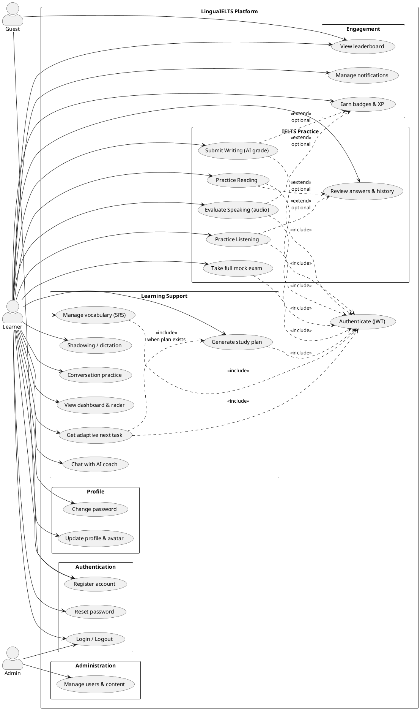

---

### 3.7.2. Class Diagram —” Domain Model (ORM)

**Explanation:** Core persistent entities from `app/db/models.py`. `User` is the aggregate root for profile, history, progress, vocab, study plan, notifications, and conversation sessions. `History` stores each attempt with JSON answers and optional `band_score`. `SkillAdaptiveState` holds per-skill SRS metadata for the adaptive engine.

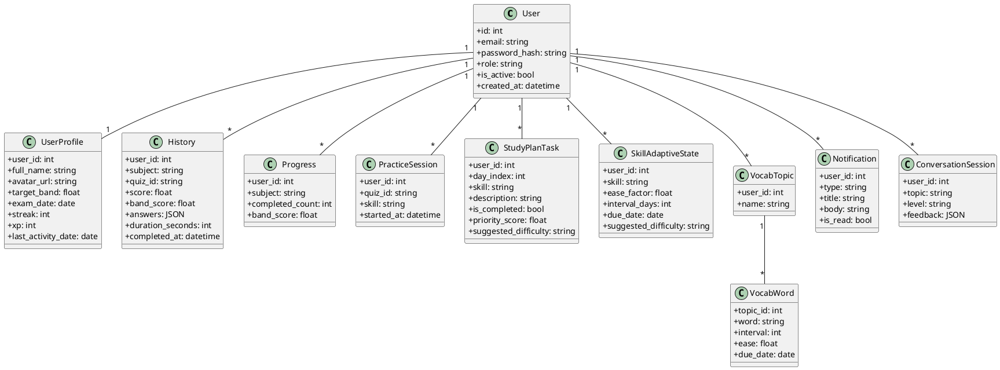

---

### 3.7.3. Class Diagram —” Application Layer (Backend)

**Explanation:** LinguaIELTS follows a **layered architecture**. Routers depend only on services; services use repositories and external clients. `HistoryService` is a hub invoked by `PracticeService`, `WritingService`, and vocab completion. `AdaptiveStudyService` and `BadgeService` are cross-cutting services triggered after successful submits. `OpenRouterClient` is a shared infrastructure component.

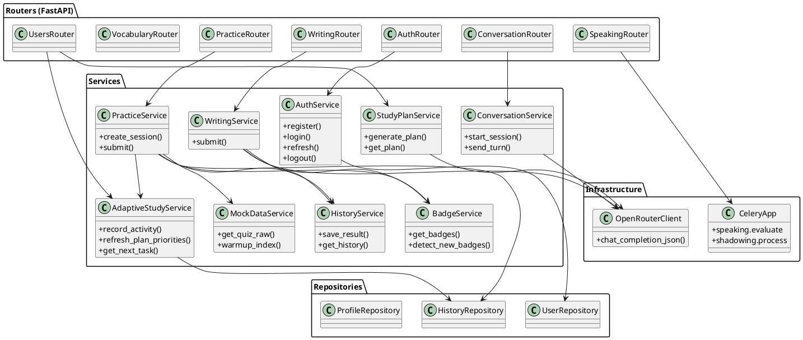

---

### 3.7.4. Class Diagram —” Frontend (Pinia + Services)

**Explanation:** The Vue SPA uses **Pinia stores** as the single source of UI state. Components do not call Axios directly; they use `services/*` (Dependency Inversion). `useAuthStore` gates routes; `useIeltsStore` aggregates dashboard data; `usePracticeStore` holds the active quiz session.

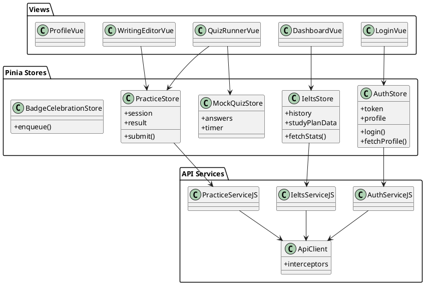

---

### 3.7.5. Activity Diagram —” Reading/Listening Practice Submit

**Explanation:** After the learner finishes a quiz, the client posts answers with duration. The server scores objectively, writes `history` and `progress`, updates XP/streak on the profile, runs adaptive SRS, and checks for newly unlocked badges. The client may show `BadgeCelebration` if `new_badges` is non-empty.

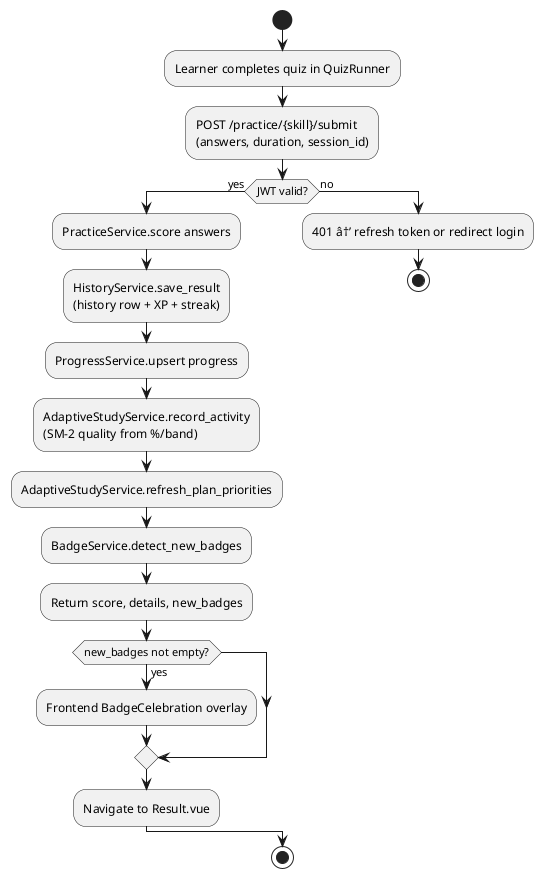

---

### 3.7.6. Activity Diagram —” Speaking Evaluation (Async)

**Explanation:** Audio evaluation is CPU/GPU intensive. The API enqueues a Celery task, binds task ownership in Redis, and returns `task_id`. The client polls until success or failure. The worker runs Whisper ASR, calls OpenRouter for rubric JSON, and aggregates band server-side.

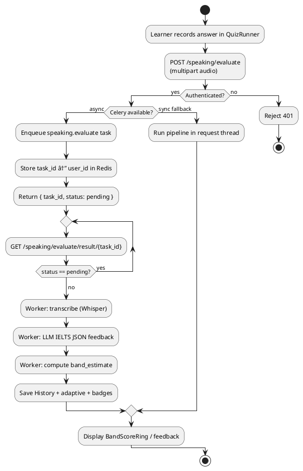

---

### 3.7.7. Activity Diagram —” Adaptive Next Task

**Explanation:** When the dashboard loads (or after submit), the client may call `next-task`. The service picks the highest `priority_score` incomplete plan task, or synthesizes a recommendation from `SkillAdaptiveState` (due SRS, weak skill, today's plan).

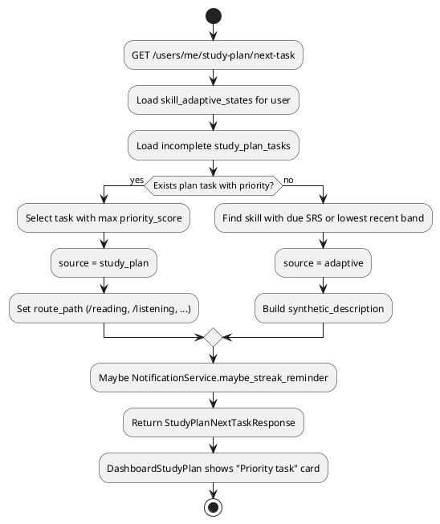

---

### 3.7.8. Activity Diagram —” Full Mock Exam

**Explanation:** Full mock state lives in **client** `sessionStorage` via `fullExam` store. Stages: Reading → Listening → break → Writing (2 tasks) → result summary. Each stage reuses QuizRunner or FullExamWriting with `fullExam=1` query flag.

```plantuml
@startuml Activity_FullMockExam
start
:User selects set on FullExamHub;
:fullExamStore.start(set_id);
:Stage 1 Reading → submit → recordStageResult;
:Stage 2 Listening → submit → recordStageResult;
:FullExamBreak (timed rest);
:Stage 3 Writing Task 1 & 2 → submit bands;
:Aggregate bands → FullExamResult.vue;
:fullExamStore.clear on exit;
stop
@enduml
```

---

### 3.7.9. Sequence Diagram —” Login and Token Refresh

**Explanation:** Login returns access + refresh tokens. Production may set httpOnly refresh cookie and CSRF token. The Axios interceptor on 401 calls `/auth/refresh` once and retries queued requests—”standard SPA JWT pattern documented in `HE_THONG.md` §2.

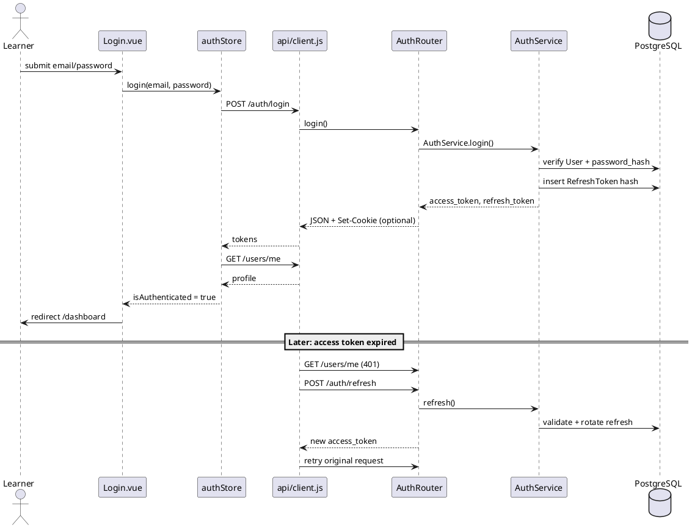

---

### 3.7.10. Sequence Diagram —” Practice Submit

**Explanation:** Detailed message flow for Reading submit; Listening is analogous with `skill_id=2` and audio assets from CDN/`/api/audio`.

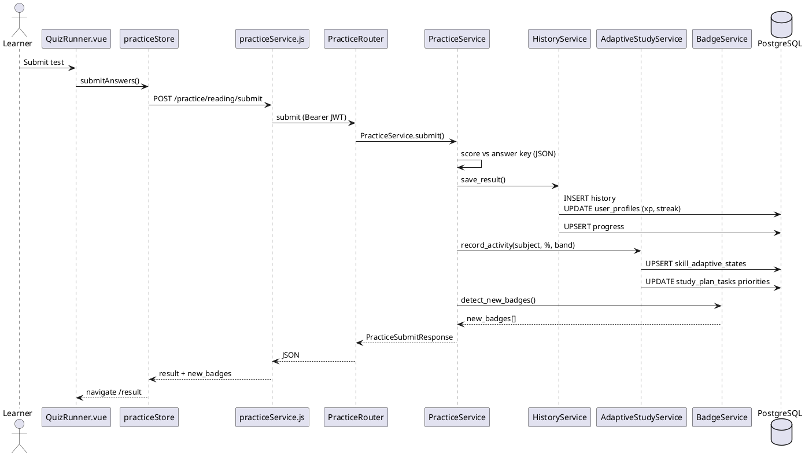

---

### 3.7.11. Sequence Diagram —” Writing AI Grading

**Explanation:** `WritingService` sends a strict system prompt requiring JSON band fields. If OpenRouter keys are missing, the service returns a controlled error. On success, history is saved like practice submit.

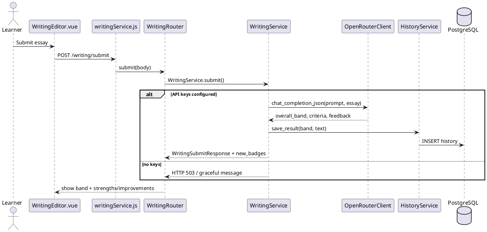

---

### 3.7.12. Sequence Diagram —” Speaking Async Evaluate

**Explanation:** Shows Celery boundary and polling loop used by `taskPolling.js`.

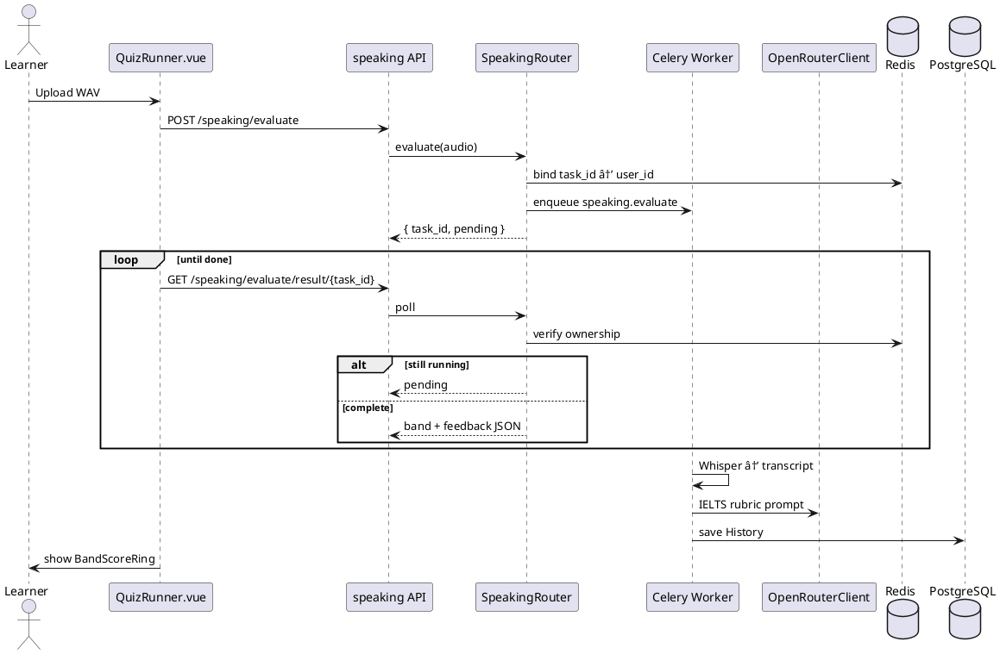

---

### 3.7.13. Sequence Diagram —” Generate Study Plan (AI)

**Explanation:** Replacing an old plan deletes incomplete future tasks and inserts five days of new tasks from LLM JSON or `_fallback_plan()` round-robin when the API fails.

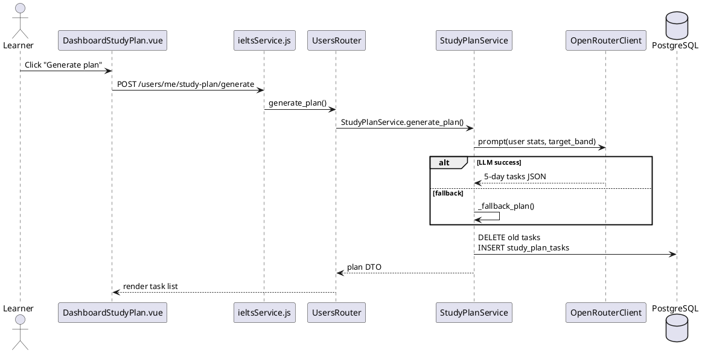

---

### 3.7.14. Deployment Component Diagram (optional)

**Explanation:** Production stack from Docker Compose—”browser hits nginx, which proxies to uvicorn and serves static Vue `dist/`.

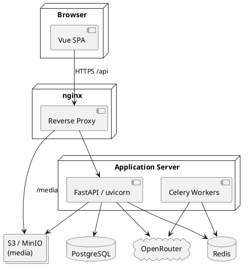

---

## 3.8. Module Implementation Summary

**Table 3.1: LinguaIELTS modules —” backend and frontend mapping**

| Module | Key backend | Key frontend |
|--------|-------------|--------------|
| Auth / Users | `AuthService`, `UsersService`, `ProfileService` | `Login.vue`, `Profile.vue`, `auth` store |
| Reading/Listening | `PracticeService`, `MockDataService` | `QuizRunner.vue`, `QuestionRenderer.vue` |
| Writing | `WritingService` | `WritingEditor.vue` |
| Speaking | `evaluate_speaking_core`, Celery tasks | `BandScoreRing.vue`, `taskPolling.js` |
| Vocabulary | `VocabService`, SRS helpers | `VocabPractice.vue`, `useVocabPractice.js` |
| Shadowing | `ShadowingService` | `ShadowingStudio.vue` |
| Full mock | `FullExamService` | `fullExam` store, `FullExamHub.vue` |
| Conversation | `ConversationService` | `ConversationPractice.vue` |
| Dashboard | `StudyPlanService`, `AdaptiveStudyService` | `DashboardStudyPlan.vue`, `SkillRadarChart.vue` |
| History | `HistoryService` | `History.vue`, `ReviewAnswer.vue` |
| Badges | `BadgeService` (32 dynamic) | `BadgeIcon.vue`, `BadgeCelebration.vue` |
| Notifications | `NotificationService` + Celery | `NotificationBell.vue` |
| Leaderboard | `LeaderboardService`, Redis ZSET | `Leaderboard.vue` |

---

## 3.9. GitNexus in the Development Lifecycle

During implementation, **GitNexus** indexed the repository as **ielts_web** (~7,370 symbols, 300 execution flows). Recommended practices from `AGENTS.md`:

1. `npx gitnexus analyze` after clone or major refactors.
2. `gitnexus_impact({target: "submit", direction: "upstream"})` before modifying `PracticeService.submit` or related history/adaptive hooks.
3. `gitnexus_detect_changes()` before commits to verify blast radius.
4. `gitnexus_query({query: "speaking evaluate flow"})` for onboarding developers to Celery + ML paths.

This reduces regression risk when consolidating APIs (e.g., merged `/history` and `/users/me` endpoints documented in `docs/HE_THONG.md`).

---

## 3.10. Chapter Summary

Chapter 3 documented **product design and development** of **LinguaIELTS**:

- **System architecture (§3.1)** — three-tier modular monolith, REST API groups, Docker Compose deployment, seven-stage learner data pipeline.
- **Database design (§3.2)** — entity groups, core tables (`history`, `skill_adaptive_states`, `study_plan_tasks`), indexing strategy; class diagram in **§3.7.2**.
- **Functional design (§3.3)** — module map, adaptive/Speaking/mock flows, non-functional constraints; use case and activity diagrams in **§3.7.1, §3.7.5–§3.7.8**.
- **UI/UX design (§3.4)** — SPA information architecture, key Vue views, interaction patterns for quiz, writing, speaking, and dashboard.
- **Technologies (§3.5)** — Vue 3, FastAPI, PostgreSQL, Redis, Celery, OpenRouter, Whisper, Wav2Vec2 pronunciation model, Docker, GitNexus.
- **MVP (§3.6)** — core feature set, pilot trial scope, distinctive value vs fragmented competitors.
- **UML (§3.7)** — full PlantUML source (use case, class, activity, sequence, deployment).
- **Implementation mapping and GitNexus (§3.8–§3.9)** — code artifact table and change-impact workflow.

**Chapter 4** covers deployment results, testing and user feedback, effectiveness analysis, and startup/commercialization models (Lean Startup, Business Model Canvas, Design Thinking).

---

# CHAPTER 4: DEPLOYMENT AND BUSINESS MODELS

Chapter 4 closes the thesis by demonstrating that **LinguaIELTS** is not only designed (Chapter 3) but **deployable, evaluable, and commercially plausible**. It covers: (i) deployment results and interface demonstration; (ii) experiments and user feedback; (iii) effectiveness analysis along time, productivity, cost, and accuracy dimensions; and (iv) innovation entrepreneurship frameworks—Lean Startup, Business Model Canvas, and Design Thinking—applied to commercialization of the product.

---

## 4.1. Deployment Results

### 4.1.1. Deployment Environment

The system was brought up in two configurations aligned with development and pilot deployment:

| Environment | Stack | Purpose |
|-------------|-------|---------|
| **Development** | Vite dev server + FastAPI + SQLite (optional) + local Redis | Feature development, thesis demos |
| **Production-oriented** | `docker compose up` — nginx, API, Celery worker, PostgreSQL 16, PgBouncer, Redis, MinIO | Reproducible pilot install |

**Deployment checklist executed:**

1. `alembic upgrade head` — schema applied to PostgreSQL.
2. Environment variables validated (`ENVIRONMENT=production`, JWT secrets, `OPENROUTER_API_KEY`, DB password).
3. `MockDataService.warmup_index()` — JSON mock corpus indexed at API startup.
4. Celery worker online — speaking and shadowing queues consumable.
5. `GET /health` — API liveness confirmed behind nginx.

**Figure 4.1** — Docker Compose service topology (reuse deployment PlantUML **§3.7.14** or screenshot of `docker compose ps`).

**Figure 4.2** — nginx reverse-proxy diagram: browser → TLS → static Vue build + `/api` → FastAPI.

### 4.1.2. System Screenshots and Functional Demo

The following screens should be inserted into the printed thesis as evidence of a working MVP. Captures were taken from the Vue SPA after successful deployment (placeholders marked **[INSERT FIGURE]**).

| Figure | Screen | Functions demonstrated |
|--------|--------|------------------------|
| **4.3** | Login / Register | JWT auth, email verification flow |
| **4.4** | Dashboard | Skill radar, XP/streak, study plan, AI coach entry, adaptive **next task** |
| **4.5** | QuizRunner (Reading/Listening) | Timed parts, audio player, submit |
| **4.6** | Result + Answer Key | Auto-score, `part_index` grouping, link to review |
| **4.7** | WritingEditor | Essay submit, four-criterion AI band JSON |
| **4.8** | Speaking result | Async poll, band ring, pronunciation + rubric feedback |
| **4.9** | Profile & badges | 32-badge grid, `BadgeCelebration` overlay |
| **4.10** | Leaderboard | Public top-50 (guest-accessible) |
| **4.11** | ShadowingStudio | YouTube shadowing, dictation check |
| **4.12** | ConversationPractice | Multi-turn topic dialogue |
| **4.13** | FullExamHub → result | Multi-stage mock (R→L→break→W) |

**Demo script (5–7 minutes for thesis defense):**

1. Register → login → dashboard loads stats.
2. Start Reading quiz → submit → view Result and Answer Key.
3. Submit short Writing task → show AI feedback panel.
4. Record 30–60 s Speaking → show `task_id` polling → completed feedback.
5. Generate five-day study plan → mark one task complete → fetch **next task**.
6. Open Leaderboard as guest in second browser tab.

### 4.1.3. Case Study: Self-Regulated Preparation Week (Pilot Scenario)

A structured **case study** illustrates intended use (pilot cohort or author self-test). Replace bracketed values with measured data after your trial.

**Profile:** University student, target IELTS band **6.5**, exam in **8 weeks**, 45–60 minutes/day available.

| Day | Activity on LinguaIELTS | Outcome recorded |
|-----|-------------------------|------------------|
| Mon | Reading mock (Test A, 40 min) | Score 28/40 → `history`; adaptive flags Reading |
| Tue | Vocabulary SRS (20 cards) + dashboard coach question | SM-2 due cleared; coach suggests Writing focus |
| Wed | Writing Task 2 (250 words) | AI bands: TR 6.0, CC 6.5, LR 6.0, GRA 5.5 |
| Thu | Speaking Part 2 audio (90 s) | Celery result; `band_estimate` ≈ 6.0; fluency tips |
| Fri | Listening mock + save 12 words to vocab | Progress updated; streak +1 |
| Sat | Full mock Reading+Listening only | Session in `practice_sessions` |
| Sun | Review weak items via `/history` | Answer Key for incorrect MCQs |

**Observed product behaviors:** single profile aggregates four skills; `get_next_task()` surfaced Reading after Monday's low score; badges unlocked on streak thresholds.

**[INSERT TABLE 4.2]** — Optional: fill actual scores, durations, and user satisfaction (1–5) per day after pilot.

---

## 4.2. Testing, Evaluation, and User Feedback

### 4.2.1. Test Objectives

1. Verify end-to-end flows: auth → practice → history → dashboard.
2. Assess API and Celery stability under normal dev/pilot load.
3. Qualitatively evaluate AI Writing/Speaking feedback against IELTS descriptor expectations.
4. Validate adaptive `next-task`, study-plan generation, and notifications.

### 4.2.2. Functional Test Matrix

**Table 4.3: Functional test scenarios**

| ID | Scenario | Steps | Expected result | Status |
|----|----------|-------|-----------------|--------|
| T1 | Registration & login | Register → verify email (if enabled) → login | JWT access + refresh; profile row | ☐ Pass / ☐ Fail |
| T2 | Reading submit | Start session → answer → submit | `history` row; XP; adaptive update | ☐ |
| T3 | Listening submit | Same as T2 | Correct auto-score vs JSON key | ☐ |
| T4 | Writing submit | Paste essay → submit | JSON with four criterion bands | ☐ |
| T5 | Speaking async | Upload 30–60 s WAV/WebM | `task_id` → poll → `completed` + feedback | ☐ |
| T6 | Study plan | `POST .../study-plan/generate` | Five days of tasks in DB | ☐ |
| T7 | Adaptive next task | Low Reading score → next-task | `focus_skill` emphasizes reading | ☐ |
| T8 | Leaderboard guest | GET `/leaderboard` without token | HTTP 200, top users | ☐ |
| T9 | Full mock flow | Hub → R → L → break → W | Stages in `sessionStorage`; writes history | ☐ |
| T10 | Badge trigger | Activity meeting rule | `new_badges` in API response | ☐ |

*Fill **Status** and notes column after execution; attach error logs for failures.*

### 4.2.3. Non-Functional and Regression Checks

| Area | Method | Criterion |
|------|--------|-----------|
| API latency | Manual / browser Network tab | Reading submit < 2 s (excl. LLM) |
| Speaking job | Celery logs | Complete within 60–120 s for 60 s audio |
| Security | OWASP spot check | Rate limit on auth; task ownership on speaking poll |
| Maintainability | `gitnexus_impact` on `submit` | Caller report documented before edits |

### 4.2.4. User Feedback

Formal large-scale user testing was **not** a graduation requirement; however, the thesis recommends collecting structured feedback during pilot deployment.

**Suggested instrument (5-point Likert + open comment):**

| # | Statement | 1 | 2 | 3 | 4 | 5 |
|---|-----------|---|---|---|---|---|
| Q1 | The dashboard helps me know what to study next. | | | | | |
| Q2 | AI Writing feedback is understandable and useful. | | | | | |
| Q3 | Speaking evaluation feels responsive enough (wait time acceptable). | | | | | |
| Q4 | I would recommend LinguaIELTS to a friend preparing for IELTS. | | | | | |

**[INSERT TABLE 4.4]** — Pilot results: *n* = ___ respondents, mean scores, sample quotes.

**Informal feedback (thesis author / peer reviewers during demo):**

- Positive: unified four-skill hub, immediate Answer Key, gamification (badges/streak) increases return visits.
- Concerns: AI band scores must be labeled *formative*; speaking wait requires clear progress UI (addressed via `taskPolling.js`); mock volume smaller than commercial publishers.

### 4.2.5. Limitations of Evaluation

| Limitation | Impact |
|------------|--------|
| Local JSON mocks | Not publicly benchmarked against live Cambridge datasets |
| AI grading | Not calibrated on expert-labeled essay/speech corpora |
| Load testing | No 1000+ concurrent user stress test yet |
| Pronunciation model | Validated offline (PCC on SpeechOcean762), not live examiner panel |

---

## 4.3. Effectiveness Analysis

Effectiveness is analyzed across four dimensions relevant to IELTS self-study and center pilots. Quantitative claims below use **illustrative assumptions**; replace with measured pilot statistics when available.

### 4.3.1. Time Savings

| Traditional practice | With LinguaIELTS | Estimated saving |
|----------------------|------------------|------------------|
| Wait 24–72 h for tutor Writing correction | AI feedback in **< 30 s** after submit | **1–3 days** per essay cycle |
| Book Speaking mock with human partner | Record + async evaluate **~1–2 min** queue | **Scheduling friction removed** |
| Manually track errors in notebook | Auto `history` + Answer Key by part | **15–20 min/session** |
| Plan weekly study manually | LLM 5-day plan + `next-task` card | **30–60 min/week** planning |

**Figure 4.14** — Optional bar chart: average turnaround time (tutor vs AI) for Writing feedback.

### 4.3.2. Productivity and Learning Throughput

- **More attempts per week:** Immediate scoring encourages additional Reading/Listening mocks without grading bottleneck.
- **Parallel skill coverage:** Vocabulary SRS + shadowing + conversation fill short gaps between long mocks.
- **Adaptive focus:** SM-2 and `priority_score` reduce time spent on already-strong skills (e.g., skipping overdue review when Reading is critical).

**Metric to track in pilot:** attempts per user per week (before/after onboarding).

### 4.3.3. Cost Reduction

**Table 4.5: Indicative cost comparison (Vietnam market, illustrative)**

| Item | Human tutoring / center | LinguaIELTS MVP (pilot) |
|------|-------------------------|-------------------------|
| Writing correction (1 essay) | 50,000–150,000 VND | Marginal API cost ≈ 2,000–10,000 VND (OpenRouter tokens) |
| Speaking mock session | 100,000–300,000 VND / session | Infrastructure + API; amortized over many users |
| Monthly prep app subscription | 200,000–500,000 VND (competitors) | Freemium target: free tier + premium AI quota |
| Center instructor time | High marginal cost per seat | B2B dashboard could scale seats with lower marginal cost |

**Infrastructure cost drivers (monthly pilot scale):**

- Cloud VPS (API + worker + DB): modest tier USD 20–80.
- OpenRouter: scales with MAU and daily AI quotas (`user_profiles` fields).
- Storage (MinIO/audio): grows with Speaking usage.

### 4.3.4. Accuracy and Quality of Outcomes

| Dimension | LinguaIELTS behavior | Accuracy interpretation |
|-----------|----------------------|-------------------------|
| Reading/Listening | Deterministic key match | **High** for keyed items; item quality depends on JSON authoring |
| Writing/Speaking AI | LLM + rubric JSON + hybrid Speaking aggregation | **Moderate**; useful for formative direction; ±0.5–1.0 band vs human examiner possible |
| Pronunciation | Wav2Vec2 multi-head (PCC ≈ 0.69 offline) | **Moderate** for ranking utterances; not official IELTS pronunciation certification |
| Adaptation | SM-2 + history-driven priorities | **High internal consistency**; pedagogical validity depends on learner adherence |

**Disclaimer:** The system **does not replace** official IELTS examination. Marketing must use "formative estimate" language until expert calibration is completed.

### 4.3.5. Comparative Summary

| Criterion | LinguaIELTS | Paper/PDF-only | Generic English chatbot |
|-----------|-------------|----------------|-------------------------|
| Four-skill integration | Yes | Rare | Partial |
| Immediate productive feedback | Yes | No | Unstructured |
| Adaptive plan + SRS | Yes | Manual | Rare |
| IELTS-specific mocks | Yes | Yes | No |
| Acoustic pronunciation model | Yes | No | Rare |

---

## 4.4. Startup Orientation and Commercialization

### 4.4.1. Design Thinking Applied to LinguaIELTS

| Phase | Activity in this project |
|-------|--------------------------|
| **Empathize** | Interviews/literature on fragmented IELTS prep, high tutor cost, lack of Speaking feedback (Chapter 1–2) |
| **Define** | Problem statement: unified, AI-augmented, self-regulated IELTS MVP with interpretable adaptation |
| **Ideate** | Feature brainstorming: mocks, LLM rubric, SM-2, shadowing, badges, Docker deploy |
| **Prototype** | Vue + FastAPI MVP, JSON mocks, Celery speaking pipeline |
| **Test** | Functional matrix §4.2; demo script §4.1.3; pilot questionnaire §4.2.4 |

### 4.4.2. Lean Startup Loop

```
Build → Measure → Learn (repeat)
```

| Cycle | Build (MVP increment) | Measure | Learn |
|-------|----------------------|---------|-------|
| 1 | Reading/Listening auto-score | Completion rate, time-on-task | Users need Answer Key by part → built `ReviewAnswer` |
| 2 | Writing AI submit | Token cost per essay; user rating Q2 | Tune prompts; add daily quota on profile |
| 3 | Speaking Celery path | Job failure rate, latency | Parallel Whisper + pron model; ownership in Redis |
| 4 | Study plan + next-task | Click-through on dashboard card | Fallback plan when LLM fails |
| 5 | Gamification | DAU, streak length | Badges increase return; leaderboard public |

**Pivot options if B2C traction is weak:** pivot to **B2B language centers** (seat licensing) while keeping core API.

### 4.4.3. Business Model Canvas

**Table 4.6: Business Model Canvas — LinguaIELTS (proposed)**

| Block | Content |
|-------|---------|
| **Customer segments** | B2C: university students, working professionals preparing for IELTS; B2B: language centers; B2Institution: career centers |
| **Value propositions** | All-in-one IELTS hub; immediate AI formative feedback; adaptive plan; pronunciation + conversation practice; lower cost than 1:1 tutoring for drills |
| **Channels** | Web app; future mobile; center partnerships; social media (TikTok/YouTube study tips); university clubs |
| **Customer relationships** | Self-serve freemium; in-app coach chat; email streak reminders; community leaderboard |
| **Revenue streams** | Premium subscription (AI quotas, analytics); B2B per-seat license; institutional semester packages; future API scoring fees |
| **Key resources** | JSON/mock content, ML weights, LLM API budget, engineering team, brand trust |
| **Key activities** | Content curation, model prompt tuning, DevOps, customer support, sales to centers |
| **Key partners** | OpenRouter/LLM providers; cloud host; universities; YouTube (shadowing content policy compliance) |
| **Cost structure** | LLM tokens, GPU/CPU inference, storage, CDN, salaries, marketing, legal/compliance |

### 4.4.4. Go-to-Market and Phased Roadmap

| Phase | Timeline | Focus |
|-------|----------|-------|
| **Phase 0 (current)** | Graduation MVP | Docker pilot, thesis demo, VKU presentation |
| **Phase 1** | 0–6 months | Closed beta at 1–2 language centers; freemium launch; disclaimer + privacy policy |
| **Phase 2** | 6–18 months | Mobile wrapper; payment gateway; examiner-calibrated Writing sample set |
| **Phase 3** | 18+ months | White-label API; RAG over licensed materials; regional expansion |

**Revenue sketch (freemium):**

- **Free:** Reading/Listening mocks (limited/month), basic history, leaderboard.
- **Premium:** Unlimited AI Writing/Speaking evaluations, advanced analytics, priority Celery queue.
- **B2B:** Cohort dashboard, branded subdomain, bulk seat pricing.

### 4.4.5. Risks and Mitigation

| Risk | Mitigation |
|------|------------|
| AI regulation / misleading band claims | Clear formative disclaimer; no "official IELTS score" wording |
| Copyright on test content | Author original JSON; license partnerships before scaling mocks |
| API cost overrun | Per-user daily quotas; model cascade to cheaper LLMs |
| Data privacy | Vietnam PDPA alignment; minimal PII; secure token storage roadmap |
| Competition from global apps | Localize UX (Vietnamese UI option), center integration, pronunciation differentiator |

---

## 4.5. Conclusion and Future Work

### 4.5.1. Conclusion

**LinguaIELTS** demonstrates that an integrated IELTS preparation product can be **designed** (Chapter 3), **deployed** via Docker/nginx (§4.1), **tested** through structured scenarios (§4.2), and positioned for **commercialization** using Lean Startup and Business Model Canvas thinking (§4.4). The MVP delivers measurable advantages in feedback latency and study organization; AI accuracy remains formative until further calibration.

The thesis contributes a full-stack reference implementation, UML documentation (§3.7), hybrid speech+language assessment, and per-learner SM-2 adaptation without dependence on massive third-party interaction datasets.

### 4.5.2. Future Work

1. **RAG + vector database** for institutional IELTS handouts (licensed content).
2. **Expert calibration** of Writing/Speaking AI on labeled corpora; report MAE vs human examiners.
3. **Formal user study** — pre/post band mock with control group.
4. **Payment gateway** and subscription billing for freemium launch.
5. **Web Push** and mobile apps for streak retention.
6. **Load testing** and observability (Prometheus/Grafana) for center-scale pilots.
7. **CI integration** of `gitnexus_detect_changes()` for safer releases.

---

# REFERENCES

1. British Council / IDP —” IELTS band descriptors.  
2. FastAPI —” https://fastapi.tiangolo.com  
3. Vue.js 3 —” https://vuejs.org  
4. SQLAlchemy 2.0 —” https://docs.sqlalchemy.org  
5. OpenRouter —” https://openrouter.ai/docs  
6. P. Wozniak —” SuperMemo SM-2.  
7. OpenAI —” Whisper (2022).  
8. Celery —” https://docs.celeryq.dev  
9. Redis —” https://redis.io/docs  
10. PlantUML —” https://plantuml.com  
12. OWASP —” JWT and XSS cheat sheets.

---

# APPENDIX A —” EDUGUIDE TOC MAPPING

| EDUGUIDE section | This report |
|------------------|-------------|
| Recommendation / DKT | §2.2 Adaptive study + SRS |
| AI Chatbot | §2.4, §3.4 |
| RAG / FAISS | §2.5 (future work) |
| DKT experiment tables | §4.2 functional tests |
| Business / startup | §4.4 Lean Startup, BMC |
| UML (not in sample TOC) | **§3.7 PlantUML** |

---

# APPENDIX B —” PLANTUML FILE INDEX

| File / section | Diagram type |
|----------------|--------------|
| §3.7.1 | Use case |
| §3.7.2 | Domain class |
| §3.7.3 | Application class |
| §3.7.4 | Frontend class |
| §3.7.5—“3.7.8 | Activity (4) |
| §3.7.9—“3.7.13 | Sequence (5) |
| §3.7.14 | Deployment component |

**Tip:** Split large diagrams per chapter figure numbers (Fig. 2, Fig. 3, —¦) in Word.

---

# APPENDIX C —” CANONICAL API SUMMARY

| Group | Endpoints |
|-------|-----------|
| Auth | `/auth/register`, `/login`, `/refresh`, `/logout`, forgot/reset |
| User | `/users/me`, stats, progress, study-plan*, badges, chat, activity-ping |
| Notifications | `/users/me/notifications*` |
| Practice | `/practice/reading|listening/session`, submit |
| History | `/history`, `/history/sessions/{id}`, `/history/quiz/{id}` |
| Mock | `/mock-tests`, `/quizzes/{id}`, `/mock-exams/sets` |
| Skills | `/writing/*`, `/speaking/*`, `/vocabulary/*`, `/shadowing/*`, `/conversation/*` |
| Public | `/leaderboard`, `/health` |

---

*Sources: `AGENTS.md`, `docs/HE_THONG.md`, `backend/README.md`, `implementation-notes.md`. Updated: 2026-06-04. Language: English.*
